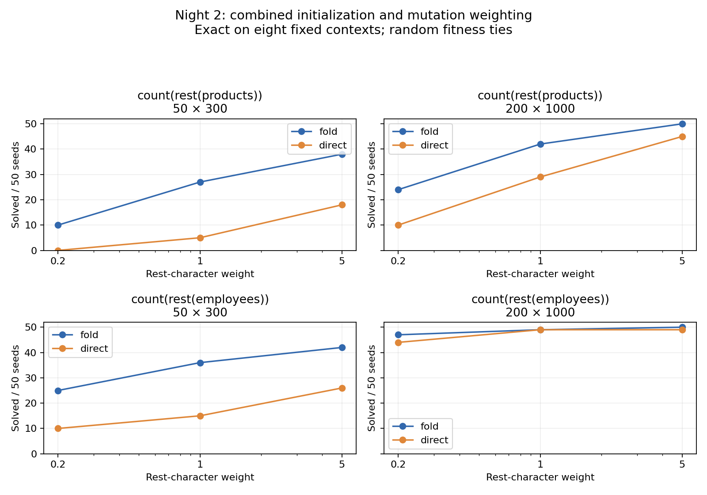
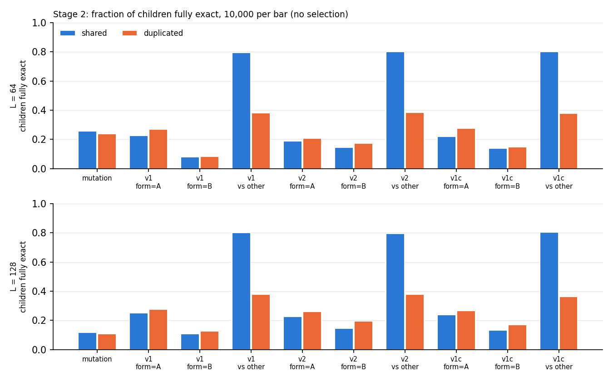
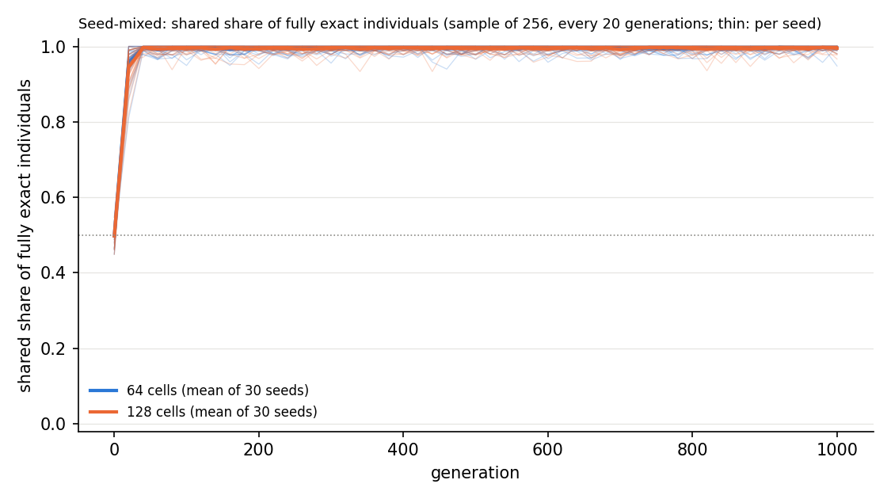
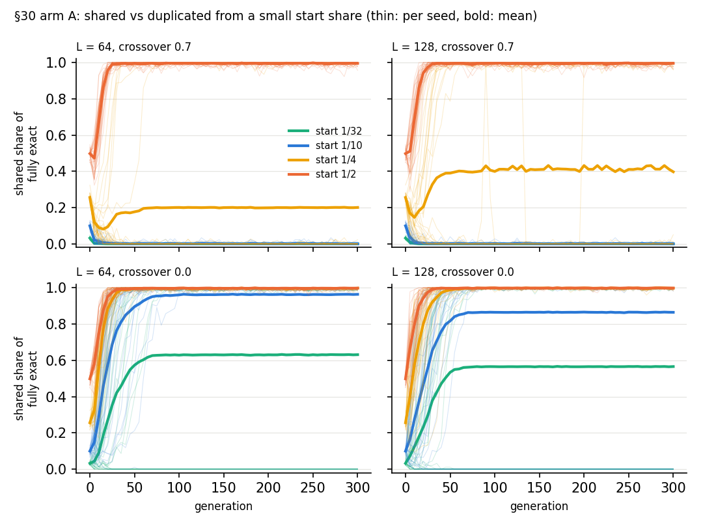
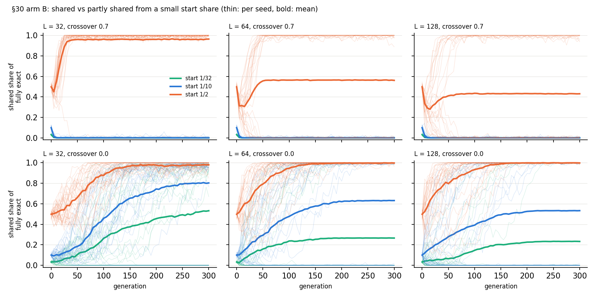

# Map-bias notebook

Lab notebook for the reframed core question (see README): how does the genotype→program
map bias what evolution finds? Hobby mode — one paragraph before, plain results after.

---

## 1. Arrival of the frequent on chem-tape (2026-09-25)

**What would be interesting to see:** if the behaviours random tapes hit often are the ones
evolution ends up on, the old proxy-basin story is just "the proxy is common, the solution is rare."

**Setup.** `experiments/chem_tape/arrival_frequent.py`, run on top of commit `d41d1e5`
(script not yet committed at run time). 50M uniform random tapes per decoder setup
(61 setups), decoded and executed on each task's seed-0 training inputs (64 examples).
"Behaviour" = the 64-long prediction vector. Then the best genotype of all 1,230 past
fixed-task runs was re-scored on the same inputs. Output:
`experiments/output/2026-09-25/arrival_frequent/` (`summary.md`, two plots). About 2 h on 10 cores.

**Results.**

1. **The maps are extremely biased.** One behaviour (a constant output) takes 66–88% of
   random tapes; only 22–636 distinct behaviours show up out of 50M tapes. Rank-frequency
   falls roughly as a power law with steps.
2. **Chem decoder and direct Arm A have almost the same bias.** Their rank-frequency curves
   overlap, and P(solve) differs by at most ~2× between them on the same task. At the level
   of behaviour, the "developmental" decoder hardly changes what is common. Same-task
   decoder pairs predicted solve-rate order in only 3/6 cases — no signal.
3. **Common solutions are always found; rare ones sometimes are.** If ≥ ~5e-5 of random tapes
   solve the task, evolution solves it 90–100% of the time. Below ~1e-6 (or never seen in 50M),
   solve rates range from 0 to 0.85. Spearman rho = 0.89 across setups, but that is mostly
   "easy tasks are easy."
4. **Evolution routinely finds behaviours rarer than 1 in 50M.** v1 `sum_gt_5`: no random tape
   scored ≥0.8, yet 85% of runs solved it. Frequency is not a ceiling — cumulative selection
   climbs where there is a gradient.
5. **The proxy basin reads as arrival of the frequent.** On `sum_gt_10_AND_max_gt_5`, ~5e-5
   of random tapes already sit at 0.92 (the single-predicate proxy) and none at ≥0.95; 0/100
   runs solve it. Decorrelating the proxy drops P(fit≥0.8) to ~1e-6 and solve rate rises to
   5–15%. Dual decorrelation removes it entirely but solve rate stays 0–5%, so rarity of the
   proxy is not the whole story.
6. **Stuck runs lean toward the common behaviour, but less than pure frequency would.**
   Among 479 runs with ≥2 sampled behaviours at or above their fitness, the evolved one was
   the most frequent in 326. Uniform-choice null: 169. Frequency-proportional null: 416.
   So evolution sits between "pick at random" and "pick by frequency."

**Take.** Bias matters (points 1, 5, 6) but it is not destiny (point 4). The interesting
cases are the ones where evolution beats the bias — what does the path look like there?
And point 2 says chem-tape's decoder is too close to direct encoding to show map effects;
a map comparison needs maps that actually differ (folding, tree GP).

**Caveats.** Behaviour measured on seed-0 inputs only, while runs trained on their own seed's
inputs. Past runs span different budgets and eras (v1 vs v2 alphabets). "Unseen" means < 2e-8.

**Next ideas.**
- Trace lineages in the solved-but-rare cases (v1 `sum_gt_5`, `sum_gt_10_v2`): which stepping
  stones were climbed, and how common was each?
- Run the same sampling on the folding map and a tree-GP generator, where biases should
  differ much more than chem-tape vs Arm A.

---

## 2. Is the AND proxy one or two steps from a solution? (2026-09-26)

**What would be interesting to see:** if a solver sits 1–2 mutations from the stuck
genomes, a smarter operator is enough. If not, the missing piece is a whole building block.

**Setup.** `experiments/chem_tape/and_neighbourhood.py`. The 40 stuck best genomes on
`sum_gt_10_AND_max_gt_5` (20 Arm A + 20 BP_TOPK, pop 1024 × 1500 gens). Every single
mutation (672 per genome) and every double mutation (218,736 per genome) was scored on
the seed-0 inputs. About 40 s on 10 cores.

**Results.**

1. **No solver within two mutations, in any of the 40 genomes.** None of the 8.7M
   neighbours even scores above the parent's fitness (0.922 for the `max>5` proxy). The
   proxy is a strict local optimum out to radius 2. 50–88% of single mutations are neutral,
   so the plateau is wide, but it leads nowhere within two steps.
2. **The gap is a whole missing block, not a bit of glue.** Building the canonical solution
   (`CONST_0 INPUT REDUCE_MAX CONST_5 GT INPUT SUM CONST_5 CONST_5 ADD GT IF_GT`) from the
   proxy one token at a time gives fitness
   0.922 → 0.922 (`CONST_0`) → 0.50 → 0 → 0 → 0 → 0 → 0.72 → 1.0.
   All six genomes between the proxy and the solution score below the proxy (0.50, 0, 0,
   0, 0, 0.72), because a half-built `sum>10` block leaves junk on top of the stack. The `sum>10` block (6 tokens) is simply not in the genome.

**Take.** Mutation can't cross this. What would: a crossover that can bring in a whole
`sum>10` block from another individual in one step, plus `IF_GT`. That only works if the
population still holds that block, and each run collapses onto one proxy. Next idea: task
switching between `max>5`, `sum>10` and AND to keep both blocks alive (Kashtan & Alon's
modularly varying goals), plus a whole-program combining crossover with random glue.

---

## 3. Crossing the AND valley: MIN token vs lexicase vs v3 domains (2026-09-26)

**What would be interesting to see:** which of three ideas gets evolution across the
AND valley — the missing primitive (MIN token), keeping specialists alive (lexicase),
or a chemistry where a block can arrive silently and be switched on in one step (v3).
Suggested by a Fable review of the v3 design.

**Setup.** `experiments/chem_tape/sweeps/mapbias/and_jump.yaml`, 30 seeds per setup,
`sum_gt_10_AND_max_gt_5`, pop 1024 × 1500 gens, same seeds in every setup.
- baseline: current chem decoder (BP_TOPK k=3), tournament.
- min: same + a `MIN` token (id 22, alphabet `v2_min`).
- lexicase: same as baseline, lexicase selection over the 64 training cases.
  This *is* standard lexicase — an earlier note here said otherwise; see §5.
- v3: `chem_tape/domains.py`. Linker tokens split the tape into domains; each domain
  runs on its own stack; linkers are SILENT / ADD / GT / MIN / MAX / GATE; a silent
  linker skips only its own domain.
Analysis: `experiments/chem_tape/analyze_and_jump.py`. About 23 min on 10 cores.

**Results.**

| setup | solved | median best |
|---|---|---|
| baseline | 1/30 | 0.922 |
| min | 1/30 | 0.922 |
| lexicase | **14/30** | 0.984 |
| v3 | 2/30 | 0.922 |

1. **Lexicase is the big lever.** 14/30 with no change to the chemistry. Solvers
   generalise (median holdout 0.988). 13 of 14 solving programs end in a single `GT`
   comparison, so evolution seems to find its own AND — some arithmetic score compared
   to a threshold — rather than the canonical `IF_GT` form. (Reading, not yet verified.)
2. **The missing primitive is not the issue.** Adding `MIN` gave 1/30, same as baseline.
3. **v3 did not produce the silent-then-switch jump.** 2/30, and in neither solve did the
   best genome carry a silent `sum>10` or `max>5` domain before the jump; the domains
   just before solving were mixed "other" computations. With tournament selection the
   `sum>10` block never forms silently — Fable's hitchhiking prediction.
4. The baseline got its first ever solve (seed 27, gen 1411) — so "0/100" is really
   "rare", about 1 in 30–130.

**Take.** What mattered was *which individuals survive*, not the chemistry: lexicase
keeps alive the individuals that get the ~8% of cases the proxy fails, and those carry
the second half of the answer. The chemistry only helps if something keeps the needed
block alive. Next obvious cell: v3 + lexicase — does the silent route appear once the
`sum>10` block has a reason to exist?

**Review and corrections (second Fable review, same day).**
- ~~**The lexicase variant adds niching.**~~ **Retracted in §5.** The claim was that picking
  a surviving behaviour group uniformly (rather than weighting by size) adds niching. It
  can't: groups are built from complete case rows, so exactly one group ever survives
  the filter and the weighting never applies. Standard and group variants gave identical
  runs on all 30 seeds. The 14/30 is plain lexicase.
- **This task has an arithmetic shortcut, so it may not need a jump at all.** Both
  predicates are monotone, so their AND is nearly linearly separable: `sum + 10·max > 70`
  scores 98.6% on all 10,000 length-4 lists (95.3% on the seed-0 training set). 13 of 14
  lexicase solvers ending in one `GT` fits a smooth arithmetic walk, not a jump.
- **Silent route estimate (Fable).** A silent block dies mainly from its own tokens being
  mutated (~1 − 0.97⁶ ≈ 17%/gen), not from its lineage drifting out. That gives
  silent : direct ≈ 1 : 80, independent of the mutation rate. Only a faster linker mutation
  rate or a decay-free reservoir changes it. Elitism could be that reservoir, but a neutral
  child never displaces the incumbent elite on a tie, so it never gets seeded.

**Bugs found on the way.**
- Fixed: the Rust executor had no `v2_split` dispatch, so `SUM_LEFT2`/`SUM_RIGHT2` ran as
  NOPs. The old `split_and` sweeps (experiments-v2.md) were unsolvable as run — the
  canonical body scored 0.5 instead of 1.0. Those 0/20 results are invalid.
- Not fixed: the BP/BP_TOPK decoders use the v1 separator mask for every alphabet, so
  under v2 `MAP_EQ_E` (14) and `CONST_2` (15) act as separators and never execute, while
  the intended separators 20/21 bond through. Affects every v2 chem-decoder run; left
  as-is so new runs stay comparable.

---

## 4. Plan: a fair test of jumps and crash-free recombination (2026-09-26)

Entry 3 showed that the AND task can probably be solved by a smooth arithmetic walk, so it
cannot tell whether a chemistry helps evolution *jump*. The plan, in order:

1. ~~**Fix lexicase to the standard version.**~~ **Done (§5): nothing to fix** — the old
   code already was standard lexicase in practice.
2. **Parent tracking + lineage labels.** **Done (§5).** Record each child's parents and how it was made
   (crossover / mutation). Tracking uses no random numbers, so re-running the solved seeds
   reproduces them exactly. Label every fitness-raising step on the path to each solver, and
   for crossover steps record child fitness against both parents and whether both parents'
   expressed blocks survive in the child. That gives the real jump routes and the real
   crash spectrum.
   - Mutation-only arithmetic walks → retire this task for jump questions.
   - Crossover steps that merge two parents' blocks with only a small drop → keep it; v3 vs
     baseline under lexicase is then a fair comparison.
3. **Fix the separator bug** (decoders use v1 masks under v2 alphabets). **Done (§5) as
   opt-in `alphabet_separators: true`**, so old sweep configs still reproduce.
4. **Testbeds with no arithmetic shortcut**, scored on all 10,000 lists so an approximate
   threshold can't pass:
   - `(max>5) XOR (sum>10)`.
   - **Modify-after-arrival curriculum:** donors evolve `sum>5`, the target needs `sum>10`,
     so a transplanted block must be edited after it arrives (`CONST_5` → `CONST_5 CONST_5
     ADD`). This is the one setting where silent insertion *should* beat direct insertion.
5. **Then compare chemistries** (baseline vs v3 domains+linkers, under standard lexicase),
   reporting solves against evaluations rather than a solve count at a fixed budget. v3
   additions to try, cheapest first: domain-transplant crossover (one whole domain, inserted
   at a domain boundary with its own linker); a higher mutation rate on linker cells; elite
   ties broken toward the newer genome, so a silent block can sit in a protected copy; a
   domain library of blocks ever expressed by specialists as a transplant source (only if
   step 4 shows silence pays).

Skipped on purpose: MAP-Elites over case-pass vectors (the descriptor would smuggle in the
task's decomposition) and epsilon/down-sampled lexicase (evaluation is not the bottleneck).

---

## 5. Steps 1-3: lexicase check, solver lineages, separator fix (2026-09-26)

**What would be interesting to see:** whether the 14 lexicase solvers got there by
recombining blocks (a jump) or by a smooth mutation walk, and whether they compute AND
at all.

**Setup.** `experiments/chem_tape/sweeps/mapbias/lexicase_lineage.yaml`, 30 seeds each of
`lexicase_group`, `lexicase`, and `lexicase` + `alphabet_separators`, otherwise as §3.
New config flags: `track_lineage` saves the final best genome's ancestry to `lineage.npz`
(main line = the fitter parent at each crossover; no RNG, so runs are unchanged);
`alphabet_separators` makes the BP/BP_TOPK decoders (NumPy, MLX, Rust) split on 20/21
under v2. Analysis: `experiments/chem_tape/analyze_lineage.py`. About 17 min on 10 cores.
Also includes the Rust top-K decode speed-up from another session (commit `35a5433`).

**Results.**

1. **The two lexicase variants are the same algorithm.** Identical runs on 30/30 seeds (see
   the retraction in §3). 14/30 solved, same seeds as §3.
2. **Only 6 of the 14 "solvers" compute AND.** Scored on all 10,000 length-4 lists, 6 are
   exact (1.000); the other 8 are approximations that happen to fit the 64 training cases
   (0.918–0.9965; median of all 14 is 0.9915). The 256-case holdout doesn't catch most of
   them.
3. **No evidence that crossover on its own drives innovation.** Along the 14 solver main
   lines there were 95 innovations (child beats both parents). *Corrected after review:*
   most "crossover" children were also mutated afterwards. Split: 26 pure crossover, 50
   crossover + mutation, 19 mutation only. Pure crossover is 27% of innovations, roughly
   its share of all children. The final step to 1.0 was a crossover in 10 of 14 runs,
   which is what a 0.7 crossover rate predicts (9.8). Caveat: only solver main lines were
   looked at, so everything here is conditioned on success; §6 measures all children.
   (The earlier "big jumps ≥ 0.05" count is dropped: 0.05 is only 3 of 64 cases.)
4. **My "merges both parents" measure doesn't discriminate.** 52/76 innovating crossovers
   put executed material from each parent into the child — but 70% of *all* main-line
   crossovers do too. A better measure is needed to say whether a step combined two
   functional blocks.
5. **Fable's prediction was half right.** The task has an arithmetic shortcut (§3) and most
   solvers use one, but the lineages are not mutation-only walks: crossover drives most
   innovations.
6. **Separator fix: 7/30 solved** (3 exact AND) vs 14/30 without it. Suggestive (p ≈ 0.1),
   not conclusive. Enabling `MAP_EQ_E`/`CONST_2` and the real separators changes the
   landscape; why it's harder is unexplored.

**Take.** On this task "solved" mostly means "fits 64 cases", and crossover is the main
innovator mainly because it's the main operator. Two changes before comparing chemistries
(plan step 4): score fitness on all 10,000 lists so approximations can't pass, and build
a functional "did this crossover combine two blocks" measure — e.g. does the child's
behaviour match an AND of the parents' behaviours on the cases where they differ.

---

## 6. Crossover spectrum on the exact-AND solvers (2026-09-26)

**What would be interesting to see:** whether any crossover actually merged two
working blocks — one from each parent — and how often crossover crashes compared
with mutation. Suggested by the third Fable review.

**Setup.** `experiments/chem_tape/crossover_spectrum.py`. The 6 exact-AND lexicase
solvers from §5 (seeds 0, 5, 6, 8, 9, 29) re-run with lineage tracking; every re-run
reproduced its saved best genome. On sampled generations (every 10th, plus the last
10 before the solve), every child except elites and unmutated clones is scored on
all 10,000 lists (balanced accuracy, since 84% of lists are positive) and compared
with its parent(s): **better** (> fitter parent + 0.001), **neutral**, **small
degradation** (not below the weaker parent − 0.05), **crash** (below that).
**Combination** = the child passes every list either parent passed, and each parent
passed ≥ 3 lists the other didn't. About 5 min on 6 cores.

**Results.**

| operator | children | better | neutral | small degradation | crash | combination |
|---|---|---|---|---|---|---|
| crossover, no mutation | 192,256 | 0.61% | 62.7% | 27.5% | 9.2% | 18 |
| crossover + mutation | 117,888 | 0.73% | 41.2% | 18.1% | 40.0% | 12 |
| mutation only | 50,326 | 1.27% | 60.3% | 2.2% | 36.3% | 0 |

1. **Pure crossover rarely crashes here: 9%, against 36% for mutation.** *Overstated —
   see §7:* this bar let crossover children fall to the weaker parent; against the
   fitter parent it is 18.5% vs 33%. The "converged parents" explanation offered here
   is also wrong (§7).
2. **Mutation is twice as likely to improve a child** (1.27% vs 0.61%). Crossover makes
   ~4× more children, so it still delivers more improvements in total.
3. **Combinations are rare and cluster at the solve.** 30 of ~360,000 children, in 3 of
   the 6 seeds, all in the last generation or two before solving. Seeds 5, 9 and 29 had
   none in the sampled generations.
4. **No combination merged one block from each parent.** Test 1: no child contains
   pieces behaving like both whole parents (0 of 15 unique events; parents were
   approximations, so this test is strict). Test 2, pieces computing `max>5` / `sum>10`
   exactly:
   - Seed 0: the child is the canonical `CONST_0 … INPUT REDUCE_MAX CONST_5 GT IF_GT …
     INPUT SUM … GT` form — but parent 2 *already had both* blocks (score 0.978). The
     crossover fixed their arrangement, not their supply.
   - Seed 8: one event had `max>5` in parent 1 and `sum>10` in parent 2, but the child
     kept only `sum>10`; the max test ended up folded into arithmetic.
   - Seed 6: `max>5` in all three, no `sum>10` piece anywhere.

**Take.** On this task and chemistry, crossover does not jump by merging two blocks
from two parents. It mostly supplies a similar genome in which a small change does the
work, and the few "combinations" are rearrangements of blocks one parent already had.
Per the plan agreed with Fable, the next step is therefore not an evolution race but a
static test: **v3's crash spectrum against baseline** — does domain isolation keep
crossover children from crashing, and does it make one-parent-per-block merges
possible at all?

**Caveats.** Sampled generations only; 6 solvers; crash / degrade thresholds are my
choice; the predicate-piece test uses task knowledge (analysis only, not selection).

---

## 7. Waiting times, fair crash bar, and a guaranteed-supply merge test (2026-09-26)

**What would be interesting to see:** (a) once both blocks exist, how long evolution
takes to arrange them into a solution — a long wait means arrangement, not supply, is
the bottleneck; (b) whether recombination can put a `max>5` block and a `sum>10` block
together at all when both are guaranteed to be there. From the fourth Fable review.

### 7a. The six exact-AND solvers again

Same re-run as §6 (`crossover_spectrum.py`, output `crossover_spectrum2/`), now with
crossover scored against the **fitter** parent like mutation, crash rate by how many
executed cells differ between the parents, the last 10 generations reported
separately, and waiting times (first generation a genome contains a piece computing
`max>5` / `sum>10` exactly, both in the population, both in one genome).

| operator (vs fitter parent) | every 10th gen: crash | endgame: crash | better |
|---|---|---|---|
| crossover, no mutation | 18.5% | 23.1% | 0.6–0.9% |
| crossover + mutation | 44.5% | 63.5% | 0.7–1.1% |
| mutation only | 33.4% | 53.6% | 1.2–1.8% |

1. **Pure crossover is gentler than mutation, but less than §6 said** (18.5% vs 33%).
2. **Populations are not converged.** 145,596 of 192,256 pure crossovers are between
   parents whose executed programs differ in ≥ 16 cells. Crash rises with that distance
   (1.8% → 6.0% → 9.5% → 17.8% → 20.3%) but stays near 20% even for very different
   parents. Crossover + mutation crashes ~57% at every distance, so the extra mutation
   does most of that damage.
3. **Supply is early, arrangement is slow.**

| seed | both blocks in population | both in one genome | solve | one genome → solve | solver has both blocks |
|---|---|---|---|---|---|
| 0 | 124 | 124 | 622 | 498 | yes |
| 5 | 123 | 328 | 1028 | 700 | yes |
| 6 | 151 | 1174 | 1178 | 4 | yes |
| 8 | 103 | never | 234 | — | no (arithmetic) |
| 9 | 217 | 253 | 390 | 137 | no |
| 29 | 5 | 8 | 369 | 361 | no |

   Both blocks exist within 5–217 generations; from co-presence in one genome to the solve
   takes 137–700 generations in 4 of 5 seeds. And 3 of 6 exact solvers contain neither
   pair of blocks — they reach exact AND another way. So once lexicase supplies the
   blocks, **arrangement is the bottleneck**.

### 7b. Guaranteed-supply merge test

`experiments/chem_tape/merge_test.py`, output `merge_test/` (an earlier run with a wrong
crash bar is kept as `merge_test_v1_wrong_crash_bar/`). New tasks `mb_max_gt_5` and
`mb_sum_gt_10` use exactly the AND task's slot/threshold bindings, so a block means the
same thing after a transplant. Donors: 25 genomes per predicate and chemistry, each
exact on all 10,000 lists, from pop 1024 × 400 gens runs (baseline needs the long budget
for `sum>10`). Every max>5 × sum>10 donor pair, both orders, crossed three ways; every
child scored on all 10,000 lists against AND. Crash = clearly worse than *both* parents.

| chemistry | operator | children | exact AND | both blocks kept | same as a parent | crash |
|---|---|---|---|---|---|---|
| baseline | single-point | 38,750 | 0 | 0 | 74.1% | 25.9% |
| v3 | single-point | 38,750 | 0 | 0 | 53.5% | 46.4% |
| v3 | domain transplant (all 6 linkers) | 393,204 | 0 | 0 | 69.7% | 30.2% |

**No child in either chemistry computes AND or keeps both blocks.** Why:
- **Baseline: blocks compete for the same place.** Donors end with their predicate's
  final comparison at the *end* of the tape, because the output is the top of the stack.
  A single-point cut keeps X's start and Y's end, so X's block is almost always cut off.
- **v3: blocks are not domains.** v3 donors spread a predicate across several domains and
  use the linkers as the arithmetic (e.g. `const MIN const MAX [reads max] GT const GT
  const`). A single domain never carries the block, and because the linker chain is a
  left-to-right fold with no grouping, two multi-domain chains can't be combined as
  units. Silent transplants are harmless (1.45% crash) but useless.

**Take.** Supply is solved by lexicase; the jump that remains is *arrangement*, and
neither chemistry gives evolution a way to treat an evolved block as one unit. That is
now the sharp design question for a crash-free recombination chemistry: blocks need to
be **closed units with one output** that recombination can move and a combinator can
join — e.g. nested / tree-shaped domains (a linker combines two *sub-chains*, not one
domain), or blocks that must return their value to a named slot instead of the shared
stack top. A first cheap check: whether evolution under such a chemistry keeps each
predicate inside one unit, before any evolution race.

**Caveats.** Waiting-time scan every 5 generations, refined to the exact generation;
donors come from 8 seeds per pool; "both blocks kept" is checked on a 10% sample for
baseline (piece search is costly) and on whole domains for v3.

---

## 8. Plan: tagged runs — connection by binding, not position (2026-09-26)

**Idea (nature-inspired, no imposed shape).** In both chemistries so far position
decides meaning: the output is the stack top, so blocks compete for the tape end, and
v3's linker chain order decides how values combine. Biology separates the two:
transcription factors and protein domains connect by what they *bind*, wherever they
sit. Tagged runs:
- The tape is split into runs; each run has a **tag** (like a binding site) and a body
  that runs on its own fresh stack; its output is its top int.
- `RECV t` pushes the output of the run tagged `t` (exact match; no match → 0).
- The organism's output is the run tagged with a fixed output tag.
- Nothing imposes a tree or chain; chains, DAGs, shared sub-results and redundant copies
  can all emerge from which tags match.

**Fifth Fable review (corrections to my pitch).**
- Fixes "blocks compete for the tape end" outright, but probably *not* smearing: any
  glue between units gets used as computation (v3's lesson), and nothing pushes toward
  closed blocks. Open-ended pressures if needed: **noisy links** (each RECV fails with a
  small probability, so deep chains lose) and **modularly varying goals**.
- "Inert for free" is false under closest-tag matching (a new run hijacks references):
  use **exact matching** and a tag space much larger than the number of runs (64 values,
  in a separate tag field).
- "Graded rewiring" is false: nearby tags are unrelated runs. Start exact.
- The AND jump is not one mutation: a ~6-token combining run is still needed. What tags
  buy is that it can be built silently and switched on by one retag, but it needs
  lexicase partial credit to be built at all.
- Use a longer tape (64) with deletion, crossover that aligns runs by tag (swap bodies of
  same-tagged runs — homologous recombination), no positional tie-breaking, a RECV depth
  cap, and log RECV frameshifts separately.

**First experiment (merge-test style).** Evolve exact `max>5` and `sum>10` donors under
tagged runs, then measure:
1. **Smear:** knock out each non-output run; count runs whose removal changes the output.
2. **Inertness:** transplant every run of donor B into donor A; fraction of children
   exactly unchanged, fraction crashing.
3. **Paths to AND:** 1- and 2-mutation neighbourhoods of transplanted children; count exact
   AND and partly built combiners.

**Kill** if donors typically need ≥ 3 load-bearing runs, or < 80% of transplants are
inert (v3 repeated). **Confirm** if predicates sit in 1–2 runs, ≥ 90% of transplants are
inert, and a 2-step path to AND exists (baseline: 0 in 38,750).

---

## 9. Tagged runs: first results (2026-09-26)

**Setup.** `src/folding_evolution/chem_tape/tagged.py` (arm `TAG`, alphabet `tagged`):
genome = 64 cells, each an op (the 20 v2 ops, `SEP`, `RECV`) plus a separate 64-value
tag field. `SEP` starts a run with that tag; `RECV t` pushes the output of the run(s)
tagged exactly `t` (none → 0; several → max); output = tag 0; cycle guard and depth cap 8;
cells before the first `SEP` are inert. Vectorised interpreter, checked against the Python
executor on 600 random programs (`tests/test_chem_tape_tagged.py`). Variation: point
mutation of ops and tags, cell insertion/deletion (rate 0.015), crossover that either swaps
bodies of same-tagged runs or cuts between runs. Donors: lexicase, pop 1024 × 400 gens,
8 seeds per predicate (exact `max>5` in 7/8 seeds, exact `sum>10` in 4/8); 20 exact donors
each, round-robin across seeds. Script: `experiments/chem_tape/tag_merge_test.py`.

**Results.**

1. **Blocks stay closed.** Load-bearing runs per donor (removal changes the output):
   median 1 for both predicates (`max>5`: 11 donors with 1, 9 with 0 — the 0s have
   redundant copies under the same tag, so no single knockout matters; `sum>10`: all 20
   with 1). Kill threshold was ≥ 3. So far each predicate lives inside one run — the
   output run itself (Fable's "everything in the output run" attractor), but a closed
   unit either way.
2. **Transplants are inert.** 940 transplants of a non-output run: **100% inert, 0%
   crash** (kill threshold < 80%). Transplanting B's *output* run is not inert (19% inert,
   81% crash), as expected: two tag-0 runs combine by max, i.e. an OR.
   Compare §7: baseline single-point 26% crash and 0 blocks kept; v3 30–46% crash.
3. **No short path to AND.** 40 silent module imports (B's runs added with its output run
   retagged to an unused tag): the import itself is inert 40/40. Exhaustive 1-mutation
   neighbourhoods (324,576 mutants) and 120,000 sampled 2-mutation neighbours: **0 exact
   AND, 0 better than both parents**. A mutation that wires the imported module into the
   output path occurs (361 and 309 cases, ~0.1–0.3%), but wiring alone doesn't compute AND.
   Caveat: these neighbourhoods use point mutations over existing cells only; the minimal
   combiner (e.g. `RECV f ADD CONST_1 GT` appended to the output run, or a 6-token
   `CONST_0 RECV a RECV b IF_GT` run) needs 3–6 *new* cells, so 0 was expected — this
   measures the combiner's cost, not the chemistry.

**Take.** Tagged runs are the first chemistry where evolved blocks are closed units and
recombination can move one without damage — both kill criteria pass, and the silent
insertion is real, not designed in. What's left is the combiner: joining two blocks costs
several new tokens with nothing rewarding the intermediate steps. Next: an evolution race
on the AND task under lexicase (tagged runs vs baseline), measuring solve rate and time
from "both blocks in one genome" to solve — does a chemistry where blocks can sit side by
side safely shorten the arrangement wait of 137–700 generations (§7a)?

---

## 10. Evolution race: tagged runs vs baseline on AND (2026-09-26)

**What would be interesting to see:** now that blocks can sit side by side safely (§9),
does evolution use that — shorter wait from "both blocks in one genome" to the solve?

**Setup.** `experiments/chem_tape/sweeps/mapbias/tag_race.yaml`: 30 seeds, AND task,
lexicase, pop 1024 × 1500 gens, 64 training cases, tape 64, mutation 0.015. Baseline =
the lexicase runs of §5 (same budget and cases). Analysis:
`experiments/chem_tape/tag_race_analysis.py` (waiting times from a deterministic re-run of
each exact solver; structure from knockouts). ~11 min for the sweep.

**Results.**

| chemistry | solved (64 cases) | exact AND (all 10k lists) | median solve gen (exact) |
|---|---|---|---|
| baseline (BP_TOPK) | 14/30 | 6/30 | 506 |
| tagged runs | 13/30 | 7/30 | 1044 |

1. **No difference in outcome.** Same solve and exact-AND counts within noise; tagged
   solvers are, if anything, slower.
2. **No shorter arrangement wait.** Both blocks in one genome → solve: tagged 109–901
   generations (6 seeds; one solver never had both), baseline 4–700.
3. **Evolution doesn't use the modular route.** Every exact tagged solver has exactly one
   load-bearing run, and that run computes AND by itself. Where the output run contains a
   `RECV`, it fetches a tag that no run has — i.e. it's used as a constant 0. Blocks that
   co-exist as separate runs are not wired together; AND is rebuilt inside one run.
   This is Fable's "everything in the output run" attractor.

**Take.** Making modular recombination *safe* is not enough; nothing on this task makes
it *pay*. A block that sits in its own run is worth nothing extra here, because it is
used exactly once. Biology's modularity is selected where parts are **reused** (one
signal read by many genes) or where **goals change in a modular way**. Candidate next
steps, both open-ended (no imposed shape):
- **Reuse:** a task with several outputs that share sub-results (e.g. output tags 0, 1, 2
  for `max>5 AND sum>10`, `max>5 OR sum>10`, `max>5 AND NOT sum>10`), so one block
  referenced by tag serves all of them.
- **Modularly varying goals:** switch the target between `max>5`, `sum>10` and the AND
  every ~20 generations (Kashtan & Alon), with tagged runs vs baseline.

---

## 11. Overnight queue: OR race, varying goals, fixed-AND control (2026-09-26, running)

**Why.** Sixth Fable review: tagged runs combine same-tag runs by max, so the chemistry's
built-in combinator is OR — the modular route (duplicate the output run, let the copy
diverge) exists for OR and not for AND, and §10 only tested AND. And building a block in
place is always cheaper than wiring two runs, so single-use tasks never reward modularity;
varying goals (Kashtan & Alon) might.

**Queue** (`experiments/chem_tape/sweeps/mapbias/overnight_queue.yaml`, 3 arms each:
baseline BP_TOPK / tagged / tagged + gene duplication at 0.1 per child; lexicase, pop
1024, lineage tracking, balanced-accuracy fitness):
1. `or_race` — OR on stratified inputs, 30 seeds × 1500 gens, no early stop.
2. `mvg_p20` — goal cycles max>5 → sum>10 → AND every 20 gens on one shared input set,
   re-selecting on the new goal at each switch; 30 × 3000.
3. `and_fixed` — fixed AND on the same inputs and budget (control for #2); 30 × 3000.
4. `mvg_period` — periods 5 and 50, baseline vs tagged+dup; 30 × 3000 (runs last).
Morning analysis: `experiments/chem_tape/overnight_analysis.py <output dir>`.

**Pre-launch review (Codex gpt-6-sol, two rounds) — fixed before launch:**
- Gene duplication could truncate existing runs, and a "silent" copy could take a tag a
  dangling RECV reads (wiring it in); same-tag copies of self-reading runs changed output.
  Now: never truncates (makes room from trailing NOPs, then never-executed leader cells,
  else skips), fresh tags avoid read tags, self-dependent runs are not copied same-tag.
  Neutrality tested on random genomes. Accepted for ~20–30% of evolved genomes.
- OR training could be solved by `sum>10` alone (38% of 32-positive samples had no
  max-only case). Now `mbs_*` tasks draw inputs equally from all four (max>5, sum>10)
  cells, shared across max / sum / AND / OR for a given seed.
- Equal cells make AND 25% and OR 75% positive, so "always 0/1" scored 0.75 and
  populations drifted to run-less genomes. Now fitness = balanced accuracy (constant → 0.5,
  `max>5` alone on AND → 0.83); lexicase itself is per case and unchanged. A pilot reached
  exact AND in 2 of 9 short runs.
- The old recovery metric compared fitness across different goals, and selection lagged one
  generation on the old goal at each switch. Now `reselect_on_flip` re-scores on the new
  goal before reproducing and logs the new goal's starting score; recovery is computed in
  the morning from per-generation data.
- Sweeps now write their index after every run and a `SWEEP_COMPLETE` marker only when all
  configs are done; the queue checks the marker; re-running a sweep resumes.
- Remaining caveats: baseline vs tagged is a chemistry-package comparison (tape length,
  indels, crossover differ); tagged vs tagged+dup isolates duplication. Lineage saves only
  the final champion's ancestry; phase-end champions come from history.csv.

---

## 12. Overnight results (2026-09-27)

All four sweeps completed (`experiments/output/2026-09-26/mapbias_*`, commit `05ad45e`;
30 / 58 / 65 / 73 min). Analysis: `experiments/chem_tape/overnight_analysis.py` →
`overnight_summary.md`; follow-ups: `experiments/chem_tape/overnight_followup.py`.
Exact = the final (or phase-end) best genome is right on all 10,000 lists.

### 12a. OR race — the modular route is used when it pays

| arm | exact OR | median first exact gen | tagged solvers using ≥ 2 runs |
|---|---|---|---|
| baseline | 10/30 | 595 | — |
| tagged | 19/30 | 290 | 18/19 |
| tagged + duplication | **25/30** | **250** | **25/25** |

- tagged+dup vs baseline p = 0.0002; tagged vs baseline p = 0.04; tagged vs tagged+dup
  p = 0.14 (Fisher). Baseline vs tagged is a chemistry-package comparison.
- Tagged solvers have two load-bearing output (tag-0) runs, combined by max = OR.
- **Crossover is where the second output run arrives.** On each solver's main line, the
  step where the champion first got its second output run was a crossover in 19/19
  (tagged) and 24/25 (tagged+dup) solvers, against a ~70% base rate (0.7¹⁹ ≈ 0.001).
  In **20 of 44** the new output run is an exact copy of the *other* parent's output run —
  confirmed two-parent block merges. The other 24 are crossovers where the new run matches
  neither parent exactly (crossover plus modification; not shown to be merges). This is
  lineage correlation; the causal test (crossover off) is in §13. Gene duplication was
  almost never the route (1/25), and its extra solves (25 vs 19) are not significant —
  no claim that duplication helps.
- **Not yet attributable to modularity.** Baseline vs tagged is a chemistry-package
  comparison, and the baseline has no integer MAX, so OR costs it a combiner
  (`ADD CONST_0 GT`) that tagged runs get free. §13 controls separate the two.
- Fixed AND for comparison: 9/30 in all three arms, single-run solvers (as §10).

### 12b. Varying goals — helps the baseline, not tagged runs

Runs with an exact AND phase-end in the last third (ever) vs the fixed-AND control
(exact at end): period 20: baseline **14/30** (18/30) vs 9/30; tagged 2/30 (6/30);
tagged+dup 2/30 (3/30). Period 5: baseline 11/30 (18/30); tagged+dup 8/30 (14/30).
Period 50: baseline 2/30 (7/30); tagged+dup 3/30 (3/30).
- Tagged runs track the goals worse than baseline at every period (e.g. period 20, early
  phases reaching 1.0: max>5 71% vs 95%, sum>10 47% vs 77%), and their phase-end solvers
  are single runs — no persistent modules formed. *Possible artefact (seventh review):*
  per-genome mutation rates are matched, but many tagged cells are inert, so a tagged child
  may change its behaviour less often, which is exactly what tracking speed depends on.
  Measured and controlled in §13.
- Sampling note: the fixed control was checked every 10 generations (~300 looks), the MVG
  arms only at ~50 AND phase ends, so the baseline's MVG gain (18/30 vs 9/30 ever exact)
  is if anything conservative.
- The baseline benefits from switching every 5–20 generations (Kashtan & Alon-like);
  slow switching (50) does not help.

### Take (provisional until §13's controls)

The question since §3 was whether evolution can combine building blocks by
recombination without crashing. Answer on this system so far:
- **Apparently yes, when the chemistry's combinator matches the task.** Tagged runs combine same-tag
  runs by max; on OR, crossover merges one parent's output run into another's, safely,
  and that raises exact solves from 10/30 to 19–25/30 and halves the time.
- **No, when joining needs a new combiner** (AND): building in place wins (§10, 12a).
- **Varying goals** did not make tagged runs modular; they helped the stack baseline.
The next open-ended step is therefore a chemistry where the way same-tag runs combine is
itself evolvable (e.g. the combiner depends on the tag), so AND-, OR- and other joins are
all as cheap as OR is now — no shape imposed, the combinator becomes a heritable trait.

---

## 13. Plan: attribution controls and an evolvable combiner (seventh review)

**Controls for 12a (OR, 30 seeds × 1500 gens each):**
1. Tagged runs with **crossover off** (mutation only). Collapse → recombination is the
   route; no collapse → a single retag of an existing run to tag 0 may be doing the work.
2. Tagged runs where several same-tag runs give **leftmost wins** instead of max: same
   chemistry package, no free combinator.
3. **Baseline + an integer MAX op**, and baseline with a 64-cell tape.
   Rule: (2) falls to ~10/30 and (3) stays ~10/30 → the modular route is the cause;
   (3) rises to ~25/30 → the finding is combiner cost (narrower).
**Varying goals:**
4. Effective mutation rate: fraction of children whose behaviour differs from their parent,
   per arm, on stored populations.
5. MVG period 20 with tagged runs' mutation rate raised to match baseline's effective rate.
   Does the tracking gap vanish?
**Closing experiment:**
6. **Evolvable combiner**: a combine field on each run (max / min / add / gate), mutable
   like the tag; same-tag runs fold with their fields. On AND and OR. Confirm: AND rises
   from 9/30 toward OR's level with two-run solvers. Kill: stays ~9/30.
Then stop this line and promote to findings; building a combiner across a valley (§9) is a
separate project.

---

## 14. Attribution controls and evolvable combiner — results, and wrap-up (2026-09-27)

Queue `experiments/chem_tape/sweeps/mapbias/queue_s13.yaml` (commits `34a4529`, `7e8699b`),
outputs `experiments/output/2026-09-27/mapbias_*`, analysis
`experiments/chem_tape/s13_analysis.py` → `s13_summary.md`. All OR runs: 30 seeds × 1500
gens, stratified inputs, balanced fitness, lexicase; exact = right on all 10,000 lists.

**OR controls** (references from §12: tagged 19/30, tagged+dup 25/30, baseline 10/30):

| setup | exact OR | median first exact gen |
|---|---|---|
| tagged, **crossover off** | **2/30** (p < 0.0001 vs tagged) | 465 |
| tagged, **leftmost wins** (no free OR) | 11/30 (p = 0.07 vs tagged) | 870 |
| **baseline + IMAX** (OR = one op) | **18/30** (p = 1.0 vs tagged) | 315 |
| baseline, tape 64, rate 0.03 | 15/30 | 600 |
| baseline, tape 64, rate 0.015 | 9/30 | 870 |

1. **Crossover is causal in tagged runs.** Without it, exact OR collapses to 2/30 and no
   solver has two output runs.
2. **The OR advantage over the baseline is combiner cost, not modularity.** Giving the stack
   baseline a one-op OR (integer MAX) brings it to 18/30 — the tagged level. Taking the free
   OR away from tagged runs brings them down to 11/30 — the baseline level (this control also
   makes run order matter, so it tests the max rule, not "max alone"). Per the §13 rule, the
   finding is the narrower one.

**Evolvable combiner** (`tagged_comb`; combine markers are ordinary body cells):
- AND: **9/30** — same count as every other arm (and_fixed: 9/30 each), so by the §13 kill
  rule it does not raise solve rates. But **9/9 solvers are two-run modular solutions**
  joined by `min` (7) or `gate` (2), against 1/9 and 3/9 for tagged / tagged+dup, and they
  are found sooner (median first exact gen 640 vs 1000–1580).
- OR: 17/30 (vs 19/30; p = 0.79) — the larger alphabet (25 ops) costs nothing measurable;
  joins used are mostly max.

**Varying goals, mutation-matched:** tagged runs' rate lowered to match the baseline's
effective rate (realised: 0.205 and 0.227 vs 0.21 — tagged children change behaviour *more*
often at the nominal rate, 0.35, the opposite of the review's hypothesis). Tagged still
track worse: exact AND at a late phase end 1/30 and 2/30 (vs baseline 14/30); early phases
reaching 1.0 fell further (max>5 43–61%, sum>10 28–36%). The tracking gap is a property of
the chemistry, not a mutation-rate artefact.

### What this line found (§1–§14)

*Superseded by the scoped, reviewed version in [findings.md](findings.md) (eighth review).*

- **Bias in the map shapes outcomes but is not destiny.** Random-tape frequency predicts
  easy tasks; evolution routinely finds behaviours rarer than 1 in 50M (§1).
- **The AND "proxy basin" is a wide valley:** no solver within two mutations of any stuck
  genome; a whole second block is missing (§2).
- **Lexicase fixes block supply** (1/30 → 14/30 on AND); **arrangement is then the
  bottleneck**, 137–700 generations from both blocks in one genome to a solve (§3, §5, §7).
- **In a stack chemistry, blocks compete for the tape end;** v3's linker chains smear blocks
  across domains; neither lets recombination merge two blocks (§7).
- **Tagged runs** (connection by tag, not position) keep blocks closed and make transplants
  inert — safe modular recombination is achievable without imposing a shape (§9).
- **Recombination does merge blocks when the join is cheap** (crossover is causal), but the
  advantage comes from the join's cost: a stack with an equivalent one-op join does as well
  (§12, §14).
- **When joins are heritable, evolution adopts the modular route completely** (all AND
  solvers become two joined runs, found sooner) — **but success rates don't rise** (§14).
- **Varying goals helped the stack baseline** (Kashtan & Alon-like), not tagged runs, and
  that is not a mutation-rate artefact (§12, §14).

**Stopping point.** The open follow-on — evolving a join that must be *built* across a
fitness valley (§9), rather than chosen from a menu — is a separate project.

---

## 15. Plan: a frequency knob, and XOR (2026-09-27, overnight)

**Why.** The line never manipulated map bias: chem-tape's decoder is close to identity (§1),
so "frequent" and "easy" were confounded. `op_weights` (config) makes chosen ops k× as
likely in random genomes and point mutations, the same as giving them k synonyms, so what
can be reached stays the same and only how often it is made changes. XOR is the harder
task: on the stratified inputs its best `sum + w·max` threshold scores 0.72 (cell-balanced)
against 0.96–0.97 for AND and OR, so the linear shortcut is gone and exact solvers must
compose. A hand-built tagged XOR (two tag-0 runs `p1 p2 GT`, `p2 p1 GT`, max-joined) is
exact on all 10,000 lists.

**Queue** (`experiments/chem_tape/sweeps/mapbias/queue_s15.yaml`, all fast_rng, lexicase,
balanced fitness, 30 seeds unless noted, each sweep has its own 1× reference arm):
1. `knob_comb_and`: tagged_comb AND, combine markers at 0.25×, 1×, 4×, and gate alone 4×.
   *Interesting if* the joined-solver share and the min:gate split move with weight
   (arrival of the frequent on route choice) while the solve count stays ~9/30.
2. `xor_race`: stack v2_probe, stack v2_imax, tagged, tagged_comb on XOR.
3. `knob_imax_or`: stack v2_imax OR, IMAX at 0.25×, 1×, 4× (dose-response on the join).
4. `knob_min_and`: stack v2_min AND, MIN at 1×, 4×, 16× (is the stack AND valley just rarity?).
5. Seed top-ups, 100 seeds: OR tagged vs tagged+dup; stack fixed AND vs varying goals
   period 20. Last in the queue; fine if they get cut.

Morning: exactness on all 10,000 lists (`overnight_analysis.py` now knows `mbs_xor`), route
per exact solver (number of tag-0 runs, join marker), first exact generation.

---

## 16. §15 results (2026-09-28)

All 7 sweeps completed (`experiments/output/2026-09-27/mapbias_{knob_*,xor_race,seeds100_*}`,
commit `7c9cc42`, ~4 h). Analysis: `experiments/chem_tape/overnight_analysis.py` →
`overnight_summary.md` (exactness now checked every generation). p = two-sided Fisher.
Caveat for every knob: raising one op's weight lowers every other op's share (at MIN 16× the
MIN token is 42% of draws), so high weights also dilute the rest of the alphabet.

**Frequency knob: join marker on tagged_comb AND** (share of each marker in draws: 0.25× ≈ 1%, 1× 4%, 4× 14%)

| markers | exact AND | median first exact | multi-run solvers | joins used (min / gate / other) |
|---|---|---|---|---|
| 0.25× | 10/30 | 608 | 10/10 | 8 / 2 / 1 |
| 1× | 12/30 | 556 | 11/12 | 5 / 6 / 1 |
| 4× (all three) | 6/30 (p = 0.16 vs 1×) | 1219 | 5/6 | 3 / 2 / 0 |
| gate only 4× | 12/30 | 863 | 11/12 | 4 / 8 / 1 |

- At 0.25× (≈ 2 marker cells per genome, ~30 new marker cells per generation across the
  population) the joined route is still used by 10/10 solvers. This does not test true rarity.
- Gate share is ordered as frequency predicts (18% / 50% / 62% at 0.25× / 1× / gate 4×), but
  only the extreme pair is near significance (p = 0.047; 1× vs gate 4× p = 0.70; §14's 1× run
  gave 2/9 gate). Consistent with a frequency effect on which join is used, not shown.
- More markers does not help the solve rate; 4× on all three (35% of all draws) is worse,
  most likely dilution (runs reaching train 1.0: 24 → 16).

**Frequency knob on the stack baseline**

| setup | 0.25× | 1× | 4× | 16× |
|---|---|---|---|---|
| OR, IMAX weight (exact / median first gen) | 9/30 / 857 | 19/30 / 466 | 17/30 / 370 | — |
| AND, MIN weight | — | 10/30 / 1493 | 9/30 / 1101 | 2/30 / 1852 |

- IMAX frequency sets when the join arrives: median first exact 857 / 466 / 370 at 0.25× /
  1× / 4× (solves by gen 750: 4 / 15 / 14). Under a fixed 1500-gen budget that becomes fewer
  solves at 0.25× (9 vs 19, p = 0.02) and saturates above 1× (17).
- MIN at 16× (42% of draws) hurts (2 vs 10, p = 0.02) — dilution: runs reaching train 1.0
  fall 15 → 4, the whole program suffers, not just the join. MIN at 4× (16%) changes nothing.
- Within this protocol MIN adds nothing to stack AND: v2_min 10/30 vs v2_probe 9/30 (§12)
  and 30/100 (below). §3's 1/30 differed in selection, inputs, fitness and budget.

**XOR** (no linear shortcut)

| arm | exact XOR | median first exact | multi-run solvers |
|---|---|---|---|
| stack v2_probe | 5/30 | 990 | — |
| stack v2_imax | 2/30 | 1466 | — |
| tagged | 13/30 (p = 0.047 vs stack) | 873 | 8/13 |
| tagged_comb | **19/30** (p = 0.0005 vs stack) | 1157 | 17/19 |

- Tagged runs beat the stack on XOR, but it is a chemistry-package result with two
  uncontrolled confounds. (a) Tape: every stack solver uses ≥ 28 of its 32 cells, and the
  stack fits the training cases in only 6/30 runs (tagged 22/30, tagged_comb 25/30); §14
  showed a 64-cell tape lifts stack OR 10 → 15/30. (b) Free OR: XOR = max(p1>p2, p2>p1),
  and 8/13 tagged solvers are exactly that — two near-identical output runs differing by a
  SWAP, joined by the free max; the second run arrived by crossover in 8/8 (an exact copy of
  the other parent's output run in 7/8). tagged_comb solvers use 3 output runs (median),
  with a mix of all four joins.
- IMAX doesn't help the stack on XOR (2/30): with ~30 of 32 cells in use, one op is not the
  constraint.

**Seed top-ups (100 seeds, fast_rng; seeds 0–29 re-run, so a replication, not an extension)**
- Gene duplication on OR: 62/100 vs 67/100 without (p = 0.55). §12's 25 vs 19 was noise;
  no duplication effect.
- Varying goals, stack baseline: exact AND at a late-third phase end in 21/100 runs, at any
  phase end in 36/100; fixed AND 30/100 (fixed ever = final: exact champions persist under
  elitism, so the extra looks don't matter). p = 0.45 (late-third: 0.19, favouring fixed).
  The §12 MVG benefit (18/30 vs 9/30) does not replicate at 100 seeds.

Multiple comparisons: of ~10 tests here only XOR tagged_comb vs stack (p = 0.0005) survives
a family correction; the p ≈ 0.02–0.05 results are trends. All §15 arms use fast_rng, so
comparisons with §12/§14 are approximate; each sweep's own 1× arm is the comparator.

**Take** (revised after the ninth Fable review).
- *Arrival of the frequent, causally:* op frequency acts as a supply rate on the join. It
  sets arrival time (IMAX), converts to fewer solves under a fixed budget when rare, and
  saturates above uniform; very high weights hurt only through dilution. Whether frequency
  steers the choice among equivalent joins is suggestive (ordered gate shares), not shown.
- *XOR* removes the linear-shortcut asterisk, and tagged runs win clearly (13–19/30 vs
  2–5/30), but until a 64-cell stack and a leftmost-wins tagged arm run on XOR it is a
  chemistry-package win, not a modularity win.
- Two suggestive earlier results (duplication, varying goals) are retracted as noise.

**Next (ninth review's ranked shortlist, ~4 h):** (1) XOR controls: stack tape 64 at rates
0.015 and 0.03, v2_imax tape 64, tagged leftmost-wins, tagged crossover off. (2) Crossed
min/gate weights on tagged_comb AND (`22:4,24:0.25` vs `22:0.25,24:4`, 50 seeds). (3) True
rarity: all markers at 0.02× and 0.05×. (4) IMAX 0.05× / 0.25× / 1× at 3000 gens, analysed
as time to first solve. Then close the chem-tape map-bias line; the core question needs a map
whose bias differs from direct encoding (folding map or tree-GP generator, as §1 said).
Tagged-run modularity is a separate, chemistry-design thread.

---

## 17. Valley crossing, Step 0: lineage post-mortem with both parents traced (2026-09-28)

**What would be interesting to see** ([Plans/valley-crossing.md](../../Plans/valley-crossing.md)):
whether any solver's output runs arrived by *silence, then switch* — built under an unread
tag, then retagged to 0. The saved lineages follow only the fitter parent, so they were
biased against finding it.

**Setup.** `experiments/chem_tape/postmortem_lineage.py` re-ran all 44 tagged solvers from
§16 (tagged XOR 13, tagged_comb XOR 19, tagged_comb AND 1× 12) up to their first exact
generation. **44/44 reproduced the original genome exactly.** Each output (tag-0) run was
traced back through *both* parents, following the run itself: the predecessor is the most
similar run in either parent, comparing ops plus tags on RECV cells only, with trailing NOPs
stripped. A run under another tag counts only if ≥ 90% similar. Runs are traced jointly, so
identical runs in one parent aren't read as a copy.
- One Codex review before the run: retags could be over-counted, and runs that didn't
  reproduce weren't excluded. Both fixed.
- The tenth (Fable) review then found that the first version also compared inert tags on
  non-RECV cells and the re-randomised padding. That mislabelled op-identical runs as
  "written" and could hide real retags. Fixed and re-run (v2).

Output: `experiments/output/2026-09-28/postmortem_v2/postmortem.md`.

| solvers | later output runs | copy of an earlier output run | … made inside one genome | retag from silent | RECV rewired (all output runs) |
|---|---|---|---|---|---|
| tagged_comb AND (12) | 12 | 11 | 0 | 0 | 4/24 |
| tagged_comb XOR (19) | 31 | 28 | 2 | 0 | 6/50 |
| tagged XOR (13) | 9 | 8 | 1 | 0 | 6/22 |

- **Silence, then switch: not seen, and not really tested.** None of the 52 later output runs
  came from a retag. The one retag (tagged XOR seed 18, run #1) was a tag flicker: one
  generation under tag 1, body unchanged. But the null is forced by the setup (tenth review):
  - a silent run becomes tag 0 at μ/64 ≈ 2×10⁻⁴ per run per generation (0–4 such events
    per solver), against 177–393 retags *away* from 0;
  - silent runs are few (0.2–1.5 per genome) and their bodies are junk;
  - half of all crossovers reshuffle expressed tag-0 bodies instead.

  So the route is outcompeted about 10⁴-fold. Untested rather than refuted.
- **Later output runs share ancestry with an earlier one ("homologous", not duplicated).**
  - Almost every later output run's trace joins an earlier output run's trace: 47 of 52.
  - Only 3 copies were made inside one genome; the rest sat in different individuals, apart
    for a median of 51–90 generations, until crossover joined them.
  - This is largely structural: in a converged population any two tag-0 runs share an
    ancestor, and homologous crossover fills every tag-0 slot from the donor's *first*
    tag-0 body.
- **Plain tagged XOR has no valley on the solving path** (tenth review, per-generation check
  of the 8 copy paths):
  - the common ancestor computed one XOR half (p1∧¬p2 or p2∧¬p1) at 1.0;
  - the other half arose as a single SWAP on one branch;
  - both halves sat in hosts scoring 0.73–0.88 (a half is right on 3 of 4 stratified cells),
    never masked;
  - crossover joining them under the free max was the solving step in 7/8.

  Fitness along the path: 0.75 → 0.75 → 1.0. tagged_comb AND is similar: the copy turned
  from p1 into p2 within 2–38 generations in single-run hosts at 0.83–0.90, and the solve
  came a median of 1 generation after the rejoin.
- **tagged_comb XOR is different.** Both branches changed (16/26), hosts dipped to 0.34–0.42
  (kept by lexicase on a few cases), and the solve came a median of 81 generations after
  the rejoin (> 500 in 8/26).
- **Interpretation (reworded after the review).** The intermediates are rewarded by partial
  credit on the target's own lexicase cases, not by a family of other functions, and the
  join is the free max. So this describes how a two-specialist polymorphism is recombined
  under a free join, not how a valley is crossed. Whether a *family* of rewarded functions
  adds anything beyond partial credit is exactly Step 2's question.

**Decision.** Follow the plan as revised after the tenth review (see the plan's "Revision"
section): move the valley work to tagged runs with **leftmost-wins** (no free join), where
XOR needs a join built inside one run. Tonight's queue (§18) starts with that.

---

## 18. Plan: XOR with no free join, and XOR controls (queue_s18)

**What would be interesting to see:** whether evolution can *build* the XOR join when the
chemistry gives none away. With leftmost-wins, the two-run max route fails. A one-run join,
e.g. `RECV a RECV b GT RECV b RECV a GT ADD`, is exact (checked by hand).

**Queue** (`experiments/chem_tape/sweeps/mapbias/queue_s18.yaml`; fast_rng, lexicase,
balanced fitness, 3000 gens):
1. `xor_leftmost`: tagged, leftmost-wins, 30 seeds.
   - ≥ ~8/30 exact → the join can be built; post-mortem the solvers and look for RECV rewiring.
   - ≤ 2/30 → the valley is real; build the ruler on this chemistry.
2. `xor_nox`: tagged (max join), crossover off, 30 seeds. §16 got 13/30 with crossover, and
   §17 says the solve is crossover joining two specialists, so collapse is expected.
3. `xor_stack64`: stack with a 64-cell tape at mutation rates 0.015 and 0.03, and v2_imax at
   64 cells. If the stack reaches ~13/30, §16's gap was tape length.
4. Parked map-bias items (ninth review):
   - `comb_cross`: min/gate weights crossed, 50 seeds;
   - `comb_rare`: markers at 0.02× and 0.05×;
   - `imax_time`: IMAX at 0.05×, 0.25× and 1× over 3000 gens, read as time to first solve.

`overnight_analysis.py` now labels arms by tape length, mutation rate, join rule and
crossover rate as well, so these arms are reported separately.

---

## 19. §18 results: XOR with no free join, XOR controls, parked map-bias items (2026-09-28)

All 6 sweeps completed (`experiments/output/2026-09-28/mapbias_*`, commit `c922028`, ~2.6 h).
Analysis: `overnight_analysis.py` → `overnight_summary.md`. Leftmost post-mortem:
`postmortem_lineage.py --target "mapbias_xor_leftmost=tagged leftmost"` →
`postmortem_leftmost/postmortem.md` (12/12 re-runs reproduced exactly). p = two-sided
Fisher, uncorrected. The "output runs / load-bearing" columns of `overnight_summary.md`
knock runs out under the max rule, so they are wrong for the leftmost arm; use the
post-mortem instead.

**XOR attribution**

| setup | exact XOR |
|---|---|
| tagged, max join (§16) | 13/30 |
| tagged, **leftmost-wins** (no free join) | **12/30** (p = 1.0 vs max) |
| tagged, max join, **crossover off** | **2/30** (p = 0.002 vs 13/30) |
| stack, 32 cells (§16) | 5/30; v2_imax 2/30 |
| stack, **64 cells**, rate 0.03 / 0.015 | **12/30 / 11/30** |
| stack v2_imax, 64 cells | 9/30 |

- **§16's tagged-vs-stack XOR gap was mostly tape length.** A 64-cell stack reaches 11–12/30,
  the tagged level (p = 1.0 vs 13/30). Findings item 13's "tagged runs beat the stack on XOR"
  does not survive this control; tagged_comb's 19/30 vs 12/30 is p = 0.12.
- **Crossover is causal for tagged XOR** (13 → 2/30 without it), as it was for OR (§14).
- **Removing the free join costs nothing.** Leftmost-wins solves 12/30. So the join can be
  built, and the "≥ ~8/30" branch of the plan applies: inspect the solvers.

**How leftmost solvers join the predicates** (post-mortem, live runs only)
- **8/12 compute XOR inside one run** (no live RECV). Their output run was built under tag 0
  (or drifted from an initial run) and gained its RECVs or ops in place.
- **4/12 join across runs: the output run reads one helper by RECV.** In all 4, the helper was
  a **former output run**. It was the live (first) tag-0 run of its lineage for 91–100% of
  115–540 generations, as a partial solution at fitness 0.42–0.75. It was then retagged away
  from 0 to the tag an output run reads. The solve followed 7, 96, 221 and 941 generations
  later.
  - Seed 7: the individual's output run already read that tag, so a dangling RECV was
    waiting. Seed 29: the read and the retag arrived in the same step. Seeds 2 and 19: the
    reading output run came later.
  - This is not silence-then-switch: the helper was expressed and selected the whole time.
    It is **co-option**. A working partial solution is demoted to a subroutine, and a new
    output run reuses it. That's the reuse event Step 3a of the plan wants to follow.
  - (The first version of the leftmost report labelled these "retag from silent", because
    nothing RECV-reads tag 0. The script now labels a retag from tag 0 as "retag from
    output run".)

**Parked map-bias items**
- **Frequency does steer which join is used** (`comb_cross`, 50 seeds each). With min at 4×
  and gate at 0.25×, the exact AND solvers joined by min 13, gate 1. Reversed weights: gate
  14, min 2. p = 2×10⁻⁵ for the gate share. Solves were the same: 15/50 vs 16/50. This
  settles §16's suggestive "which" result: among equivalent joins, frequency picks the one.
- **Route adoption survives true rarity** (`comb_rare`). With all markers at 0.02×
  (≈ 0.27% of draws), 9/10 exact solvers are joined runs, and solves are unchanged at 10/30.
  The same holds at 0.05× (9/10, 10/30).
- **IMAX frequency is a rate, not a floor** (`imax_time`, stack OR, 3000 gens):

  | IMAX | exact by 750 | by 1500 | by 3000 | median first exact |
  |---|---|---|---|---|
  | 0.05× | 7 | 15 | 21 | 1243 |
  | 0.25× | 4 | 9 | 15 | 1262 |
  | 1× | 15 | 19 | 21 | 568 |

  At 0.05× the arm catches up with 1× by generation 3000. Rarity delays the join and
  doesn't prevent it. The 0.25× arm sits lower than 0.05× at every point, so the ordering
  between the two rare arms is noise at 30 seeds.

**Take.**
- *Valley crossing:* without a free join, evolution still solves XOR at the same rate.
  Mostly it builds XOR inside one run; in a third of solvers it co-opts a former output run
  as a helper. No silent build was seen. So far there is still no evidence of a valley that
  selection can't climb here: partial solutions stay rewarded (lexicase, 0.42–0.75), and
  crossover is essential.
- *Map bias:* the frequency-knob picture is now complete for this system. Frequency sets
  arrival time (rate, not floor), picks among equivalent routes strongly (13:1 vs 2:14), and
  doesn't change whether a route is adopted even at 0.27% of draws.
- *Findings to revise:* item 13 (the XOR gap was tape), item 12 (the "which" part is now
  shown; IMAX is a rate).

**Next per the plan:** Step 3a on the 4 co-option solvers. Follow the helper past the first
solve: does it stay conserved, does anything else come to read it, and does it tolerate
mutation differently once read? Plus the recovery ruler (Step 1) on leftmost, which now has
real anchors (8 one-run and 4 two-run solvers).

**Corrections after the eleventh (Fable) review** (details in findings items 12–14):
- *IMAX "rate, not floor" was wrong.* At 0.05×, 18 of 21 solvers contain no IMAX. The rare
  arm solved OR by the join-free route at that route's speed, so rarity switches routes.
- *Co-option was overstated.* In 3/4 the helper is a sibling copy of the solver's own output
  run, reunited by crossover (the §17 pattern, wired by retag + RECV). Only 1/4 helpers
  already computed at the retag what the solver uses them for, so the retag mostly supplied
  a wired slot.
- *The 8 "one-run" solvers* are 1–2 cell edits of near-XOR bodies or of 0.75 specialists,
  except seed 8, which made the join by run fusion (a SEP deletion in front of a neutral
  `ADD`).
- *"No valley" is survivorship.* Only solving paths were inspected, and they show plateaus.
  The non-solvers need a neighbourhood scan.
- *Step 3a on these runs can't show reuse:* after the solve, elitism freezes the champion
  (helper unchanged, one reader, to generation 3000 in all 4). It needs a multi-output task
  (Step 2) first.

---

## 20. Neighbourhood scan: leftmost-XOR plateau genomes and non-solvers (2026-09-28)

**What would be interesting to see** (eleventh review, item 1): whether the genomes stuck on
the XOR plateau have any step up. Non-solvers with empty neighbourhoods would mean a
valley that lexicase can't climb.

**Setup.** `experiments/chem_tape/xor_neighbourhood.py` on `mapbias_xor_leftmost` (§19),
about 10 s. Genomes scanned: each solver's champion 100 generations before its first exact
generation, and each non-solver's final champion (generation 3000).
- **Single mutants (~11,000 per genome):** every op change; tag changes on SEP and RECV cells
  (other tags are inert); every deletion; and every insertion after a cell, as the mutation
  operator does it (SEP and RECV with every tag, other ops with one inert tag).
- **Double mutants:** 20,000 sampled per genome.

Counted: mutants exact on all 10,000 lists; mutants gaining a training case without losing
one; mutants with higher balanced fitness.

**Sanity check.** One generation before the solve, champions do have exact single mutants
(seeds 22: 6, 3: 9, 1: 4, 23: 2), so the tool finds steps when they exist. At that point the
solver itself is not a single mutant of the previous champion (9–121 cells differ); it came
from elsewhere in the population, by crossover.

**Results** (reworded after an outside read; see the correction below).
- **No neighbour dominates, none is fitter, many trade or are neutral.** For all 18
  non-solvers and all 12 solvers' champions 100 generations before the solve, none of
  ~11,000 single or 20,000 sampled double mutants dominates the champion (gains a training
  case without losing one) or raises balanced fitness.
  - Case-*trading* mutants (gain some cases, lose others) are common: 486–6,388 singles
    per genome, 1,238–13,611 sampled doubles. Lexicase can select those when a gained case
    comes early in the case order, depending on the rest of the population.
  - Neutral singles: 854–9,995 per genome.
  - So these are plateaus with many neutral moves, **not strict local optima**. The
    supported statement: no fitter or dominating neighbour was found (singles enumerated,
    doubles sampled). A longer neutral route, or selection of a trade, remains possible.
- **Where solves came from.** One generation before the solve, the champions do have exact
  single mutants, but the solver itself came from elsewhere in the population (9–121 cells
  differ), by crossover.
- **3/18 non-solvers fit all 64 training cases but are not exact** (seeds 15, 20, 26; 98–100%
  on all lists). Two of them are one point mutation from exact XOR (seed 20: 9 single
  mutants; seed 26: 3). Selection can't see it, because training is already perfect. These
  count as training-set overfit, not stuck; 15/30 runs are genuinely unsolved.

**Take.** The champions' immediate neighbourhoods hold no strict improvement. Improvements
seen in solvers arrived through the population, mostly by crossover. "Valleys under mutation
that recombination crosses" is a **hypothesis**. It is consistent with crossover-off XOR
collapsing to 2/30 (§19), but not shown by this scan. The open question is whether
non-solver *populations* (not only champions) still hold complementary parts; §21 saves
final populations to answer that.

**Correction.** The first version of this entry said "strict local optima" and "no step
improves anything lexicase sees". Both were too strong: the scan's "case gain" required
gaining without losing any case, which misses lexicase-selectable trades, and the neutral
counts rule out strict optima.

**Review.** One Codex review before tonight's run: the insertion moves didn't match the
mutation operator (front insertion; SEP insertions need every tag). Fixed and re-run; the
conclusion holds.

**Caveats.** Double mutants are sampled (20,000 of ~10⁸). Only the champion of each
generation is on disk (history.csv), not the population. The plateau genome is the
champion at a fixed offset (100 generations), not a measured plateau start.

---

## 21. Plan: XOR valley controls (queue_s21)

**What would be interesting to see:** whether the XOR plateau becomes a valley once lexicase
stops protecting partial solutions, and whether recombination is essential when the join
has to be built. One sweep, `xor_valley_ctrl` (30 seeds × 3000 gens, ~45 min):
1. leftmost-wins, **tournament** on balanced fitness. Prediction: well below 12/30. A
   collapse would mean the partial solutions are no longer reachable under that selection
   scheme, not that the landscape changed: fitness values are identical, only who gets to
   reproduce differs.
2. leftmost-wins, lexicase, **crossover off**. Prediction: ≤ 3/30 (max-join XOR went 13 → 2).
3. max join, tournament: a reference, so a drop in arm 1 can be told apart from tournament
   hurting XOR in general.
`overnight_analysis.py` now also labels tournament arms, and its knockout summary uses the
run's own join rule (it used max before, which was wrong for leftmost). All runs save
`final_population.npz`, so non-solver populations can be checked for complementary parts,
and for training-perfect individuals that generalise when the champion doesn't.

---

## 22. §21 results: XOR valley controls, and stack crossover-off (2026-09-29, overnight)

`xor_valley_ctrl` (queue_s21, commit `5a85eb5`, 22 min) and `xor_stack64_nox` (queue_s22).
Outputs in `experiments/output/2026-09-28/`. Population analysis:
`experiments/chem_tape/population_parts.py`, which evaluates every final-population genome
on all 10,000 lists, per (max>5, sum>10) quadrant. A genome "covers" a quadrant at ≥ 95%.

| arm | exact XOR | final champion train balanced (median, range) |
|---|---|---|
| tagged leftmost, lexicase (§19) | 12/30 | — |
| tagged leftmost, **tournament** | **0/30** (p = 0.0001) | 0.50 (0.50–0.75) |
| tagged max, **tournament** | **0/30** (p < 0.0001 vs 13/30) | 0.50 (0.50–0.75) |
| tagged leftmost, lexicase, **crossover off** | **4/30** (p = 0.04 vs 12/30) | 0.80 (0.67–1.0) |
| stack 64 cells, **crossover off** | 7/30 (p = 0.27 vs 12/30) | — |

- **Without lexicase, XOR is out of reach under either join rule, and it isn't a valley in
  the usual sense: it's flat.** Under tournament the champions end at balanced 0.5, the
  constant-output level. In 26/30 populations the largest class covers only the two
    quadrants where XOR is 0, i.e. programs that output 0 (or nearly) on every list.
  - The reason is XOR's parity: a single predicate scores exactly 0.5 on XOR (right on half
    of each class). So the building blocks carry no aggregate fitness signal. Even the 0.75
    partial solutions (p1∧¬p2 etc.) need both blocks first.
  - Lexicase sees the blocks case by case and keeps them. That is the whole difference
    between 0/30 and 12–13/30.
  - This also scopes items 13–14: those are lexicase results, and under summed fitness
    XOR's plateau is at 0.5, not 0.75.
- **Crossover matters for building the join (4 vs 12/30), less for the stack (7 vs 12/30).**
  All 26 unsolved crossover-off leftmost populations hold individuals whose quadrant covers
  together reach all four quadrants. So the parts exist, but without recombination they
  rarely end up in one genome. That fits "recombination crosses what mutation doesn't"
  (§20 hypothesis), without proving it. The stack's smaller drop (not significant) matches
  §19: stack solvers are mostly built in place.
- 1 stack crossover-off population holds an exact individual that isn't the recorded
  champion; elsewhere, the champion is exact whenever any individual is.

**Leftmost XOR to 10,000 generations (`xor_leftmost_long`, queue_s22).** Same config and
seeds as §19, lineage tracking off. **All 30 seeds replay §19's first 3,000 generations
exactly** (champion genome by generation), so the extension is a pure continuation. The
machine slept for much of the run: 4.9 h wall time for ~1 h of compute.
- **Slow, not all stuck.** Exact by generation 3000: 12/30; by 5000: 14; by 10,000: 17.
  The late solvers (seeds 10, 28, 5, 27, 12 at 3801, 4945, 5027, 5632, 9356) are all among
  the non-solvers §20 scanned at generation 3000. There, their champions had no fitter or
  dominating single or sampled double neighbour. So the plateau was left later anyway, by
  neutral moves or through the rest of the population, as §20's rewording expected.
- **Training-set overfit grows with time.** The three §20 overfit runs (15, 20, 26) never
  become exact. By generation 10,000, 6 of the 13 unsolved runs fit all 64 training cases
  without being exact on all lists, so selection has nothing left to act on. The other 7
  sit at 0.75–0.97 training balanced.
  - So at this budget about half the remaining failures are a training-set limitation
    (64 cases; exactness judged on 10,000), not a landscape property.
  - Any follow-up on "stuck" runs should use more training cases, or resample them.

**Final populations: the champion-only score undercounts solves**
(`population_parts.py` on the §22 sweeps).
- **Exact individuals hide behind training ties.** When several individuals fit all 64
  training cases, the recorded champion is one of them, arbitrarily, and may not be exact
  even when many others are.
  - Long runs: seeds 20, 26, 15 (the "overfit" non-solvers of §20 and above) hold 470, 439
    and 358 exact individuals out of 1,024 at generation 10,000. Seed 6 holds 6.
  - Seeds 30–99: seed 45 holds 449.
  - **Populations containing an exact individual:** long runs 21/30 (vs 17/30 exact
    champions); seeds 30–99 20/70 (vs 19/70). Every champion-based XOR count in §16–§22
    is a lower bound. The §20 "overfit" seeds were probably solved at the population level
    already; the sweeps that ran to 3000 saved no population to check.
  - Fix for future sweeps: report population-level exactness (saved populations), or pick
    the champion by holdout among training ties.
- **Unsolved lexicase populations always hold complementary parts.** In every unsolved
  population (seeds 30–99: 50/50; long: 9/9; crossover-off: 26/26; stack crossover-off:
  22/22), the quadrant covers present together reach all four quadrants. Under tournament
  only 6–7/30 do. The largest class in unsolved lexicase populations covers only the two
  quadrants where XOR is 0: programs that output 0 on the positive lists.
  "Parts present" is weak evidence: covers can come from different, incompatible programs.

**More leftmost solvers** (`xor_leftmost_more`, seeds 30–99: 19/70 exact champions;
post-mortem `postmortem_leftmost_more/`, 19/19 reproduced).
- 18/19 solve inside a single run, and 1/19 has a helper (retag from a former output run).
  Seed 54's one "live RECV" reads tag 0, i.e. its own output run, which evaluates as a
  cycle (0), so it counts as self-contained.
- Pooled with §19: 31 solvers from 100 seeds; 26 single-run, 5 helper (all from a former
  output run). §19's 4/12 helpers was high by chance; helper co-option is the minority
  route (≈ 16%).

---

## 23. XOR with 256 training cases (2026-09-29, overnight)

**What would be interesting to see** (§22): whether the training-perfect-but-not-exact
failures go away when there is more to fit. `xor_n256` (queue_s23; configs as §19/§16 but
256 stratified training cases; 30 seeds × 3000 gens; 61 min; outputs
`experiments/output/2026-09-29/`). With more than 64 cases, the fast lexicase falls back to
the per-selection path: correct, and only ~25% slower early on.

| arm | exact champions (64 cases) | exact champions (256) | populations with an exact individual (256) | train 1.0 but not exact (256) |
|---|---|---|---|---|
| tagged, max join | 13/30 (§16) | 17/30 (p = 0.44) | 20/30 | 4 |
| tagged, leftmost | 12/30 (§19) | 14/30 (p = 0.79) | 14/30 | 2 |

- **More training cases help a little and don't remove the ties.** Neither difference is
  significant at n = 30. Training-perfect champions that aren't exact still occur (6 runs),
  and with the max join 3 populations hold exact individuals behind a non-exact champion.
- Unsolved populations again all hold complementary quadrant covers (26/26).
- So the undercount is structural: the champion is picked by training fitness, and ties are
  broken arbitrarily. Population-level exactness, or picking the champion by holdout, is
  the fix for any future count; enlarging the training set only moves it a little.

**Corrections after the twelfth (Fable) review** (details in findings, Measurement and items
13–16):
- *The champion is locked in, not picked arbitrarily.* The recorded champion is the first
  individual to fit all training cases. Elites go to the front of the population and
  `argmax` returns the first maximum, so it is never displaced: 0 champion changes after
  first reaching training 1.0 in 26/29 long runs. §22–§23's "ties broken arbitrarily" was
  wrong.
- *The holdout fix proposed in §22–§23 doesn't work.* 10 of 21 locked champions also score
  1.0 on the 256 holdout cases. The fix is to evaluate training-perfect individuals on all
  lists.
- *Lock-in exposure differs by arm* (tagged max 9/30, stack + IMAX 9/30, stack 64 cells
  4–5, leftmost 3), so champion-based between-arm comparisons are uneven.
- *"Complementary quadrant covers always present" was too weak.* Constant 0 plus constant 1
  satisfies it (41/50 unsolved populations of seeds 30–99 hold both). Better: a
  three-quadrant specialist is present in ~80% of unsolved lexicase populations (vs 1/30
  under tournament); a complementary pair of specialists in roughly a third to a half.
- *Late solvers vs §20:* the scan doesn't discriminate. All 18 scanned non-solvers had no
  improving neighbour, and the 5 late solvers were necessarily among the non-locked ones.
  The champion is the wrong object to scan under lexicase.
- *Tournament 0/30:* parity sets the plateau level (0.5); whether it causes the failure
  needs tournament on OR/AND in the same package.
- *Crossover-off:* "matters less for the stack" is untested (12→4 vs 12→7 can't be
  distinguished at n = 30).

---

## 24. Plan: population-level exactness by replay, and tournament on OR (queue_s24)

**What would be interesting to see** (twelfth review, items 1–2): whether the champion
lock-in changes any between-arm comparison, and whether tournament's XOR failure is about
parity.

- **New option `track_exact_any`.** Each generation, every distinct training-perfect genome
  is evaluated on all 10,000 lists. It uses chunked evaluation and a digest cache keyed by
  task and K, and records the first generation with an exact individual and the final count
  in `result.json`. It draws no random numbers.
  - Checked: replays are identical (4 test runs, stack and tagged). Seed 7's first exact
    individual is at generation 444, as its champion. Seed 20, locked on a non-exact
    champion at 778, has exact individuals from 779.
  - One Codex review: unbounded cache memory, cache key missing K, a plasticity guard, and
    the report not excluding mismatched replays. All fixed.
- **Replays** (`*_pop` sweeps): the §16/§19/§22 lexicase XOR arms, same configs and seeds,
  with the option on and lineage off. Covered: xor_race (4 arms), xor_leftmost,
  xor_stack64 (3), xor_nox, leftmost crossover-off, stack64 crossover-off.
  `experiments/chem_tape/pop_exact_report.py` compares population-level with champion
  counts. It checks that each replay's final champion equals the original's (and excludes
  runs where it doesn't), and that the configs are equal apart from the tracking flags.
  - *Interesting:* tagged max moves up towards ~17 while leftmost stays ~13, so item 14's
    "no cost" falls.
  - *Kill:* all arms move by the same 1–2, and items 13–14 stand.
- **`or_tournament`**: tagged OR under tournament, leftmost and max, 1500 gens (lexicase
  references 11/30 and 19/30). A single predicate scores 0.83 balanced on OR.
  - OR ≥ ~10/30 → parity explains tournament's XOR failure.
  - ~0–2/30 → tournament fails in this package, and parity only sets the XOR plateau level.

**Result 1: tournament on OR** (`or_tournament`, 5 min).

| arm | exact (population level) | champion train balanced (median) |
|---|---|---|
| tagged leftmost, tournament | 0/30 | 0.50 |
| tagged max, tournament | 2/30 | 0.50 |
| (lexicase references: or_leftmost 11/30, or_race tagged 19/30) | | |

- **Tournament fails on OR too, although a single predicate scores 0.83 there.** So parity
  is not why tournament fails on XOR (twelfth review's kill branch).
- **Not a bug.** A 300-generation check gives the same flat 0.5 under both random-number
  paths (fast_rng on and off), while lexicase climbs to 0.84–1.0 in the same setup.
- **The cause is a flat start, set by the map.** Among 20,000 random genomes:
  - tagged runs: 99.3% score *exactly* 0.5 balanced on OR, XOR and AND, and none scores
    above 0.5 (the rest are below);
  - the stack: 88% exactly 0.5, and 0.02% above.

  Random tagged programs are almost all constant outputs (item 1: the map's most frequent
  phenotype). Balanced fitness gives every constant exactly 0.5, so under tournament there
  is no gradient until a whole predicate is assembled by chance. Lexicase escapes because,
  case by case, a constant-0 program and a constant-1 program are different specialists.
- So item 15 should read: tournament fails in the tagged package because the map makes
  nearly every starting program a constant and balanced fitness scores them all the same.
  XOR's parity only sets the level of the later plateau (0.5 vs 0.75).

**Result 2: population-level replays** (queue_s24, 330 runs; `pop_exact_report.py` →
`experiments/output/2026-09-29/pop_exact_report.md`).
- **All 330 replays matched their originals** (same final champion; configs equal apart
  from the tracking flags).
- During the queue the metric was made faster twice without changing its results: first a
  cache keyed by what a genome computes, then a 500-list prefilter plus checks every 50th
  generation after the first exact individual. First exact generation and final count are
  unchanged on three test runs; a slow stack run dropped from 5,449 s to 199 s.

| arm | exact champions | populations with an exact individual | hidden |
|---|---|---|---|
| tagged, max join | 13/30 | **19/30** | +6 |
| tagged + combine markers | 19/30 | **22/30** | +3 |
| tagged, leftmost | 12/30 | **15/30** | +3 |
| stack, 32 cells | 5/30 | 6/30 | +1 |
| stack + IMAX, 32 cells | 2/30 | 2/30 | 0 |
| stack, 64 cells, rate 0.03 | 12/30 | **15/30** | +3 |
| stack, 64 cells, rate 0.015 | 11/30 | 14/30 | +3 |
| stack + IMAX, 64 cells | 9/30 | 14/30 | +5 |
| tagged, max, crossover off | 2/30 | 2/30 | 0 |
| tagged, leftmost, crossover off | 4/30 | 4/30 | 0 |
| stack, 64 cells, crossover off | 7/30 | 9/30 | +2 |

- **Item 14: the free max now leads leftmost 19 vs 15** (p = 0.43). Still no significant
  cost from removing the join, but the gap widened in the direction the twelfth review
  predicted.
- **Item 13: tagged vs a 64-cell stack is 19–22 vs 14–15** (p = 0.43; tagged_comb vs stack
  p = 0.11). Tagged runs are ahead at the population level, but not detectably at n = 30.
  The 32 → 64-cell tape effect holds (6 vs 15, p = 0.03).
- **Crossover-off drops are clearer at the population level:** tagged max 19 → 2
  (p < 0.0001), leftmost 15 → 4 (p = 0.005), stack 64 cells 15 → 9 (p = 0.19). Crossover
  is essential for tagged runs, and the stack's drop is smaller and not significant.
- Arms without crossover hide almost nothing. Lock-in needs a training-perfect individual
  to spread, and those arms rarely get one.

**Take.**
- Population-level counts change the numbers but none of the directions. Every champion-
  based comparison was conservative for the arm with more lock-in (tagged max).
- Tournament's failure in the tagged package is a flat start caused by the map (99.3% of
  random programs score exactly 0.5 under balanced fitness), not XOR's parity.
- Future sweeps should report population-level exactness (`track_exact_any`).

**Corrections after the thirteenth (Fable) review** (details in findings Setup and items
11, 13–15):
- *Tournament escapes are small first steps, not whole predicates.* In the 4 tournament OR
  runs that left 0.5, the first step was 0.53 (one or two cases better than a constant),
  then tournament climbed to ≥ 0.83 within 65–225 generations. So amplification works. The
  wait is for the first output run whose 0/1 answers correlate with the input.
  - 96% of random tagged genomes have no output run at all.
  - "Set by the map" isn't shown: no stack arm has run under the same tournament setup.
  - "Not a bug: identical under both random-number paths" tested nothing relevant.
- *Tagged crossover loses runs.* The child keeps parent A's leading inert cells in full and
  is truncated to the tape length, so overflow drops runs and a run-free parent A gives a
  run-free child. With no selection, mutation + crossover takes a random population from
  2.9 to 0.2 runs per genome in 100 generations. Stuck tournament populations look exactly
  like that (54% NOP). Under lexicase the output run is held, but unread runs are purged.
  - Not the main cause of the tournament failure: without crossover the population keeps
    ~3 runs per genome and still stays at 0.5 (3-seed check).
  - It does make the silent route (item 11) and helper wiring (16%) rarer, and it works
    against Step 2's shared helper runs.
- *Exactness check:* sound; first-exact generation and final count are exact under all
  three versions. A latent bug remains: with early termination enabled, the final count
  would be stale (no §24 config uses early termination). `result.json` should record the
  git commit.
- *§24 Result 1's table* mixes population-level tournament counts with champion-level
  lexicase references.
- *The XOR/valley thread is closed:* the join question is answered, and no valley was found
  on solving or non-solving paths. The Step 1 recovery ruler is dropped: it would measure
  reassembly on a plateau, not a valley crossing.

## 25. Crossover v2, and item 14's tournament controls (2026-09-29, overnight; queue_s25)

Code and sweeps from commit `85e3da1`; analysis scripts `overnight_analysis.py` (§25 sweeps,
`xv2` arm label) and `s25_report.py` → `experiments/output/2026-09-29/s25_report.md`.

**What changed.**
- `tagged_crossover: v2` (`tagged.fit_runs`). Same choice of runs as v1 (homologous half
  the time, else a cut `ra[:i] + rb[j:]`). Only when the child overflows the tape: strip
  trailing NOPs from every body, delete whole runs uniformly at random until the runs fit,
  then drop leader cells from the front. v2 equals v1 whenever the v1 child fits uncut.
  Tests cover: a run-free first parent can receive runs; padding never displaces runs that
  fit; kept runs are whole and in order; overflow deletion is uniform over runs.
- `track_runs`: every 50 generations a population census (runs, output runs, runs read
  from the output through RECV, helpers, trailing NOPs) in `result.json` `run_stats`. Draws
  no random numbers: all 130 v1 replays end on their original champion.
- Two codex reviews before launch (no P1; four P2s, all in the drift script and queue file,
  fixed).

**Result 1: drift, no selection** (`crossover_drift.py`, 10 seeds, 1024 genomes, 300
generations, μ 0.015, crossover 0.7).

| | runs per genome, gen 300 | run-free genomes | children of a run-free parent A with a run |
|---|---|---|---|
| v1 | 0.19 | 83% | 6% |
| v2 | 0.88 | 42% | 29% (gen 50) |
| crossover off | 2.63 | 7% | 6% |

- On identical proposals (cloned random state), v2 keeps 0.19–0.26 more runs per crossover
  than v1.
- v2's remaining loss is capacity overflow: a cut at a random boundary in each parent gives
  a variable-length child, and ~39% of gen-0 crossovers overflow 64 cells. A property of
  the operator on a fixed tape, not a leftover bug. v2 recovers ~28% of v1's loss.

**Result 2: v2 vs v1 under lexicase** (population-level exactness; champion in brackets).

| sweep | v1 | v2 | p (population) |
|---|---|---|---|
| leftmost XOR, 100 seeds | 38 (31) | **68 (52)** | 3.5×10⁻⁵ |
| max XOR, 30 seeds | 19 (13) | 25 (19) | 0.14 |
| leftmost OR, 30 seeds | 24 (12) | 25 (14) | 1 |

- Leftmost XOR: exact members still present at generation 3000 in 58 vs 35 runs (p = 0.002).
- Census, generations ≥ 1000, leftmost XOR: runs 1.78 vs 1.32 per genome, unread 0.81 vs
  0.36, helpers 0.09 vs 0.08, genomes with a helper 8% in both. On leftmost OR helpers rise
  (16% vs 4% of genomes) with no change in solves.
- Max XOR: solvers using more than one run 17/19 vs 8/13.

**Result 3: tournament on OR** (item 14; 30 seeds).

| arm | populations with an exact individual |
|---|---|
| stack 64 cells, rate 0.015 | 0/30 |
| stack 64 cells, rate 0.03 | 2/30 |
| tagged max / leftmost, crossover off | 0/30 / 0/30 |
| tagged max / leftmost, crossover v2 | 4/30 / 0/30 |

The stack fails the same way, and crossover (off, v1, v2) doesn't matter. 74–83% of tagged
genomes have no output run in these populations.

**Fourteenth (Fable) review.**
- v1 is a fair control and the replay check is sound; the exactness tracker's sparse
  schedule depends only on the first exact generation, so it doesn't bias either arm. Of
  six v2-vs-v1 tests only leftmost XOR survives any correction.
- v2 changes three things at once on overflow (NOP stripping, random whole-run deletion
  including the output run, leader trimming), so the XOR gain is "v1 assembly vs v2
  assembly", not "run loss".
- The census doesn't support "surviving unread runs become helpers" on XOR. Fable's read-
  only pass over the final-population dumps: exact individuals with a helper 11% (v2) vs
  14% (v1); distinct training behaviours per unsolved population 74 vs 75; output bodies
  (trailing NOPs stripped) 37 vs 47 cells in solved populations, leaders 4.4 vs 6.2 cells;
  the output run is the last run in 39% vs 72% of exact individuals; a silent second
  output run in 17% vs 12% of genomes in solved populations.
- Two live mechanisms: (a) compaction — shorter executed code takes fewer harmful mutations
  at the same rate; (b) whole-run transfer — B's runs arrive intact instead of cut. A v1c
  arm (v1 plus stripping and leader trimming, still truncating) separates them.
- Median first-exact generations are conditional on solving; use solved-by-generation
  curves. Add an "extra output runs" census column (the item 11 observable).
- Item 14 is closed: the failure is balanced fitness in both packages.

**Next** (Fable's ranking, agreed): v1c on leftmost XOR (100 seeds); analysis of the dumps
(extra output runs, body lengths, solved-by-generation curves); drift at a 128-cell tape
for Step 2 capacity; then the Step 2 pilot with v2 by default. Dropped: more tournament
arms, OR at higher n, entrenchment before Step 2. One disagreement with the review: if 128
cells overflow often in Step 2, lengthen the tape rather than delete unread runs first
(that would protect runs by use, a different intervention).

## 26. Compaction-only control (v1c) and drift at 128 cells (2026-09-30, daytime)

Code from commit `08b315e`: `tagged_crossover: v1c` (`tagged.compact_runs`) is v1 plus v2's
compaction. On overflow it strips trailing NOPs and trims the leader, then cuts at L like
v1, so b's last runs go first and the run at the cut is kept partway. No random run
deletion. Scripts: `s26_dumps.py` → `experiments/output/2026-09-30/s26_dumps.md`.

**Result 1: leftmost XOR, lexicase, 100 seeds** (v1 and v2 from §25, same seeds).

| | v1 | v1c | v2 |
|---|---|---|---|
| populations with an exact individual | 38 | **61** | 68 |
| exact champions | 31 | 38 | 52 |
| exact members at generation 3000 | 35 | 49 | 58 |

- v1c vs v1: p = 0.002. v1c vs v2: p = 0.38. **Compaction accounts for most of v2's gain;**
  whole-run random deletion instead of truncation may add a little, not detectably at
  n = 100.
- v1c locks in more non-exact champions (61 populations, 38 champions).
- Solved by generation (population level):

  | | 500 | 1000 | 1500 | 2000 | 2500 | 3000 |
  |---|---|---|---|---|---|---|
  | v1 | 4 | 12 | 21 | 29 | 34 | 38 |
  | v1c | 5 | 14 | 30 | 39 | 51 | 61 |
  | v2 | 8 | 32 | 45 | 57 | 63 | 68 |

  v2 is ahead early (32 vs 14 at generation 1000); v1c catches up late.

**Result 2: final populations** (checks Fable's §25 numbers, which hold).

| | output body, solved pops | leader | extra output run | exact individuals with a helper | output run is last (exact) |
|---|---|---|---|---|---|
| v1 | 46.7 | 6.2 | 12% | 13% | 73% |
| v1c | 31.8 | 2.7 | 58% | 18% | 5% |
| v2 | 37.0 | 4.4 | 17% | 9% | 37% |

- The shorter the output body, the more solves: v1c and v2 both compact.
- Helper use still doesn't track solving (9–18%).
- v1c genomes carry a silent second output run in 58% of cases (it keeps cut-off tail
  runs, and these include copies of the output run). Silent output copies are common when
  crossover doesn't purge them, which is the item 11 observable; whether any become the
  read copy is untested.
- What compaction does is not separated: shorter executed code (less mutational load at
  the same rate) and fewer truncated runs both follow from stripping inert cells.

**Result 3: drift with no selection** (`crossover_drift.py`, 300 generations; 10 seeds at
64 cells, 5 at 128).

| runs per genome, gen 300 | v1 | v1c | v2 | off |
|---|---|---|---|---|
| 64 cells | 0.19 | 1.23 | 0.88 | 2.63 |
| 128 cells | 0.42 | 2.10 | 1.26 | 5.44 |

- v1c keeps more runs than v2 because a cut-off tail run still counts as a run; v2 deletes
  whole runs.
- For Step 2: without selection a 128-cell tape under v2 holds ~1.3 runs, far below 14
  outputs. Selection has to hold the output runs (under lexicase on XOR it keeps 1.8 per
  genome at 64 cells), and overflow deletion will hit rewarded runs often. Consider 256
  cells, or measure the per-output census in a short pilot before a long run.

## 27. Pivot night 1: folding map vs direct encoding (2026-09-30, overnight; queue_pivot1)

Plan: `Plans/map-bias-pivot.md`. Code and queue from commit `cd7d463`
(`experiments/map_bias/fold_direct.py`, `queue_pivot1.yaml`); reports
`experiments/output/2026-09-30/pivot_report/report_L50.md`, `report_L80.md`, Phase A alone in
`pivot_phase_a/report_phase_a.md`. Two codex reviews before launch (one P1: direct encoding
returns closures whose `repr` carries a memory address; fixed by canonical behaviour keys).

Folding (`phenotype.develop`) and direct encoding (`direct.develop_direct`) share alphabet,
operators and evaluator. A behaviour is the canonical output vector on the 8 discriminating
contexts; 11 tasks (count, count∘rest, count∘filter, a sum of two filtered counts).

**Phase A: random-genotype bias** (20M paired genotypes per map at lengths 30–200; 34 min).

| | fold | direct |
|---|---|---|
| distinct behaviours, length 30 → 200 | 2,747 → 6,059 | ~2,000–2,200 (flat) |
| no output (None) | 71–79% | 43% |
| Spearman rho of log frequency, well-sampled behaviours | 0.19–0.30 | |
| P(exact) fold / direct, count tasks | 6.3× (length 30) → 1.3× (200) | |
| P(exact) fold / direct, count∘rest | 10–30× | |
| filter tasks | ≤ 1 exact in 20M | 0 |

The kill branch (rho > 0.9, P(exact) within 2×) does not fire: folding is a different-bias
map at the behaviour grain. Direct encoding's bias doesn't change with length (it parses a
prefix); folding's does.

**Phase B: evolution** (11 tasks × 2 maps × budgets 50×300, 200×1000, 500×2000 × 50 seeds,
start lengths 50 and 80, seed-paired; random search at 200×1000; 3.8 h + 3.5 h).

1. *Solve rates follow the random-genotype frequencies.* In every (task, budget) cell where
   both maps' P(exact) and solve counts differ, the map with more random solvers solves more
   often: 16/16 at both start lengths. Folding wins clearly at the small budget (count tasks
   39–47 vs 22–33/50 runs; McNemar p 0.05 to 4×10⁻⁵) and on count∘rest at every budget
   (200×1000: 47 vs 21 and 46 vs 27; 500×2000: 50 vs 37 and 50 vs 34). Easy tasks saturate at
   larger budgets; filter tasks are solved in ≤ 1/50 runs.
2. *No steering by evolution toward the own map's frequent behaviours.* On seed pairs where
   neither map solved (mostly filter tasks), d = log10 P_fold(b) − log10 P_direct(b) of the
   endpoint is often larger for fold runs (filter tasks at 50×300: median 0.07–1.3, p down
   to 10⁻⁹), but:
   - at 50×300 and 200×1000 it is smaller than the same statistic for the generation-0 best
     behaviours (1.4–2.2) in every cell;
   - at 500×2000 the generation-0 separation is ~0 (populations of 500 hold the same top
     behaviour under both maps) and the evolved one is mixed (−0.66 to +0.48);
   - against random search with the same budget (200×1000 only) on matched seeds, evolved −
     random is about 0 or negative (p ≥ 0.11 in all 10 cells).
   The separation is inherited from each map's starting sample and erodes under evolution.
3. *Endpoints are the most frequent behaviour at their fitness level.* Rank 1 among own-map
   behaviours at or above the endpoint's fitness in 92–98% of eligible endpoints at the two
   larger budgets (55–85% at 50×300), vs 22–39% expected by uniform choice (7–19% at
   50×300); both maps. As chem-tape item 1.

**Take (first draft, superseded by the review below).** The map's bias predicts which tasks
are easy; it does not predict where unsolved runs end up beyond random sampling.

Caveats: readout 1 is correlational — folding also differs in neutrality and in what a
mutation does, so frequency is not isolated as the cause. 21–74 endpoints per (map, budget)
were unseen in Phase A's samples (4–74 by cell) (more for fold at large budgets, where genotypes grow). The
d test uses the Phase A length nearest the endpoint genotype's length.

**Sixteenth (Fable) review** (checked against the data; the first two points re-checked here):
- *The loop has no neutral drift.* `fold_direct.py` keeps `exp_2x2.run_stable`'s (μ+λ)
  truncation with parents first on ties, so an equal-fitness child never enters a population
  of plateau parents. 87–89% of unsolved final populations hold a single behaviour. Phase B
  tested "find the solver before the population freezes", not evolution on a neutral network,
  so the steering readout ran with its mechanism switched off.
- *Evolution is no better than random search.* At 200×1000, count∘rest(products): direct
  evolution 21 (L50) / 27 (L80) of 50 vs direct random search 46 / 45; fold 47 / 46 vs 50 / 50.
  On count∘rest(employees) evolution isn't worse (direct 48–49 vs 42–47). The report never
  tabulated random-search solve rates.
- *A deceptive plateau, not frequency, stops direct runs.* Every unsolved
  count∘rest(products) run on both maps ends at `count(orders)` (`2|3|1|2|4|1|2|5`, fitness
  0.593), fitter than `count(products)` (0.576); both one-step routes to the solver are
  fitness drops. One-step neighbourhoods of 30 stuck direct genotypes (4k mutants + 4k
  self-crossovers each) hold no solver; fold 26/29 none. Direct at 50×300 also freezes at
  fitness 0.05 on raw list outputs in most unsolved count runs.
- *"16/16" overstates.* Half the cells per length have ≤ 2 discordant seeds; the four count
  tasks are the same program with one data-source character, so the support is two task
  families. Folding has the higher P(exact) on every task, so "the map with more random
  solvers wins" can't be told apart from "folding never loses".
- *The d-test's generation-0 baseline measures kind, not start bias:* d(direct gen 0) =
  −1.23 because direct's best initial behaviour is a raw list output (rare under folding);
  both maps' endpoints sit at +0.7…+1.4 and 4–23 of 50 pairs end on the same behaviour. The
  0.5/n floor is asymmetric at 500×2000 (fold endpoints unseen 20–28/50), so that row is
  partly an artefact.
- *The rank test is near-tautological:* the set at or above the endpoint's fitness has a
  median of 2 (fold) or 5–6 (direct) behaviours; the endpoint is the most frequent data-
  dependent behaviour overall in 0–53 of 240–406 runs.
- *Corrections:* "smaller than generation 0 in every cell" fails at L80 50×300 for
  count(orders) and count(expenses); "count∘rest at every budget" holds for rest(products)
  only (rest(employees) saturates).

**Take (after review).** The maps differ in bias, and folding finds solvers more often where
they differ, consistent with its higher P(exact) but not shown to be caused by it. Night 1's
loop freezes on deceptive plateaus and does no better than random search, so the steering
question is untested.

**Next** (review's ranking, agreed):
1. Restore neutral drift: random tie-breaking (or offspring-first) in the truncation. Both
   tie rules × 2 maps × 11 tasks × {50×300, 200×1000} × 50 seeds, start length 50 (~2.5 h).
   Prediction: solve rates rise toward random-search levels; the fold/direct gap shrinks if
   the plateau race is the mechanism, persists if frequency is.
2. Frequency knob within one map: weight the `rest` character (`k`) at 0.2× and 5× in
   `random_genotype` and in point mutation / insertion. Reachability unchanged, P(exact) for
   count∘rest moves. Phase A 2M × 3 weights × 2 maps; Phase B count∘rest + count(products)
   × 3 weights × 2 maps × 2 budgets × 50 seeds (~1.5 h). Solve rate should track P(exact)
   within each map; a null kills the frequency story.
3. Random search at every budget, reported as evolution minus sampling per map (~1 h).
4. Steering: drop the d-difference; retry only with a per-arm test and restored drift.
Dropped: the L80 replication, 500×2000 on saturated count tasks, the "at or above fitness"
rank test.

---

## 28. Pivot night 2: drift, rest-character weighting, and matched random search (2026-10-01)

**Status:** `INCONCLUSIVE` (mixed Q1–Q3; exploratory; Fable review pending) · n=50 per cell · commits `f483aaf` + `a86c49c` · baseline `cd7d463`

**Plan:** [map-bias-pivot-night2.md](../../Plans/map-bias-pivot-night2.md), handoff `70b4aba`.
Hobby notebook, **not pre-registered**, as explicitly requested in the plan. There is
no numeric pre-registered outcome grid to match. The mixed outcome is: behavioural
concentration persists after tie changes (Q1); the combined initialization/mutation
weight intervention moves rest-task solve rates (Q2); evolution's advantage over
matched random search depends on the tested task, map, and budget (Q3).

**Compute and artifacts.** Ten workers, one Rayon thread per worker. Four new 5M
samples, 4,400 tie-rule runs, 1,200 weighted evolution runs, and 2,200 random-search
runs completed. The merged report has 12,200 rows including 4,400 reused night-1
rows. The queue completed at 20:51 UTC. New completed entry times: Phase A 94 s,
resumed drift 1,496 s, knob 757 s, random search 6,546 s, report 4 s; these exclude
the interrupted parser attempt. Raw ignored artifacts are under
`experiments/output/2026-10-01/`; the full generated tables are
`pivot2_report/report.md`, with endpoint classifications in
`pivot2_report/endpoint-inspection.json`. Night-1 inputs are under
`experiments/output/2026-09-30/pivot_phase_a` and `pivot_phase_b_L50`.

**Provenance and completion checks.** Initial Phase A and the first 2,196 random-tie
rows used `f483aaf`; the four remaining random-tie rows and subsequent computation
used `a86c49c`. Every new queue entry is done with exit zero and clean-tree metadata;
DONE markers, exact arm/seed coverage (seeds 0–49 in every cell), absence of duplicate
run keys, all four sample counts, and the preserved pre-repair row-prefix hash were
checked independently of the runner's exit status. Night-1 metadata records
`cd7d463` with a dirty tree; this is inherited baseline provenance, not a claim of a
clean historical checkout. Pilots and parser scratch runs are excluded. No missing
row was counted as unsolved; every reported paired contrast has 50 seed pairs.

**Implementation.** Parents-first remains the default, with the original random-generation
and mutation functions at k=1. Random and offspring-first ties are separate run arms.
Every new row records its tie rule, weight, full final behaviour count, and top share.
The report merges night 1 and night 2, uses actual denominators and intersecting seed
IDs, and removes the discarded steering/rank tables. P-values are exploratory and
uncorrected. The pooled trend test ignores dependence from reused seeds; a paired
low/high-weight contrast is also printed.

**Prelaunch checks.**

- Replayed seeds 0–2 for count(rest(products)), both maps, both 50×300 and 200×1000:
  all legacy fields match the twelve night-1 rows, including best genotype and first
  exact generation. Additional generation/mutation checks preserve RNG state at k=1.
- One million character draws per weight: observed k shares 0.003219, 0.016261,
  0.075275 at weights 0.2, 1, 5; each within five sampling standard errors of
  w/(61+w). Synthetic tied populations keep parents, keep offspring, or mix them
  under their respective rules.
- Timing pilot: two seeds × eleven tasks × two maps at 200×1000 for each new tie
  rule (88 runs). Random ties: 57.98 s; offspring first: 51.72 s with ten workers.
  Timeout margins remain conservative; faster pilot performance is not a guarantee
  for every seed or longer random-search budget.
- End-to-end pilot included weighted Phase A samples (20,000/map/weight), 24 weighted
  runs, twelve small k=1 reference runs, and two random-only CLI runs. Every report
  table was inspected; incomplete seed coverage is labelled PARTIAL, constant outcomes
  are uninformative, and equal estimated frequencies are not treated as ordered.
  Two-seed pilot outcomes are hypothesis-generating only, excluded from the full sweep.
- Resume check schedules zero jobs and preserves the two-row random-only result file.
  Queue validation confirms five sequential entries and the planned 4,400 drift,
  1,200 weighted, and 2,200 random-search runs.

### T1. Allowing tied offspring: behaviour stays concentrated

The pooled T1 table groups **unsolved runs** over the eleven tasks. For both maps,
both 50×300 and 200×1000 budgets, and all three tie rules, median final behaviour
count is **1** and median top-behaviour share is **1.000**. Best-genotype length
medians among unsolved runs do change:

| budget | map | parents | random ties | offspring first |
|---|---|---:|---:|---:|
| 50×300 | direct | 50 | 55 | 56 |
| 50×300 | fold | 51 | 141 | 132 |
| 200×1000 | direct | 29 | 84 | 86 |
| 200×1000 | fold | 53 | 159 | 148 |

The tie intervention permits equal-fitness replacement, but the measured final
populations remain behaviourally concentrated. Final behaviour counts and best
lengths do **not** measure genotype diversity or within-run neutral drift. Longer
best genotypes are compatible with neutral replacement; they do not establish a
neutral-drift mechanism. Task-specific unsolved populations for count(rest(products))
and count(rest(employees)) also have median one behaviour and top share one in
each map/tie/budget cell with unsolved observations. For count(rest(employees)),
folding parents-first and offspring-first at 200×1000 have **N/A, unsolved n=0**
because each solved 50/50; no concentration median is assigned to those cells.

### T2. Solve rates and matched random search

Solved means at least one individual exact on the **eight fixed evaluation contexts**
at any generation. This is an observed task-success metric, not unseen-input
correctness. Each entry below is fold / direct, each denominator 50.

| task | budget | parents | random ties | offspring first | random search |
|---|---|---|---|---|---|
| count(rest(products)) | 50×300 | 24 / 7 | 27 / 5 | 27 / 5 | 50 / 11 |
| count(rest(products)) | 200×1000 | 47 / 21 | 42 / 29 | 43 / 35 | 50 / 46 |
| count(rest(products)) | 500×2000 | 50 / 37 | — | — | 50 / 50 |
| count(rest(employees)) | 50×300 | 32 / 10 | 36 / 15 | 32 / 11 | 50 / 3 |
| count(rest(employees)) | 200×1000 | 50 / 48 | 49 / 49 | 50 / 48 | 50 / 47 |
| count(rest(employees)) | 500×2000 | 50 / 48 | — | — | 50 / 50 |
| count(products) | 50×300 | 44 / 33 | 43 / 35 | 45 / 39 | 50 / 50 |
| count(products) | 200×1000 | 50 / 49 | 50 / 50 | 50 / 50 | 50 / 50 |
| count(products) | 500×2000 | 50 / 49 | — | — | 50 / 50 |

The complete T2 tables cover all eleven tasks, including fold/direct McNemar and
per-map evolution minus random search at every available arm and budget. The 500×2000
budget has only the reused parents-first evolution arm; new tie rules were not run there.

For count(rest(products)) at 200×1000, the observed fold/direct solve gap shrinks
from 26 to 13 to 8 seeds under parents/random/offspring ties. Fold-only versus
direct-only discordances are 27/1, 18/5, and 12/4 respectively (two-sided paired
McNemar p=2.16e-7, .0106, .0768). This is a gap in solve counts, not an identified
mechanism. In direct encoding, random ties gain eight solves and offspring ties
fourteen versus parents; offspring-only / parents-only is 18/4 (p=.00434), while
random-only / parents-only is 17/9 (p=.169).

Matched sampling still beats each evolution arm on count(rest(products)) at
200×1000: direct evolution minus random search is −50, −34, −22 percentage points
(parents/random/offspring); fold is −6, −16, −14 points. For direct offspring ties,
evolution-only / random-only is 1/12 (p=.00342). Conversely, direct
count(rest(employees)) at 50×300 favours random-tie evolution: 15 versus 3 solves,
+24 points, evolution-only / random-only 14/2 (p=.00418). Thus the blanket reading
“evolution is no better than random search” does not survive these tested cells.
The full table matters: ceilings and near-zero filter outcomes are not evidence
that the two search procedures are equivalent.

### T3. The rest-character intervention

At L0=50, the measured exact random-genotype frequency changes as follows. Weight
1 uses the reused 20M sample per map; weights .2 and 5 use 5M each.

| task | map | P(exact), .2 | P(exact), 1 | P(exact), 5 |
|---|---|---:|---:|---:|
| count(rest(products)) | fold | .0000816 | .00034015 | .0009682 |
| count(rest(products)) | direct | .0000028 | .0000129 | .0000428 |
| count(rest(employees)) | fold | .000079 | .00034405 | .0009816 |
| count(rest(employees)) | direct | .0000032 | .0000113 | .0000512 |
| count(products) | fold | .002708 | .00241445 | .0015404 |
| count(products) | direct | .0005408 | .00052405 | .0004256 |

Random-tie evolution, solved/50 at weights **.2 / 1 / 5**:

| task | map | 50×300 | 200×1000 |
|---|---|---|---|
| count(rest(products)) | fold | 10 / 27 / 38 | 24 / 42 / 50 |
| count(rest(products)) | direct | 0 / 5 / 18 | 10 / 29 / 45 |
| count(rest(employees)) | fold | 25 / 36 / 42 | 47 / 49 / 50 |
| count(rest(employees)) | direct | 10 / 15 / 26 | 44 / 49 / 49 |
| count(products), control | fold | 46 / 43 / 40 | 50 / 50 / 50 |
| count(products), control | direct | 33 / 35 / 29 | 50 / 50 / 48 |

Solve rates are nondecreasing in measured P(exact) in the eight rest-task map/budget
cells at the three tested weights; count(rest(employees)) has a high-budget plateau.
The control does not improve from .2 to 5. The within-map intervention provides
experimental evidence that the **combined initialization and mutation-proposal
weight** affects these observed rest-task solve rates. It cannot separate starting
frequency from mutation accessibility, or establish frequency as the sole source
of the fold/direct difference. Weight 1 calls the legacy RNG functions, while
non-unit weights call the weighted sampler; equal seed IDs pair stochastic runs
but do not align every random draw across weights.

The full T3 table reports the planned pooled Cochran–Armitage trends and paired
low/high-weight contrasts. For count(rest(products)), low-to-high gains are +56,
+52 points (fold, small/large budgets) and +36, +70 (direct); paired p-values are
5.77e-8, 2.98e-8, 7.63e-6, 5.53e-10 respectively. For count(rest(employees)), gains
are +34/+6 fold and +32/+10 direct; large-budget paired p=.25/.125. No
“statistically significant” claim is gated on these values. All tests are exploratory
and uncorrected across tasks, maps, budgets, and comparisons. Count tasks share a
program family; seeds are reused across cells. The pooled trend test ignores that
dependence and is descriptive; paired contrasts preserve seed matching. Its
nominal p-value should not be treated as independent-seed confirmatory evidence.



The plot shows observed counts, without an uncertainty or independence claim.

### Endpoint and plateau inspection

Re-developed all 12,200 recorded best genotypes with the repaired code and verified
stored exactness, behaviour and fitness against the resulting outputs. Classified
unsolved winners by equality to candidate-task outputs on the eight contexts;
this is an **output proxy classification**, not proof of the corresponding source
program or of an attractor basin's geometry.

At 200×1000, unsolved count(rest(products)) winners reproduce count(orders) outputs
in 29/29 direct parents, 21/21 direct random, 14/15 direct offspring, and 3/3, 8/8,
7/7 folding parents/random/offspring runs. The residual direct offspring winner has
another behaviour. This inspection supports persistence of the observed deceptive
output plateau despite improved direct solve counts. It does not show that no
neutral genotype motion occurred.

For each evolution cell with at least 48/50 successes in the three knob tasks,
canonical-source counts versus other exact source forms are listed below. Every
recorded endpoint retained the run’s observed exact-success state; no endpoint
loss was detected across the 12,200 rows.

| task | map | budget | tie | weight | exact endpoint | canonical source | other exact source |
|---|---|---|---|---|---:|---:|---:|
| count(products) | direct | 200×1000 | offspring | 1 | 50/50 | 49 | 1 |
| count(products) | direct | 200×1000 | parents | 1 | 49/50 | 44 | 5 |
| count(products) | direct | 200×1000 | random | 0.2 | 50/50 | 48 | 2 |
| count(products) | direct | 200×1000 | random | 1 | 50/50 | 49 | 1 |
| count(products) | direct | 200×1000 | random | 5 | 48/50 | 45 | 3 |
| count(products) | direct | 500×2000 | parents | 1 | 49/50 | 40 | 9 |
| count(products) | fold | 200×1000 | offspring | 1 | 50/50 | 28 | 22 |
| count(products) | fold | 200×1000 | parents | 1 | 50/50 | 41 | 9 |
| count(products) | fold | 200×1000 | random | 0.2 | 50/50 | 31 | 19 |
| count(products) | fold | 200×1000 | random | 1 | 50/50 | 29 | 21 |
| count(products) | fold | 200×1000 | random | 5 | 50/50 | 34 | 16 |
| count(products) | fold | 500×2000 | parents | 1 | 50/50 | 39 | 11 |
| count(rest(employees)) | direct | 200×1000 | offspring | 1 | 48/50 | 48 | 0 |
| count(rest(employees)) | direct | 200×1000 | parents | 1 | 48/50 | 40 | 8 |
| count(rest(employees)) | direct | 200×1000 | random | 1 | 49/50 | 47 | 2 |
| count(rest(employees)) | direct | 200×1000 | random | 5 | 49/50 | 43 | 6 |
| count(rest(employees)) | direct | 500×2000 | parents | 1 | 48/50 | 44 | 4 |
| count(rest(employees)) | fold | 200×1000 | offspring | 1 | 50/50 | 34 | 16 |
| count(rest(employees)) | fold | 200×1000 | parents | 1 | 50/50 | 44 | 6 |
| count(rest(employees)) | fold | 200×1000 | random | 1 | 49/50 | 43 | 6 |
| count(rest(employees)) | fold | 200×1000 | random | 5 | 50/50 | 43 | 7 |
| count(rest(employees)) | fold | 500×2000 | parents | 1 | 50/50 | 43 | 7 |
| count(rest(products)) | fold | 200×1000 | random | 5 | 50/50 | 38 | 12 |
| count(rest(products)) | fold | 500×2000 | parents | 1 | 50/50 | 45 | 5 |

Saturated count-task cells were inspected at source level as well as replayed; exact
winners include canonical count/rest programs and wrappers with the same eight-context
outputs. These are endpoint task successes, not demonstrated novel assemblies or
out-of-distribution generalization. A particularly revealing new filter-task success
is direct, random ties, 200×1000, seed 10, for count(filter(amount>300, orders)):

```lisp
(count (if (rest (if (rest data/employees) (rest data/orders) data/employees))
           data/expenses
           (if (rest data/employees) (rest data/orders) data/employees)))
```

It contains no filter or threshold 300: an eight-context shortcut. The other three
filter-task successes in the merged data are reused night-1 folding rows (one
evolution, two random-search), with canonical filters or fallback wrappers. The
new success therefore does not establish general threshold-predicate synthesis;
the observed 0/50 cells likewise do not establish unreachability.

### Plan fidelity and interpretation

- [x] All planned scientific arms completed, with unchanged maps, tasks, seeds,
  budgets, L0 and weight/tie settings. Parents-first and weight-1 reference arms and
  the 200×1000 random baseline were reused as planned. Four new Phase A samples
  total 20M draws; all new evolution/random cells contain seeds 0–49.
- [x] T1 full final behaviour count/top share and best length; T2 solve rates,
  fold/direct paired tests and evolution-minus-sampling paired contrasts; T3 exact
  frequencies, monotonicity, pooled trends, paired low/high contrasts and control
  are present in the full report. No discarded steering or fitness-rank result is
  reinstated. Genotype drift was not a measured diagnostic.
- [x] No scientific setting changed mid-run. **Implementation-scope deviation:**
  bounded suffix memoization in `src/folding_evolution/direct.py` repaired exponential
  parsing after launch; semantic equivalence checks and exact replays below anchor
  its use. Two reviews occurred before launch; a separate repair review occurred
  after launch. Existing rows were preserved, not replaced by scratch outputs.
- [x] Findings item 17/Open promotion and Fable review: deferred 2026-10-01, done
  2026-10-02 (seventeenth review, at the end of this section).

Q1 is mixed: some direct solve rates improve and the fold/direct gap narrows in the
rest(products) large-budget cell, while final behavioural concentration remains.
Q2 supports a scoped combined proposal-weight effect in these two rest tasks at
weights {.2, 1, 5}, maps {fold, direct}, and budgets {50×300, 200×1000}; it does not
supply the proposed initial-frequency-only explanation. Q3 is task-specific: random
sampling often wins, but the small direct rest(employees) cell favours evolution.
No new mechanism name or universal claim is proposed. Unseen contexts, additional
maps/tasks/weights, genotype-level drift, and separate initialization-only versus
mutation-only interventions remain open.

**Findings forward-link:** [item 17 and Open](findings.md), amended 2026-10-02;
existing §27 and findings claims are preserved as their historical reasoning trail.
**Next step:** Fable reviews this section, the complete report, and endpoint shortcut
inspection before any findings amendment. Any subsequent experiment requires its
own scoped plan; no additional scientific runs were launched for this write-up.

**Queue safeguards.** Each entry uses a GNU timeout process-group watchdog, 60 seconds
inside the runner deadline, with a 30-second kill grace. A compound-command timeout
probe confirmed the experiment child exited. Random-search jobs always use parents-first
even when evolution requests another tie rule; missing baselines flag PARTIAL.

**Post-launch repair (2026-10-01).** Phase A completed all four 5M samples. The
random-tie arm produced 2,196/2,200 rows; four direct-encoding runs were still
using CPU after an hour. A scratch replay of count(products), 50×300, seed 20
found more than 200,000 recursive parser calls on one length-114 genotype.
Failed multi-argument parses retry suffixes via fallback, producing exponential
reparsing. A scratch memoized parser completed all four slow runs in 15.3 seconds.
These scratch outputs were excluded from the scientific files.

The queue was interrupted cleanly and completed rows preserved. The repair caches
immutable parse results for repeated suffixes, with a bounded cache and defensive
copies of remaining-token lists. The grammar, fallback, evaluation, fitness,
operators, seeds, and budgets are unchanged. This necessary implementation repair
also touches `src/folding_evolution/direct.py`, beyond the handoff's initial
single-file scope. Tests check the pathological genotype, agreement with original
recursion on 300 random genotypes, mutable remainder isolation, and all 62 repeated
characters at the experiment's length cap. The prelaunch review count remains two;
the repair received a separate clean post-launch review before a bounded resume.

Results cite initial execution commit `f483aaf` and repair commit `a86c49c`.
The original 2,196-row prefix SHA256 matches the resumed file; pre-repair metadata
and `pivot2_drift/resume-provenance.json` retain the interruption provenance.
No missing row is treated as an unsolved outcome. No sampler/parameter amendment
or additional scientific arm is introduced by this performance repair.

**Seventeenth (Fable) review (2026-10-02).** Checked against the 12,200 rows; no new runs.
Reanalysis: `experiments/map_bias/neff_reanalysis.py` (solve rate at generation G from
`first_exact_gen`, converted to equivalent independent samples −ln(1 − solved/n) / P(exact)
and divided by evaluations spent; 1 = blind sampling).

- *The suite is sampleable, and that is the main result.* Random search matches
  1 − exp(−N·P(exact)) from Phase A. Evolution's ratio to sampling at k = 1:

  | cell | ratio |
  |---|---|
  | fold, count and count∘rest, any budget | 0.03–0.75, falling with generations |
  | direct, plain count | 0.03–0.3 |
  | direct, count∘rest(products), generation 1000 | 0.2–0.5 |
  | direct, count∘rest(employees), 200×1000 | 1.4–1.7 (2.9–4.1 at generation 300) |
  | direct, count∘rest(employees), 50×300 | 1.3–2.1 |
  | direct, count∘rest(employees), k = 0.2 | 3.3 at 200×1000, 4.6 at 50×300 |

  Fold solves early or not at all (count∘rest(products), 200×1000: 29–33/50 by generation
  30, 42–47/50 by generation 1000). Evolution beats sampling only on direct
  count∘rest(employees), where N·P(exact) is below about 1 and the plateau is not
  deceptive. Fold never enters that regime: its P(exact) is 25–30× higher. Filter tasks
  have no gradient. So folding's solve-rate advantage here is a sampling advantage.
- *Q1 could not have restored behavioural diversity.* (μ+λ) truncation keeps only the top
  fitness level, whatever the tie rule. The tie rules do admit equal-fitness children:
  best lengths grow, and folding's P(exact) falls with length.
- *Q2 is sublinear.* Fold's ratio on count∘rest(employees) at 50×300 falls 0.58 → 0.25 →
  0.12 as the weight rises (direct 4.6 → 2.1 → 0.95): frequency acts mostly through
  sampling.
- *Q3's cited cell overstates.* Random search solved 3/50 on direct count∘rest(employees)
  at 50×300 where about 8 are expected; the evolution advantage is real but is 1.3–2.1×
  there, and clearer at population 200 (43–47 solved by generation 300 vs about 25
  expected from sampling).

**Next:** a rarity ladder, count(restᵈ(X)) for d = 1–3, to put both maps at
N·P(exact) ≪ 1 on a task with a gradient and compare their ratios to sampling (findings,
Open). P(exact) at length 50 on employees from the existing samples, d = 0–4: fold
2.4×10⁻³, 3.4×10⁻⁴, 1.6×10⁻⁵, 8.5×10⁻⁷, 1×10⁻⁷; direct 5.2×10⁻⁴, 1.1×10⁻⁵, 3×10⁻⁷, then 0
in 20M.

## 29. Shared helpers, stages 1–3: can tagged runs hold and keep a shared part? (2026-10-02)

**Status:** exploratory; reviewed by Fable (eighteenth review, corrections applied below) · stage 3: 30 seeds per cell · code commits
`9848d08` (stages 1–2) and `7141ecf` (stage 3; queue ran from it) · baseline `fa36ac7`

**Plan:** [shared-helper-reuse.md](../../Plans/shared-helper-reuse.md), run unattended by
[night-2026-10-02-shared-helper.md](../../Plans/night-2026-10-02-shared-helper.md) (started
at about 13:00 rather than 23:00; the plan's deadlines were kept). Hobby notebook, not
pre-registered.

**Before.** Nights 1–2 of the pivot asked which map samples fixed-target solvers more often.
This section returns to the building-block question: can the chemistry hold a functional part
that several outputs use, and does evolution keep it? Three outputs are read from tags 0, 1, 2
under leftmost-wins (alphabet `tagged`, no markers): A = max > 5, A and B, A or B (B = sum > 10).
B is never rewarded on its own, so a B run read by two outputs is a pure helper; A is the
"an output is also a helper" case. Stage 1 builds a shared, a partly shared and a duplicated
solution by hand and checks them on all 10,000 lists with a knockout measure (blank one run's
body, count the outputs that change). Stage 2 applies variation alone to each form. Stage 3
starts evolution from populations of these forms and watches which form the fully exact
individuals take over 1000 generations. Tape length is the sharing knob: the duplicated form
(33 cells) does not fit in 32.

**Provenance and checks.**
- Stages 1–2 from `9848d08`. Stage 3 code `7141ecf`. The queue ran from it: 3/3 entries
  done, exit 0, 210/210 runs (seeds 0–29 in all 7 cells), no duplicate run keys, 1000
  generations each. The runner records `git_dirty: true` because its own lock and status
  files were untracked; no tracked file was modified.
- Defaults unchanged: 3 seeds × both paired arms of `xover_v2_xor_leftmost.yaml` give
  identical `result.json` and final populations at `fa36ac7` and at `7141ecf`. The stored
  §25 outputs were not on the Mini, so this compares against a fresh baseline run.
- Two Codex reviews, no P1, two P2s, both fixed before launch:
  - Outputs that read each other in a cycle shared a run memo, which made the evaluation
    order-dependent. Each output now gets a fresh memo. Stages 1–2 re-run: identical tables.
  - Multi-output tracking under task alternation is now rejected.
- Pilot: 2 seeds per arm, run twice (before and after the memo fix), same results.
- Generation 0 is 100% fully exact in every run. The census reads 100% shared (seed-shared),
  100% duplicated (seed-dup) and 45–55% shared (seed-mixed).
- Nothing was scaled. The queue took 56 min wall (1030 + 1319 + 1024 s), 88–196 s per run
  (median 139).
- Census: every 20 generations, on 256 sampled individuals, with its own random generator.
  It records exactness per output on all 10,000 lists and the knockout form of each fully
  exact individual.
- Final populations were also tallied directly (all non-elite fully exact individuals).
  The tallies agree with the census.
- Elites (slots 0–1) are the first two of an unstable sort over tied training fitness. Slot 0
  kept a seeded genome in the inspected runs; slot 1 sometimes held an evolved one. Elites are
  reported separately. An early inspection that decoded slot 0 made the pilot look
  contradictory.

**What was built.**
- `mbs_three`: outputs on tags 0/1/2. Pooled lexicase runs over 3 × 64 cases; above 64
  cases the cases are packed into several 64-bit words, on multi-output tasks only.
- Tagged `seed_tapes` (full 2L genomes), and `seed_split` (seeds in exactly equal shares).
- `run_census` reads from every output tag; `track_shared` records the census.
- Analysis: `experiments/chem_tape/shared_helper.py` (stages 1–2) and `s29_report.py`
  (stage 3).

### Stage 1: the forms can be written and measured

| form | cells | fits at | fully exact (all 10,000 lists) | consumer counts by knockout (run tag: outputs that change) |
|---|---|---|---|---|
| shared: A [0], B [3], `RECV0 RECV3 ADD C1 GT` [1], `RECV0 RECV3 ADD C0 GT` [2] | 24 | 32, 64, 128 | yes | 0:3, 3:2, 1:1, 2:1 → pure helper (B) and output-as-helper (A) |
| partly shared: tags 1, 2 read A, recompute B | 27 | 32, 64, 128 | yes | 0:3, 1:1, 2:1 |
| duplicated: tags 1, 2 recompute A and B | 33 | 64, 128 | yes | 0:1, 1:1, 2:1 |

- The stop rule did not apply: a shared form exists under leftmost-wins with the `tagged`
  alphabet.
- Cell counts match the plan, so the lengths stayed 32/64/128. The partly shared form also
  fits at 32; only the duplicated form is excluded there.
- A test checks that a RECV that is read and then buried under the real result gets
  consumer count 0.

### Stage 2: variation alone (fraction of 10,000 children fully exact)

| operator | 32: shared / partly | 64: shared / partly / dup | 128: shared / partly / dup | B helper intact (shared, 64) |
|---|---|---|---|---|
| mutation (0.015) | 0.42 / 0.41 | 0.26 / 0.26 / 0.24 | 0.12 / 0.12 / 0.11 | 0.78 |
| v1, form = A, random B | 0.21 / 0.25 | 0.23 / 0.26 / 0.27 | 0.25 / 0.27 / 0.28 | 0.62 |
| v1, random A, form = B | 0.03 / 0.02 | 0.08 / 0.09 / 0.08 | 0.11 / 0.14 / 0.12 | 0.22 |
| v1, form = A, other form = B | – / 0.32 | 0.79 / 0.38 / 0.38 | 0.80 / 0.37 / 0.38 | 0.79 |
| v2, form = A, random B | 0.16 / 0.19 | 0.19 / 0.22 / 0.21 | 0.23 / 0.26 / 0.26 | 0.59 |
| v2, random A, form = B | 0.14 / 0.16 | 0.14 / 0.18 / 0.17 | 0.15 / 0.19 / 0.19 | 0.35 |
| v2, form = A, other form = B | – / 0.26 | 0.80 / 0.37 / 0.38 | 0.79 / 0.38 / 0.38 | 0.80 |
| v1c, form = A, random B | 0.21 / 0.26 | 0.22 / 0.27 / 0.28 | 0.24 / 0.28 / 0.27 | 0.61 |
| v1c, random A, form = B | 0.12 / 0.14 | 0.14 / 0.17 / 0.15 | 0.13 / 0.18 / 0.17 | 0.35 |
| v1c, form = A, other form = B | – / 0.32 | 0.80 / 0.37 / 0.38 | 0.80 / 0.37 / 0.36 | 0.80 |

"Other form" pairs shared with duplicated (each way) and partly shared with shared.



- **Mutation and crossover with a random genome:** shared and duplicated survive about
  equally. The smaller target and the single point of failure roughly cancel.
- **Shared × duplicated crossover is lopsided in exactness, not in sharing.**
  - Shared as parent A: 0.80 of children fully exact. Homologous crossover swaps in
    duplicated bodies, which are self-contained.
  - But those exact children are only about a third shared; the rest are partly shared or
    duplicated (Fable, eighteenth review: 818 / 1161 / 867 of 10,000 at L=64).
  - Duplicated as parent A: 0.38. Shared consumer bodies (`RECV0 RECV3 …`) arrive in a
    genome with no tag-3 run.
  - So crossover between the forms mostly converts shared genomes into the other forms.
- **Mutation survival falls with tape length for every form.** The NOP padding after the last
  run belongs to that run's body (tag 2 here), so insertions there change output 2. It is a
  layout effect, the same for all forms.

### Stage 3: retention from seeded populations (30 seeds per cell, 1000 generations)



| arm | L | final fully exact (sample) | among fully exact at gen 1000: shared / partly / duplicated | seeds > 90% shared | seeds > 90% duplicated |
|---|---|---|---|---|---|
| seed-mixed | 64 | 0.35 | 1.00 / 0.00 / 0.00 (min shared 0.95) | 30/30 | 0/30 |
| seed-mixed | 128 | 0.38 | 1.00 / 0.00 / 0.00 (min 0.97) | 30/30 | 0/30 |
| seed-shared | 32 | 0.34 (min 0.26) | 1.00 / 0.00 / 0.00 | 30/30 | 0/30 |
| seed-shared | 64 | 0.37 (min 0.31) | 1.00 / 0.00 / 0.00 | 30/30 | 0/30 |
| seed-shared | 128 | 0.36 (min 0.32) | 1.00 / 0.00 / 0.00 | 30/30 | 0/30 |
| seed-dup | 64 | 0.33 | 0.00 / ≈1.00 / 0.00 (29 runs; 1 has no fully exact at end) | 0/30 | 0/30 |
| seed-dup | 128 | 0.34 | 0.00 / 0.99 / 0.01 (29 runs; 1 has no fully exact at end) | 0/30 | 0/30 |

- **seed-mixed (main readout):** the neutral expectation was drift around 50%. Instead the
  shared form takes over in every seed at both 64 and 128 cells.
  - At generation 20 (the first logged point) the shared share is a mean of 96% (L=64) and
    94% (L=128); the lowest seed is 81%.
  - The mean stays ≥ 94% from then on.
  - A 3-seed probe by Fable shows a 19–34% partly shared bump around generation 10, which
    the 20-generation census cannot see.
- **seed-shared:** every population holds fully exact individuals at every logged
  generation. The shared form is never replaced, at 32, 64 or 128. The lowest logged shared
  share is 0.987; the final share is 1.00 in all 90 runs.
- **seed-dup:**
  - Sharing of A arises in 60/60 runs. Tags 1 and 2 drop their copy of A for `RECV0`.
    Partly shared passes 50% of fully exact individuals at a median of generation 80
    (range 40–440).
  - A pure B helper practically never arises. Only 1/30 (64) and 3/30 (128) seeds ever
    show a shared individual: each time one individual among the 84–105 fully exact ones in
    a sample, at one log point, never at the end. The label only needs some non-output run
    with count ≥ 2, so these may be relays of A rather than a B helper.
  - "Partly" includes genomes where only one of the two consumers reads A: the tag-0 run
    then has consumer count 2, not 3. That is 4.9% of partly shared individuals in the
    final populations (998 of 20,454; Fable).
  - **In 2/60 runs the solution was lost** (seed 9, at both lengths). The population moved
    to a shorter tag-1 body, `INPUT SUM C5 C5 ADD C5 ADD GT` (sum > 15). It is right on that
    seed's 64 training cases and wrong on 1,940 of the 10,000 lists. The census has no fully
    exact individual from generation 960 (L=64) and 280 (L=128, with brief returns). The
    final populations hold 4 and 1 fully exact individuals out of 1022.
  - **The seeds may make this result easier.** The hand-built forms carry tag 0 on every
    non-RECV cell, and mutation changes op and tag independently. So an op mutation to RECV
    reads tag 0 (A) by default, and a single point mutation (the `GT` of the A copy → RECV)
    makes a consumer partly shared. With random latent tags, as in evolved genomes, that
    route is about 64 times rarer. The 60/60 and the median of generation 80 may not hold
    there.
- **Fully exact share:** after generation 20, about a third of each sample is fully exact,
  in every arm and at every length. That fits a mutation-and-crossover load rather than a loss
  of the solution, but it is not what stage 2 predicts: hand-built mutant survival falls from
  0.42 (32) to 0.12 (128). The evolved populations have become more robust than the
  hand-built forms; decoded genomes often end in a junk run that absorbs the padding. The
  load was not measured separately.
- **Run census, generation 0 → 1000, population means:**
  - The B helper is kept: helper runs per genome 0.84–0.93 in seed-shared and seed-mixed,
    0.00–0.01 in seed-dup.
  - Unread runs pile up with tape length: 0.9 at 32, 3.6 at 64, 7.1 at 128 (seed-shared).
    In the decoded genomes many of them are shadowed copies of output and helper runs
    (not counted).
- **By-eye inspection:** five sampled non-elite fully exact genomes per cell. Their
  knockout labels match what they visibly do. Neutral substitutions are common: `ANY`,
  `SUM` or `THR` stand in for `C0` because each pushes 0 here, and `RADD` for `SUM`. No
  shortcut that changes behaviour was seen.

**What this shows, and what it doesn't** (revised after the eighteenth review).
- **Retention from a majority or an equal share is not the obstacle.** A fully exact shared
  form persists at 32, 64 and 128 cells. Against an equal share of duplicated solutions it
  wins outright and fast at 64 and 128 cells; at 32 only persistence was tested.
- **Establishment from a small share was not tested here, and it is the case that matters
  for discovery,** since a newly found shared genome starts rare. Fable's probe (3 seeds per
  cell, 100 generations, not a result):
  - from 10% or 1/32 shared with crossover v2 at 0.7, the shared form was gone within 15
    generations in 9/9 runs, and the population turned partly shared;
  - from 10% with crossover off it won (3/3);
  - from 50% it won with or without crossover.
- **So the plan's third reading ("discovery is the obstacle") is premature.** Crossover may
  stop a rare shared form from establishing.
- **The likely cause of the takeover is the mutation target, not crossover.**
  - The shared form has fewer critical cells: 24 against 33.
  - In Fable's one-generation model at 50/50, crossover lowers the shared share (to 0.44 at
    L=64) while mutation alone raises it (per-capita 0.271 vs 0.230).
  - The takeover is as fast with crossover off (probe, 3 seeds).
  - The seed-9 loss shows the same force: among training-perfect genomes, the one with fewer
    critical cells wins, exact or not.
- **From a duplicated start, evolution found the cheap sharing (A read by RECV) every time,**
  possibly helped by the tag-0 latent tags of the seeds. It never factored B out into a
  helper run within 1000 generations.
- **Scope:** seeded starts, one task, crossover v2, lexicase, population 1024, 1000
  generations.

**Next (Fable's recommendation, §30):** establishment from a small share.
- Shared vs duplicated (L 64, 128) and shared vs partly shared (L 32, 64, 128) from 1/32 to
  1/2 shared, crossover 0.7 and 0, 300 generations.
- Seed-dup with random latent tags (L 64, 128, 1000 generations).
- Stage 4 (random starts) follows. If crossover is the establishment barrier, it gets a
  crossover-off arm.

## 30. Can a rare shared form establish? Crossover says no (2026-10-03)

**Status:** exploratory; reviewed by Fable (nineteenth review, corrections applied below) · 30 seeds per cell, 1080 runs · code and
sweeps `d49f4ec` (the queue ran from it) · plan
[establishment-s30.md](../../Plans/establishment-s30.md), from Fable's eighteenth review of §29

**Before.** §29 showed that a shared form held from 100% and took over from 50%. A newly
discovered shared genome starts rare, though, and Fable's 3-seed probe found a rare shared
form wiped out when crossover was on. This section measures establishment.
- Arms A and B: the shared form starts at 1/32 to 1/2 of a population, against the
  duplicated form (A) or the partly shared form (B). Crossover v2 at 0.7 or off, 300
  generations, census every 5 generations.
- Arm C repeats §29's seed-dup with random latent tags on the non-RECV cells. §29's seeds
  carried tag 0 there, so an op → RECV mutation read A.

**Provenance and checks.**
- Queue: 3/3 entries done, exit 0, 1080/1080 runs, 36/36 cells complete, no duplicate run
  keys. Wall time 2414 + 2478 + 1075 s. `git_dirty: true` is again only the runner's own
  untracked lock and status files.
- Pilot: 2 seeds per arm (72 runs). Tests check exact start counts (32, 103, 256, 512 shared
  of 1024) and that random-latent forms compute and classify the same as §29's forms.
- One Codex review, one P2 (the report's "majority of seeds" left out seeds without a fully
  exact individual), fixed before launch.
- No run in arms A or B ended with zero fully exact individuals in the sample. But seed 9
  (arm A, 1/4, crossover 0.7, L=128) lost the solution from generation 70: it has under 20
  fully exact individuals at 47 log points, and 3 of 1022 at the end. It is the same seed
  and shortcut as §29 (sum > 15), and it is not counted as a form outcome. Arm C, L=128,
  seed 9 likewise has no fully exact individual at 32 log points (last at 990), with a
  return at generation 1000.
- Census vs direct tallies of all 1020 arm A/B final populations (Fable): the largest gap in
  shared share is 0.05. One cell moves at the 90% line: arm B, 1/2, crossover 0, L=32 is
  29 wins by the full tally, not 28.
- Elites: slot 0 keeps its generation-0 genome in 1020/1020 runs. It is shared in about
  1/k of seeds.

### Arm A: shared vs duplicated



| start share | crossover | L = 64: won / lost | L = 128: won / lost |
|---|---|---|---|
| 1/32 | 0.7 | 0 / 30 | 0 / 30 |
| 1/10 | 0.7 | 0 / 29 | 0 / 29 |
| 1/4 | 0.7 | 6 / 23 | 12 / 14 (1 lost the solution) |
| 1/2 | 0.7 | 30 / 0 | 30 / 0 |
| 1/32 | 0 | 19 / 11 | 17 / 13 |
| 1/10 | 0 | 29 / 1 | 26 / 4 |
| 1/4 | 0 | 30 / 0 | 30 / 0 |
| 1/2 | 0 | 30 / 0 | 30 / 0 |

Won = > 90% of fully exact individuals shared at generation 300; lost = shared share 0; the
remaining seeds are in between.

### Arm B: shared vs partly shared



| start share | crossover | L = 32: won / lost | L = 64 | L = 128 |
|---|---|---|---|---|
| 1/32 | 0.7 | 0 / 30 | 0 / 30 | 0 / 30 |
| 1/10 | 0.7 | 0 / 28 | 0 / 29 | 0 / 29 |
| 1/2 | 0.7 | 29 / 1 | 16 / 11 | 13 / 13 |
| 1/32 | 0 | 15 / 13 | 8 / 22 | 7 / 23 |
| 1/10 | 0 | 24 / 5 | 19 / 10 | 16 / 13 |
| 1/2 | 0 | 28 / 0 | 30 / 0 | 30 / 0 |

### Arm C: seed-dup with random latent tags (1000 generations, crossover 0.7)

| L | partly shared > 50% at some point | median generation | any shared individual | lost the solution | final partly / duplicated |
|---|---|---|---|---|---|
| 64 | 23/30 | 390 | 1/30 | 1/30 | 0.75 / 0.25 |
| 128 | 22/30 | 640 | 2/30 | 0/30 | 0.72 / 0.28 |

§29, with tag-0 latent cells: 60/60 at a median of generation 80.

**Results.**
- **With crossover on, a rare shared form does not establish.** From 1/32 or 1/10 it is lost
  in 294 of 300 runs across both contests, and won in none. It hits 0 at a median of
  generation 5–12; that is when it drops below what the census can see (none among 70–110
  sampled exact individuals), and 5 is the first log point. The population turns partly shared (against duplicated) or stays partly
  shared (against partly).
- **With crossover off, it often does.** Against duplicated it wins from 1/10 in 29/30 and
  26/30 runs, and from 1/32 in 19/30 and 17/30. Against partly shared it wins from 1/10 in
  24, 19 and 16 of 30 runs (L 32/64/128), and from 1/32 in 15, 8 and 7.
- **Outcomes are mostly all-or-nothing per seed.** Few seeds end in between. With crossover
  on, all but one of those are the seeded elite in slot 0, which never changes, plus a few of
  its children; only arm B, 1/2, L=64, seed 17 (0.88) is a real mix.
  - In seeds 4, 9, 16 and 27 an immortal shared elite fed children in for 300 generations
    and never established.
  - At ≤ 1/10 with crossover on, 290 of 300 final populations have no non-elite shared
    individual (Fable's full tally).
- **Partly shared is the stronger competitor.**
  - With crossover on, the shared form needs a 1/2 start to beat partly shared at 64 and
    128 cells, and then wins only 16/30 and 13/30 runs.
  - At 32 cells it wins 29/30 from 1/2.
  - Without crossover, a 1/32 start wins against partly shared mainly at 32 cells (15/30
    vs 8 and 7).
- **Arm C:** with random latent tags, duplicated populations still turn partly shared in
  most runs (23/30 and 22/30), but about 7–9 times more slowly at least. The all-seed median
  is near generation 545 and 715, against 80; 7–8 runs had not converted by generation 1000.
  - The latent tags are one fixed draw per length. The L=128 draw happens to put tags 0, 1
    and 2 on body cells, so 64 vs 128 is not a length effect.
  - A pure B helper still practically never appears (3 runs, one individual each). But arm C
    ran with crossover at 0.7, so it cannot separate "never discovered" from "discovered and
    removed by crossover".

**What this shows, and what it doesn't.**
- **Crossover v2 at 0.7 is a sufficient barrier for a rare shared form** (32–103 copies).
  - A rare shared genome is eliminated within a few generations when crossover is on, and
    often spreads when it is off.
  - Crossover off does not make establishment likely from a single copy. 32 copies lose to
    partly shared in 22–23 of 30 runs at 64 and 128 cells. If copies were independent, that
    is roughly 1% per copy against partly shared and 3% against duplicated (Fable).
  - A 3-seed probe suggests the barrier is symmetric. With crossover on, whichever of two
    incompatible forms holds the majority removes the other: shared at 3/4 or 9/10 reached
    ≥ 99% in 9/9 runs. Arm B from 1/2 is a coin flip (16/30, 13/30), which fits two stable
    states.
- **Both crossover branches remove the shared form** (Fable's enumeration of v2 at L=64,
  20,000 children per pairing).
  - As the recipient, a shared genome takes self-contained consumer bodies. Its children stay
    exact but stop being shared: 75% of homologous children.
  - As the donor, its `RECV3` consumers land in hosts without a tag-3 run, and the children
    die.
  - One round of crossover at 0.7 cuts a rare shared share by about 35% (1/32 → 0.019).
  - A probe that repaired only the second case (a taken body brings the runs it reads) did
    not rescue a rare shared form (0/6).
- **Against partly shared, 32 cells helps:** 29/30 vs 13–16/30 from 1/2 with crossover on,
  and a weaker trend from 1/32 and 1/10 with crossover off. It does not rescue a rare shared
  form with crossover on. Against duplicated, 32 cells could not be tested.
- **Arm A is shared vs duplicated only for the first tens of generations.** The duplicated
  form turns partly shared on its own (§29). Lost runs with crossover off end 100% partly
  shared, 0% duplicated.
- **§29's seed-dup speed was helped by the tag-0 latent cells.** The conversion to an
  output-as-helper still happens, but slowly. §29's caveat stands, and the 60/60 should be
  read as an upper bound.
- **Scope:** seeded starts, one task, crossover v2 at 0.7 or off (no intermediate rate),
  lexicase, population 1024, 300 generations (1000 for arm C).

**Next (Fable's programme, §31):**
- D: crossover dose (0.1, 0.3, 0.5) from 1/32 and 1/10.
- E: the reciprocal, with shared at 3/4 to 31/32.
- F: 1 and 8 shared copies with crossover off, 100 seeds.
- G: stage 4 from random starts at 32/64/128 cells, crossover 0.7 / 0.3 / 0, 3000
  generations.
