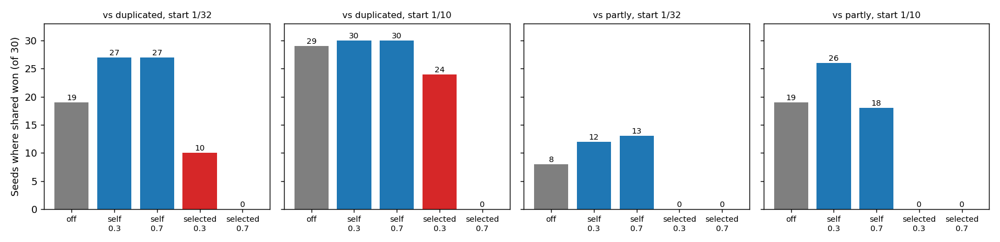
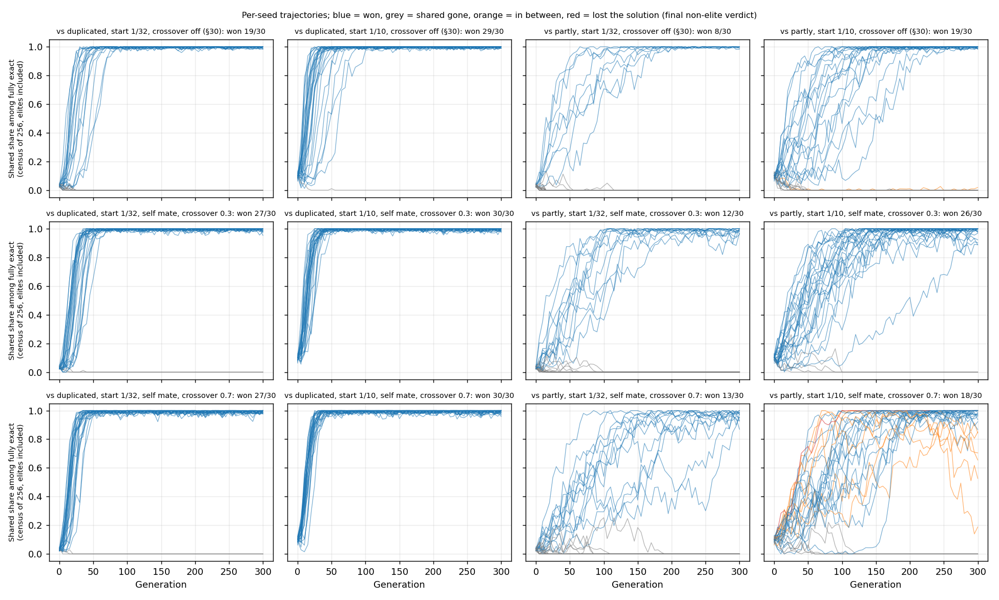

# Analysis: self-mate establishment contest and self-crossover census

Reviewer analysis, written before opening `plan.md`. Code and data: commit `f2e4048`,
`git_dirty: false` for both queue entries. My scripts: `reviewer_analysis.py` (re-derives
every verdict from `final_population.npz`) and `reviewer_final_forms.py` in this folder.

## Data completeness

- **Contest: 240 / 240 runs present**, 8 cells × seeds 0–29, each seed exactly once per cell,
  no extra run folders. All ran 300 generations, all have `crossover_mate: self`. No failures;
  queue exit 0; empty stderr.
- **Arm wiring checked from the sweep file:** each cell has one shared tape and 31 or 9
  competitor tapes (so 1/32 and 1/10 with `seed_split`), L 64, population 1024, lexicase,
  μ 0.015. The only differences from `s31_dose.yaml` are crossover rate and mate.
- **Verdicts reproduce:** my re-classification of the 240 final populations agrees with
  `readouts.json` in 240 / 240 runs (outcome and number of exact non-elites).
- **The reference rows are valid comparisons.** I re-classified the historical runs of the
  same cells (crossover off from §30; selected mate at 0.3 from §31 D and 0.7 from §30) with
  the same rule and got the proposal's numbers (19/29/8/19; 10/24/0/0; 0 everywhere at 0.7).
  I also re-ran two historical configs (off and selected 0.3, seed 0) at the current commit:
  the final populations are byte-identical to the stored ones. So the old rows are what this
  code would produce today. They share seeds with the new runs, so the arms start from the
  same shuffled population; they are not independent samples of starts.
- **Census: 3 forms × 10,000 children, complete.** One RNG seed (0). I repeated it with seeds
  1–3 (below); nothing changes.
- One reporting detail: `selected wins/30` in `readouts.md` shows 0 for cells missing from a
  lookup table. The zeros are correct here (checked against the raw runs), but they are a
  default, not a lookup.

## Key numbers

### Final verdicts (shared wins of 30; §31 rule: ≥ 20 exact non-elites, > 90% shared)

| contest | start | crossover off | self 0.3 | self 0.7 | selected 0.3 | selected 0.7 |
|---|---|---|---|---|---|---|
| vs duplicated | 1/32 | 19 | **27** | **27** | 10 | 0 |
| vs duplicated | 1/10 | 29 | **30** | **30** | 24 | 0 |
| vs partly | 1/32 | 8 | **12** | **13** | 0 | 0 |
| vs partly | 1/10 | 19 | **26** | **18** | 0 | 0 |

- Total: self-mate 183 / 240 wins; crossover off 75 / 120; selected mate 34 / 240.
- Non-wins under self-mate: 50 "shared gone", 6 "in between", 1 "lost the solution". The
  last seven are all in one cell (vs partly, 1/10, crossover 0.7).
- Self-mate vs selected mate at the same rate: every one of the 8 cells is far apart
  (smallest gap: 30 vs 24 of 30; the rest are ≥ 12 wins apart, six of them against 0).
- Self-mate vs crossover off (Fisher, two-sided, per cell of 30 vs 30): vs duplicated 1/32
  p = 0.03 at each rate; vs partly 1/10 at 0.3 p = 0.07; the other five p ≥ 0.28. In no cell
  is self-mate below crossover off by more than one win (18 vs 19).

### Early shared share (mean over 30 seeds, among fully exact, census of 256)

| contest | start | arm | gen 0 | gen 5 | gen 10 | gen 20 |
|---|---|---|---|---|---|---|
| vs duplicated | 1/10 | off | 0.099 | 0.148 | 0.286 | 0.575 |
| | | self 0.3 / 0.7 | 0.099 | 0.162 / 0.153 | 0.350 / 0.351 | 0.742 / 0.772 |
| | | selected 0.3 / 0.7 | 0.099 | 0.075 / 0.022 | 0.134 / 0.014 | 0.289 / 0.004 |
| vs partly | 1/10 | off | 0.099 | 0.102 | 0.123 | 0.169 |
| | | self 0.3 / 0.7 | 0.099 | 0.105 / 0.117 | 0.136 / 0.125 | 0.213 / 0.193 |
| | | selected 0.3 / 0.7 | 0.099 | 0.048 / 0.018 | 0.023 / 0.001 | 0.020 / 0.001 |
| vs duplicated | 1/32 | off | 0.032 | 0.044 | 0.089 | 0.270 |
| | | self 0.3 / 0.7 | 0.032 | 0.044 / 0.070 | 0.125 / 0.189 | 0.387 / 0.553 |
| | | selected 0.3 / 0.7 | 0.032 | 0.025 / 0.002 | 0.028 / 0.002 | 0.043 / 0.000 |
| vs partly | 1/32 | off | 0.032 | 0.026 | 0.047 | 0.080 |
| | | self 0.3 / 0.7 | 0.032 | 0.045 / 0.041 | 0.058 / 0.053 | 0.094 / 0.069 |
| | | selected 0.3 / 0.7 | 0.032 | 0.013 / 0.004 | 0.006 / 0.000 | 0.002 / 0.000 |

- Under self-mate the shared share does not fall in the first 5 generations in any cell.
  Under a selected mate it halves (0.3) or drops five-fold or more (0.7) by generation 5.
- Self-mate tracks crossover off closely and is never behind it at generations 5–20.
- `readouts/trajectories.png` plots a different quantity (shared as a fraction of the whole
  sample, exact or not). It plateaus near 0.4 because only about 35–40% of any population is
  fully exact, in every arm. Read it with that in mind; my plot conditions on exactness.

### Per-seed trajectories

- Time for winners to pass 90% (census): vs duplicated, median generation 25–35 under
  self-mate and 30–40 with crossover off; vs partly, 100–150 and about 100–115.
- Mutational load: median exact non-elites at the end are about 445 of 1022 with crossover
  off, 410 at self 0.3, 365 at self 0.7 (selected mate: 400 and 345). Self-crossover costs
  exactness at about the same rate as selected-mate crossover.

### Census (one v2 self-crossover, no mutation; children of 10,000)

| parent | exact, same form | broken | other form | byte clones |
|---|---|---|---|---|
| shared | 7961 | 2039 | 0 | 5830 |
| partly | 8143 | 1857 | 0 | 6277 |
| duplicated | 8121 | 1879 | 0 | 6281 |

- Repeats with RNG seeds 1–3 (mine): shared broken 1976, 2006, 1984; partly 1940, 1931, 1872;
  duplicated 1835, 1881, 1881. Over the four seeds: shared 20.0%, partly 19.0%, duplicated
  18.7% broken.
- So the shared form breaks about 1 percentage point more often per self-crossover. The
  difference comes from fewer clones (shared has 4 runs, the others 3), not from changed
  children failing more: among non-clone children about half are broken for every form
  (49% / 50% / 51%).
- **No self-crossover child changed form** (0 of 30,000 here, 0 of 90,000 in my repeats). A
  child is either its parent's form or broken.

## What the data shows

1. **With self as the mate, crossover at 0.3 or 0.7 does not remove a rare shared form.**
   Shared wins 183 / 240, against 34 / 240 with a selected mate in the same cells and seeds.
   The gap is large in every cell and does not rest on any single one.
2. **Self-mate establishment is at least at the crossover-off level.** No cell is meaningfully
   below crossover off. This holds at both rates, both starts and both competitors.
3. **The early loss seen with a selected mate is absent.** Shared share rises from generation
   0 under self-mate, as it does with crossover off.
4. **The census gives the shared form a small extra fragility** (about 20% vs 19% broken per
   self-crossover), and it does not show up as a contest disadvantage.

## What the data does not show

- **"Self-mating helps the shared form" is unclear, not a finding.** Self-mate has more wins
  than crossover off in 7 of 8 cells, and vs duplicated from 1/32 it is 27 and 27 vs 19. But:
  the two rates are not independent replicates (same seeds, and 24 of the 27 winners are the
  same seeds), the comparison was one of four cells, and seed-paired counts are 10 self-only
  vs 2 off-only wins (sign test p ≈ 0.04). A real effect of about +8 of 30 is possible; so is
  no effect. The census offers no mechanism for it (shared is slightly more fragile, not
  less).
- **Rate 0.7 vs partly from 1/10 is the one soft spot.** 18 wins against 26 at 0.3, and all 6
  "in between" runs and the one lost solution are here.
  - In 5 of the 6 in-between runs the sampled shared share had reached ≥ 0.95 (by generation
    70–210) and then fell back; final non-elite shared shares are 0.85, 0.83, 0.70, 0.66,
    0.54 and one at 0.20 (seed 2, still falling).
  - So this is not slow establishment that 300 generations cut short. A partly shared form
    came back after shared was near fixation. In all six the slot-0 elite is the partly
    seed tape, which is never replaced, so a source of partly copies always exists. Whether
    the returning partly forms descend from that elite or from shared individuals cannot be
    told without lineage. This does not happen at 0.3 (0 of 30) or with crossover off.
  - Seed 9 kept only shared exact individuals but fell to 17 exact non-elites (lost the
    solution, 4 of 256 exact in the last census).
  - Counted strictly, 18/30 here is still equal to crossover off (19/30). But "shared stays
    once it is the majority" is not fully supported under self-mate 0.7 against partly.
- **The seeded duplicated form never wins, in any arm.** In all 6 self-mate "shared gone"
  runs of the vs-duplicated contest the final population is partly shared (296–387 exact
  non-elites partly, 0–17 duplicated). The same holds in the historical rows: every
  "gone" run vs duplicated, off or selected, ends with a partly-shared majority (1 + 11 off,
  6 + 20 at selected 0.3, all 57 at selected 0.7 plus 3 in between). Partly shared was not
  seeded in that contest, so it arises during the run. "Shared lost to duplicated" would be
  the wrong reading of those rows; the loser is replaced by a third form.
  - Under self-mate there are no hybrids and the census shows no one-step conversion, so
    these partly forms need mutation (alone or with rearrangement). Their origin (from shared
    or from duplicated) is not measured.
- **Nothing here is about arrival.** These are seeded contests with hand-built tapes at 1/32
  and 1/10. The runs say what happens to a shared form that is already present in 32–102
  copies, not whether it appears, and not what happens to a single copy.
- **One form of each kind, one length, one task.** The census in particular is about three
  specific hand-built genomes; evolved shared forms may have different run layouts.
- **The census does not explain the contest by itself.** It measures one rearrangement of the
  founder genome with no mutation and no selection. It rules out "self-crossover turns shared
  into something else" and "shared is much more fragile"; it does not measure the fitness
  cost of the 1-point fragility difference.
- **Mechanism.** The data are consistent with the hybrid account (the loss needs a mate from
  another lineage). They do not show what in the selected-mate child does the damage; that
  rests on §30 / §32 K.

## Shortcut check

- The verdict excludes the two elites, so a win cannot come from a protected founder. In the
  1/10 cells 4 of 30 seeds have shared in elite slot 0; those are 4/4, 4/4, 4/4 and 3/4 wins,
  and removing them leaves 26/26, 26/26, 22/26 and 15/26 — the same picture.
- Winning runs hold 350–420 exact shared non-elites, not a thin margin over the 20 threshold.
- `crossover_mate: self` is read at one place (`evolve._mate`) and passes the parent itself
  to the same `tagged.crossover(..., 'v2')` the census calls; the census's 58–63% byte clones
  fit what that operator does with identical parents.

## Against the predictions

Read `plan.md` after writing everything above. Its pre-data table has three rows
(strong / weak / partial rescue) and two columns (census damage to shared exceeds
competitors, or not).

**Row: strong rescue — met in all 8 cells.** The plan's exact two-thirds ceilings are 13 and
20 wins vs duplicated (1/32, 1/10) and 6 and 13 vs partly.

| contest | start | threshold | self 0.3 | self 0.7 | met |
|---|---|---|---|---|---|
| vs duplicated | 1/32 | 13 | 27 | 27 | yes |
| vs duplicated | 1/10 | 20 (proposal: 19) | 30 | 30 | yes |
| vs partly | 1/32 | 6 | 12 | 13 | yes |
| vs partly | 1/10 | 13 (proposal: 12) | 26 | 18 | yes |

No cell is near a boundary, so the proposal-vs-plan one-win difference does not matter. The
closest is vs partly, 1/10, at 0.7: 18 against 13. This is the proposal's outcome **A**. The
"weak" row (partly wins 0–3, duplicated at 0.7 far below off) is clearly not what happened,
and nothing is partial across competitor, rarity or rate, so not C.

**Column: between the two, closer to "no excess".** Shared breaks in 20.0% of
self-crossovers against 19.0% and 18.7% (four RNG seeds pooled; with seed 0 alone, 20.4% vs
18.6% and 18.8%). The excess is real in the pooled counts but is about one percentage point,
comes from shared having one more run (fewer clones), and there is no form conversion at all.
Both cells of the strong-rescue row read the same way on the main question: **the
mixing-dependent barrier is supported for these layouts, and seeded establishment is
compatible with self-mate crossover at 0.3 and 0.7.** The left cell's addition,
"rearrangement damage exists but does not prevent establishment in these cells", is also an
accurate description.

**The plan's early/late reading:** early persistence plus final wins — the plan's "retention"
case. There is no early decline in any cell.

**Checks the plan asked for.**
- "Too-clean success triggers operator/config/seed checks": two cells are 30/30. I checked
  config (all 240 runs have `crossover_mate: self` and the stated rates), seeds (0–29 once
  each), and that self-crossover is not a no-op: 37–42% of census children differ from the
  parent and about 19–20% are broken, and exact non-elites fall from about 445 (off) to 410
  and 365 as the self-mate rate rises. Crossover is being applied.
- "Persistent/increasing mixed populations at generation 300 are unresolved": the 6
  in-between runs are not rising. Five had reached ≥ 0.95 shared and fell back; one is at
  0.20 and falling. Under the plan's wording they stay unresolved rather than failures, but
  they point the other way from "would have won with more time". They are the one place
  where the plan's expectations did not anticipate the data: a late partial reversal at
  self 0.7 against partly.
- "No statistical significance tests": the Fisher and sign-test p-values above are mine, as
  descriptions of how far apart counts are. The A/B/C reading does not use them.

**What the predictions did not cover.**
- Self-mate ending above crossover off (7 of 8 cells; 27 vs 19 vs duplicated from 1/32).
  Neither the proposal nor the plan predicted it. Unclear, as argued above; I would not build
  on it without fresh seeds.
- In the vs-duplicated contest, runs where shared disappears end partly shared, never
  duplicated, in every arm including the historical ones. This does not change the A verdict
  (the count is of shared wins), but summaries should not say the shared form "lost to
  duplicated".

**Limits that stand, in agreement with the plan.** These are seeded contests with 32 or about
102 hand-built copies at L 64 on one task. They support "a shared form that is already
present at 3–10% is kept and usually wins under self-mate crossover". They say nothing about
arrival or about a single new copy, and the census speaks only for the three hand-built
layouts.
