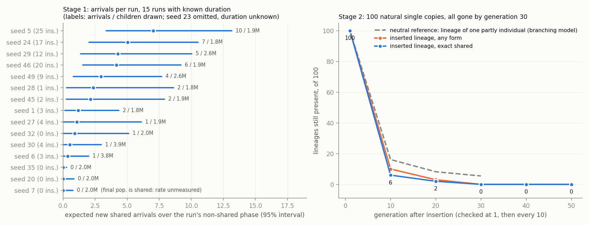

# Analysis — shared arrival (run 2026-10-04-2135)

Data: `experiments/output/2026-10-04/2026-10-04-2135-shared-arrival/` (commit `f418c91`, clean
tree, exit 0, 8416 s). Written before opening `plan.md`; the last section was added after.

**Short version.** Established partly populations do produce exact shared children: about
2 per run over the non-shared phase (per-run estimates 0–7). All 100 natural single copies put
back into their own populations were gone within 30 generations. So neither "they never
arrive" nor "they arrive in large numbers" holds; arrivals are few and each one is lost.
Two things limit what this supports: 100 insertions cannot separate "worse than neutral" from
"neutral drift" for establishment (a neutral single copy among ~400 would establish about
0.25% of the time), and every arrival seen is a different helper type (A-only / other) from the
B-helper form that actually took over in the two historical shared runs.

## 1. Data completeness

- **Stage 1 census:** 50 of 50 source populations (seeds 0–49, no duplicates), every one with
  draws: 1,727–5,247 frozen generations each, 173,692,988 children in total. Stopped on the
  target (30,002,899 children of partly parents) after 5,602 s, not on the wall cap.
  - Of those, 29,877,230 partly-parent children are in the 16 target populations; the other
    125,669 are in seed 16, which is not a target (10 exact individuals at the end).
  - Children per population are uneven (1.76M–5.36M) because workers ran at different speeds.
    Rates are per population, so this does not bias them.
- **Target set:** 16 populations, matching the proposal (14 partly-first, 1 duplicated-first,
  plus seed 23). Two of them are not fully usable:
  - **Seed 7 (`017735…`)**, the run with the historical replacement: its final population is
    99.8% shared, so the census there drew only 9,346 partly-parent children. Its "0 expected
    arrivals" in `report.md` is not a measurement of its non-shared phase.
  - **Seed 23 (`93f5c0…`)**: the saved history never reaches the ">90% of ≥20 exact" rule, so
    its duration is unknown. It has a rate but no expected-arrival figure and received no
    insertions.
- **Stage 2:** 100 of 100 insertion trials present, 100 distinct continuation seeds, each with
  its matched control, all run to generation 500 (52 checkpoints each). No failures. Not
  extended to 300 (see §3).
  - Trials come from 11 populations, sampled in proportion to expected arrivals: seed 5 has
    25, seed 46 has 20, seed 24 has 17, seed 29 has 12, the rest ≤ 9. Seed 32 (1 arrival) was
    eligible but drew none.
  - 37 distinct child genotypes were inserted (76 trials A-only, 24 "other").
- **Mid-phase side check: effectively missing.** The 600 s budget covered 2 exact replays
  (seeds 27 and 28; history, both censuses and the final population all matched). The third
  hit the time cap at generation 860, and it was seed 16, a non-target. Each verified
  mid-phase population got 32,704 children and 0 arrivals, which bounds the rate at
  ≤ 1.1e-4. The final-population rates are around 1e-6, so this says nothing about
  representativeness. The run correctly labels its scope "final populations only".

## 2. Stage 1: how often exact shared children arrive

**Arrivals.** 150 new shared children in total; 56 in target populations, all from partly
parents.

| group | arrivals | children drawn | rate per child |
|---|---|---|---|
| 15 target populations ending non-shared | 56 | 36,107,260 | 1.6e-6 |
| of which seed 23 (duration unknown) | 14 | 4,431,392 | 3.2e-6 |
| seed 7 (ends shared) | 0 | 1,976,548 (9,346 from partly) | unmeasured |
| seed 13 (non-target, shortcut-dominated) | 94 | 4,553,010 | 2.1e-5 |
| other 33 non-target populations | 0 | 131,056,170 | — |

- **Per population:** 12 of the 15 non-shared target populations had at least one arrival.
  Rates run from 0 (seeds 20 and 35, upper bound 1.9e-6) to 5.3e-6 (seed 5). The spread is
  real: seed 5 (10 in 1.9M) against seed 6 (1 in 3.8M) is not sampling noise.
- **Expected arrivals over each run's non-shared phase** (rate × historical duration × 1022):
  32.0 in total across the 15 runs with a known duration, on 21,257,600 offspring of exposure.
  - That is 2.0 per run if divided by 16 as the report does, or 2.3 per run over the 14 runs
    where both rate and duration are measured.
  - Per run: 9 runs at ≥ 1 (highest 7.0, interval 3.4–13.2), 3 runs between 0.3 and 0.9,
    2 runs at 0 with short non-shared phases (100 and 340 generations).
  - The report's joint envelope is 0.34–9.2 per run.
- **Not single-step mutants only.** Parent-to-child distances range from 1 to 121 of 128
  positions; roughly half the target arrivals differ at more than 10 positions, so
  self-crossover produces many of them. 56 arrivals came from 36 distinct parent individuals.
- **Helper type:** 44 A-only, 12 "other", **0 B-helper** among the 56 target arrivals. The two
  historical shared populations (seed 7 after its replacement, and seed 18) are entirely
  B-helper. Zero B-helper arrivals in 29.9M partly-parent children bounds that rate at
  ≤ 1.2e-7 per child, or ≤ about 2.6 B-helper arrivals across all 16 runs' history.
- **Seed 13 (off-target, noted because it stands out).** It reached >90% shared around
  generation 1360 by the script's rule and then lost it; the final population has 370
  training-perfect-but-not-exact individuals and 4 shared. Its 94 arrivals are A-only children
  of those shortcut parents. This run is outside the proposal's cohort description ("1 run
  establishes shared first") and contributes nothing to E.

## 3. Stage 2: what happens to a natural single copy

- **Outcome at generation 500: 0 of 100 established, 100 extinct, 0 unresolved.**
  Establishment probability 0%, 95% upper bound 3.6%.
- **Loss is fast.** Every inserted copy was present at generation 1. Exact shared descendants
  were still present in 6 of 100 trials at generation 10, 2 at generation 20, none at 30.
  Descendants of any form: 10, 3 and 0. The largest lineage ever seen was 6 shared individuals
  (32 descendants of any form). Loss times are known only to the 10-generation checkpoint.
- **Controls: 99 extinct, 1 unresolved.** The unresolved one (seed 45) has a single
  spontaneous shared individual at generation 500. No arm of any trial ever exceeded 3.6%
  shared among exact individuals.
- **Spontaneous arrivals are visible in the controls.** 35 of 100 controls show shared
  individuals at some checkpoint (39 separate episodes, at most 8 individuals), and all
  vanish. Insert arms after generation 1 look the same (39 of 100). This is in-situ evidence
  that arrivals keep happening in running populations and keep being lost. It is a lower
  bound, since populations were only checked every 10 generations.
- **Why it stopped at 100.** The stop rule saw E ≈ 2 per run, which is neither "≤ 1" nor
  "≥ 10", so it stopped after the first stage. That follows the proposal as written.

**A neutral reference (my calculation, not in the run).** Lexicase treats every
training-perfect individual alike, so a lone copy has no selective edge or handicap from
selection itself; what differs is how often its children keep the form. From the saved
offspring files, a partly individual leaves on average 1.0 same-form child per generation
(0.92–1.01 across the six populations that hold 87 of the trials). A lineage with those
offspring numbers would still be present in about 16% of cases at generation 10 and 5.5% at
generation 30.
- Observed: 6 of 100 shared lineages at generation 10 and 0 of 100 at generation 30.
- Against the reference these are low (binomial p ≈ 0.002 and 0.004), so newborn shared
  copies look somewhat less heritable than the resident partly form.
- Treat this as suggestive. The reference is a branching model fitted to frozen final
  populations, and the any-form count at generation 10 (10 of 100) is not clearly below it.
- Long-run neutral establishment would be about 1 in 400 (0.25%). With 100 trials, 0
  successes is what both "neutral" and "disadvantaged" predict.

## 4. What the data shows

1. **Shared children do arrive in established partly populations, at a low rate.** About
   1.6e-6 per child in final populations, which extrapolates to roughly 2 per run over the
   non-shared phase and about 32 across the cohort.
2. **A natural single copy does not establish.** 0 of 100 (≤ 3.6%), all lost within 30
   generations, with the same transient pattern in untouched controls.
3. **The two factors together are consistent with the one observed replacement, without
   explaining it.** With about 32 arrivals and p ≤ 3.6%, the expected number of replacements
   is at most about 1.2 across the cohort; 1 was observed. If p is near the neutral 0.25% the
   expectation is about 0.08, and one event is then mildly surprising (about 8%). The proposal
   already said this product is only a consistency check.
4. **The arriving forms are not the form that won.** All measured arrivals are A-only or
   "other"; both historical shared populations are B-helper.

## 5. What the data does not show

- **Not which factor is "the" bottleneck in the proposal's terms.** E ≈ 2 per run is above
  the arrival-limited threshold (≲ 1) and well below the fixation-limited one (≳ 10). p is
  bounded at 3.6%, not at the 1% the proposal wanted for "fixation-limited", because stage 2
  stopped at 100.
- **Not that shared copies are selected against.** Fast loss of a single copy is what drift
  does. The comparison with the neutral reference hints at lower heritability but rests on a
  model.
- **Nothing about B-helper copies.** None arrived, so their establishment probability is
  unmeasured. A reading that fits everything here is: A-only copies arrive a few times per run
  and die, while the B-helper form almost never arrives (≤ ~2.6 times in the cohort's history)
  and is the one that takes over when it does. This is a hypothesis; the run has no
  B-helper insertion to test it.
- **Nothing about the run that actually switched.** Seed 7's partly phase was not sampled.
- **Whether final populations stand for the whole established phase.** The side check has no
  power, so every "per run" figure is an extrapolation from generation 3000.
- **Seed 23** has the second-highest rate among targets (14 arrivals, all from 3 parent
  genotypes among 34 partly individuals) and is excluded from E and from stage 2. Including
  it could only raise E.
- **First discovery** is outside the design, as the proposal states.
- **Scope:** one task, one cell (L 64, self-mate, crossover 0.3), 100 insertions concentrated
  in five populations (86 of 100 trials).

## 6. Checks on the measurement

- The census reuses the engine's reproduction step with per-case results recomputed for the
  frozen population, and counts all children, with parents taken from the engine's own
  lineage rows. Arrival counts in `census.json`, `arrivals.jsonl` and the report agree
  (150 / 56 target).
- The insert and control arms share a continuation seed and differ only by the replaced slot;
  the inserted copy is confirmed present and exact shared at generation 1 in all 100 trials,
  and no control has a shared individual at generation 1.
- Two display issues in `report.md`, neither affecting the numbers above: seed 7 is printed
  with "expected arrivals 0.0" although its rate is unmeasured, and the per-run figure 2.0
  divides the 15-run total by 16.
- No shortcut found: arrivals pass the full 10,000-case exactness check before being counted,
  and "established" requires at least 20 exact individuals.

## Against the predictions

`plan.md` made no directional prediction ("both explanations remain live") and set an advisory
grid of E per run against p.

- **Grid cell.** E is in the 1–10 row: 2.0 per run by the plan's own formula (sum of E_k over
  16; the amendment says a missing duration prevents a whole-cohort point estimate, so this is
  the known-exposure figure), with the joint envelope 0.34–9.2. The envelope's lower end
  reaches into the ≤ 1 row, and seed 23 could only push E up.
  p is 0 of 100 with an upper bound of 3.6%. That is not "substantial" and not
  "unmeasured / persistent-submajority" (no trial was unresolved). It sits between the "low"
  and "intermediate" columns: the bound rules out p ≥ 10% but does not get below 1%.
  Both candidate cells read the same way: **"both may limit"**, and INCONCLUSIVE if the bounds
  are broad. They are broad on the p side.
- **Stop rule: followed.** Intermediate exposure stops at 100 and "remains unresolved as
  appropriate"; the amendment also says a missing duration blocks a low-arrival stop. The run
  did exactly this.
- **Source-aligned product.** E_k × p_k is 0 for all 11 populations with trials, because every
  p_k is 0. Only seeds 5 and 46 have ≥ 20 trials; the plan labels the other nine as
  hypothesis-generating. The useful form is the bound: about 32 arrivals × ≤ 3.6% gives at most
  about 1.2 replacements against 1 observed. That is within 10×, so the ">10× inconsistency"
  blocker does not fire. It also does not confirm anything, since p could be far lower.
- **Blockers named in the plan:**
  - *Zero arrivals with loose bounds:* does not apply; arrivals were found in 12 populations.
  - *Concentrated arrivals without source coverage:* partly applies. Arrivals are spread over
    12 populations, but 86 of 100 trials sit in five of them, seed 7 (the run that switched)
    and seed 23 have no usable E or p, and seed 32 had an arrival but no trial.
  - *Material mid/final disagreement:* cannot be assessed. Two of five replays verified, each
    with too few draws to detect a rate near 1e-6. Under the plan this restricts conclusions to
    final populations, which the report does.
- **Degenerate-success guards: all hold.** Shared-parent copies are excluded (0 arrivals
  counted from shared parents in 3.8M such children), shortcuts are a separate class,
  descendant and total shared shares are reported separately, and independent arrivals in
  controls never reached the 50% / 20-exact verdict.
- **Not anticipated by the plan:**
  - The helper-type mismatch (0 B-helper among target arrivals, B-helper in both historical
    shared populations). The grid treats "shared arrival" as one thing; the data suggests the
    measured p belongs to A-only / other copies only.
  - Controls showing spontaneous transient shared individuals in 35 of 100 continuations,
    which supports the arrival estimate in running populations independently of the frozen
    census.
  - Seed 13, a population that had been mostly shared and ended shortcut-dominated.
- **Reading for the decision rule.** The cell is "both may limit" with broad bounds, which the
  plan counts as unresolved rather than a closed mechanism. What can be stated with the scope
  tag (one task, L 64, self-mate, 0.3, final populations): exact shared children arrive about
  twice per run and a natural single copy establishes in fewer than 3.6% of cases. Calling the
  line arrival-limited or fixation-limited would go beyond the data.
