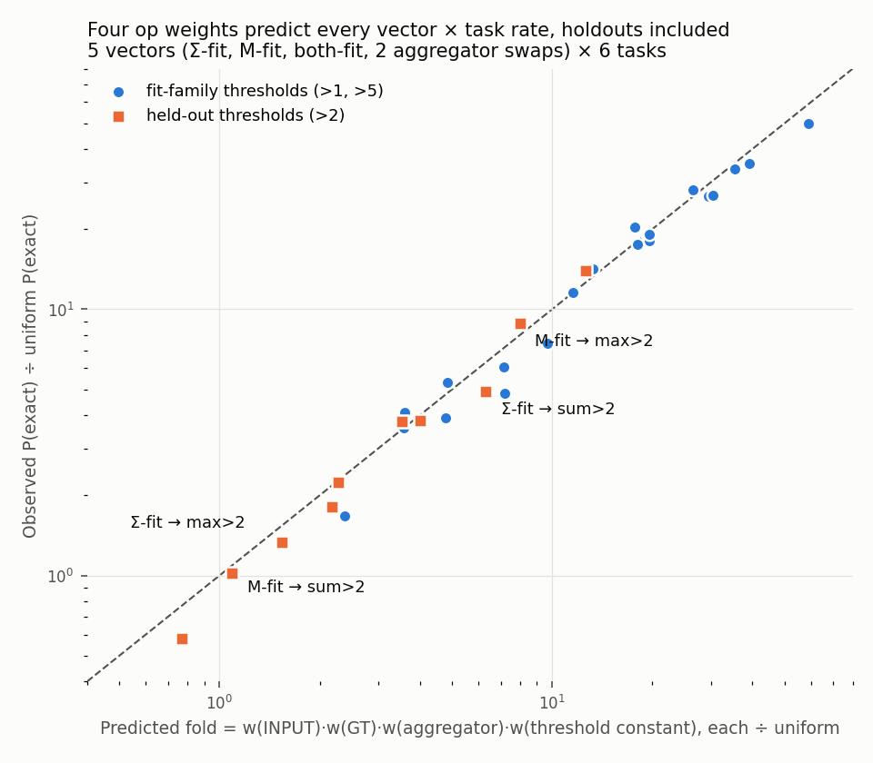

# Analysis — 2026-10-05-1558 family-bias (sum vs max, constant thresholds)

Reviewer analysis of `experiments/output/2026-10-05/2026-10-05-1558-family-bias/`
(commit `cd69bce`, clean tree, master seed 202610051558). Written before opening plan.md.

**Short version.** The run is complete and the pre-registered verdict is **A**: both
matched fits raise P(exact) on their held-out threshold by more than 3×, against both
uniform and the other family's fit, with adjusted lower bounds of 3.4–5.2. The numbers are
solid. What they mean is narrower than "family-specific information": every rate in the run,
holdouts included, is reproduced to within 1.5× by multiplying four op weights
(INPUT, GT, the aggregator, the threshold constant). The transferable family-specific part
is the aggregator weight; the fits also pushed CONST_2 down to 0.37× and that cost the
holdouts about 2.7× of the gain they would otherwise have had.

## 1. Data completeness

| Check | Result |
|---|---|
| Queue entries | 1 of 1 done, exit 0, 2309 s wall (limit 10800 s), `stderr.log` empty, `COMPLETE` present |
| Expected outputs | result.json, progress.jsonl, report.md, diagnostics.png, COMPLETE all present |
| Pools | 72 pools, 78 named seed streams, no duplicate names, no duplicate entropy, requested = completed for every stream, none marked `budget_truncated` |
| Runtime scaling | scale 1.0 throughout; `transfer_budget_cut` = False, so no comparison was forced to U |
| Task eligibility | all six gate tasks eligible on 200M uniform (122–288 hits each); no substitution |
| Fits | Σ: 3 of 3 starts updated and validated. M: **1 of 3** (start 0 only). Both: 2 of 3 |
| Transfer | 4 decisive arms × 125M tapes (look 1 of 4), then stopped by rule because no decisive class was U |
| Descriptive pools | both-fit, sum_swap, max_swap at 10M each, all complete |

Two things to know about the shape of the data:

- **The transfer stopped at look 1.** Each decisive arm has 125M tapes, not 500M. This is the
  pre-registered stopping rule and the bounds already use the four-look correction
  (α = 0.05/64 per rate bound), so it is legitimate; it just means the cap was never tested.
- **The M fit rests on one trajectory.** Cold starts 1 and 2 never collected 10 exact elites
  for either max task (0–7 hits per 10M pool), so their weights never moved from the random
  initial vector and they failed validation (0.26× and 0.98–1.3× uniform). Only start 0,
  seeded from the 200M calibration elites, produced a fit. The same happened to start 1 of
  the both-fit. Σ cold starts worked because sum tasks are about twice as frequent.

One master seed, one run. Nothing was repeated with another seed.

## 2. Key numbers

Decisive transfer, look 1, 125M tapes per arm. Hits are tapes exact on all 10,000 inputs.

| Arm | sum>1 | sum>5 | **sum>2** (holdout) | max>1 | max>5 | **max>2** (holdout) |
|---|---:|---:|---:|---:|---:|---:|
| uniform | 193 | 139 | **173** | 96 | 79 | **69** |
| Σ-fit (start 1) | 3484 | 3710 | **852** | 376 | 479 | **92** |
| M-fit (start 0) | 793 | 741 | **176** | 2697 | 2663 | **612** |
| prune (ops 0, 12, 13 floored) | 253 | 212 | **161** | 112 | 84 | **86** |

Verdict comparisons on the holdouts (adjusted bounds, four looks):

| Family | Axis | Hits | Ratio | Adjusted interval | Class |
|---|---|---|---:|---|---|
| Σ | specificity (Σ-fit / M-fit on sum>2) | 852 / 176 | 4.84 | 3.36 – 7.08 | G |
| Σ | gain (Σ-fit / uniform on sum>2) | 852 / 173 | 4.92 | 3.42 – 7.22 | G |
| Σ | beyond pruning | 852 / 161 | 5.29 | 3.72 – 7.66 | G |
| M | specificity (M-fit / Σ-fit on max>2) | 612 / 92 | 6.65 | 4.13 – 11.08 | G |
| M | gain (M-fit / uniform on max>2) | 612 / 69 | 8.87 | 5.24 – 15.73 | G |
| M | beyond pruning | 612 / 86 | 7.12 | 4.49 – 11.64 | G |

I recomputed the ratios from the raw counts; they match report.md. All six lower bounds are
above 3, not just above 1, so the classification does not hinge on the correction used.

Supporting numbers:

- **Fit tasks gained far more than the holdouts.** Against the fresh transfer uniform pool:
  Σ-fit gives sum>1 18.1× (3484/193) and sum>5 26.7× (3710/139); M-fit gives max>1 28.1×
  (2697/96) and max>5 33.7× (2663/79). The holdouts got 4.9× and 8.9×, roughly a quarter.
- **Mismatched fits do nothing for the other family's holdout.** M-fit on sum>2: 176 vs 173
  uniform (1.02×). Σ-fit on max>2: 92 vs 69 (1.33×). The same mismatched fits do raise the
  other family's *fit* thresholds 3.9–6.1× (e.g. M-fit on sum>5: 741/139).
- **CONST_2 was suppressed** to 0.37× uniform by the Σ-fit and 0.36× by the M-fit (0.24× by
  the both-fit), while CONST_1 sits at 1.15–1.21× and CONST_5 at 1.62–1.72×.
- **Σ holdout transfer repeats across starts** in the independent 5M validation pools: sum>2
  hits of 37, 32 and 37 for starts 0, 1, 2 (6.4–7.4e-6, versus 6.8e-6 in the transfer pool).
  For M only start 0 exists: 28/5M (5.6e-6, versus 4.9e-6 in transfer).
- **Pruning alone does nothing**: 0.93× on sum>2 and 1.25× on max>2.
- **Uniform is stable** between calibration (200M) and transfer (125M): sum>2 1.23e-6 vs
  1.38e-6, max>2 6.4e-7 vs 5.5e-7. The largest gap is sum>5, 1.35e-6 vs 1.11e-6.

Descriptive pools (10M each, never part of the verdict):

| Vector | sum>2 | max>2 | Reading |
|---|---|---|---|
| both-fit | 31 (2.2×) | 21 (3.8×) | lower than either matched fit on its own holdout |
| Σ-fit with aggregator mass swapped | 8 (0.58×) | 77 (13.9×) | the Σ vector becomes a *better* max>2 sampler than the M-fit |
| M-fit with aggregator mass swapped | 53 (3.8×) | 10 (1.8×) | the M vector becomes a sum>2 sampler |

Descriptive one-ADD thresholds, hits per 125M (uniform pooled over calibration + transfer is
5, 5, 1, 1 per 325M for sum>6, sum>7, max>3, max>6):

| Arm | sum>6 | sum>7 | max>3 | max>6 |
|---|---:|---:|---:|---:|
| uniform | 2 | 4 | 0 | 1 |
| Σ-fit | 42 | 6 | 4 | 6 |
| M-fit | 12 | 2 | 10 | 19 |

Counts this small only say that the fits do not hurt these tasks and that sum>6 (5+1, both
fitted constants) rose clearly under the Σ-fit. No ratios should be quoted from them.

## 3. What the data shows

1. **Verdict A holds as pre-registered**, on one seed, one holdout per family, at look 1.
2. **The Σ result is replicated across three independent fit starts**; the M result is not
   (one start).
3. **A four-weight product reproduces every measured rate.** Take the fold-vs-uniform weight
   of INPUT, GT, the task's aggregator (mean of SUM and REDUCE_ADD, or REDUCE_MAX) and the
   task's threshold constant, and multiply them. Across 5 vectors × 6 tasks = 30 cells the
   prediction is within 1.5× of the observed fold in every cell (median 1.11×, log
   correlation 0.99), holdouts and aggregator swaps included.

   

   | Vector → task | Observed | Predicted |
   |---|---:|---:|
   | Σ-fit → sum>2 | 4.92 | 6.32 |
   | M-fit → max>2 | 8.87 | 8.00 |
   | M-fit → sum>2 | 1.02 | 1.09 |
   | Σ-fit → max>2 | 1.33 | 1.54 |
   | Σ-swap → max>2 | 13.95 | 12.64 |

   This is a zero-parameter description, but I chose the four ops after seeing the data, and
   all 30 cells share one uniform denominator, so treat it as a strong regularity rather
   than a tested model. Op identities: SUM 5, GT 8, REDUCE_ADD 11, CONST_5 16, REDUCE_MAX 18
   are named in repo code; CONST_2 = 15 is taken from the experiment's own report line;
   INPUT = 1 and CONST_1 = 3 are my inference from the knockout table (op 1 breaks every
   solver; op 3 breaks 252/288 sum>1 and 131/155 max>1 solvers).
4. **The specificity ratio is the aggregator-weight ratio.** Σ: 1.85 / 0.39 = 4.7 against an
   observed 4.84. M: 2.84 / 0.45 = 6.3 against 6.65. It is the same on the fit tasks
   (sum>1 4.4, sum>5 5.0; max>1 7.2, max>5 5.6), so the holdout carries no extra
   family signal beyond what the fit tasks already show.
5. **The fits overfit their constants, as the proposal feared, but not enough to reach D.**
   Dividing the holdout gain by the CONST_2 fold gives 13.3× (Σ) and 24.6× (M), in line with
   the fit tasks divided by their own constant folds (15.5–15.7× and 20.8–23.2×). So the
   shared scaffold transfers in full and CONST_2 suppression then removes about 2.7× of it.
6. **No sign of an odd shortcut solver for the holdouts** in the uniform calibration elites:
   all 245 sum>2 solvers execute INPUT, GT and a sum aggregator, and 242 execute CONST_2;
   all 127 max>2 solvers execute INPUT, GT, REDUCE_MAX and CONST_2.

## 4. What the data does not show

- **Nothing about evolution.** Sampling only. A 5–9× lift takes P(exact) from about 1e-6 to
  5–7e-6; whether that changes anything for a search process was not measured.
- **Not that a frequency bias carries family structure beyond one op.** Specificity was close
  to guaranteed by the design: the holdout shares its aggregator with the fit tasks and the
  other family's fit suppresses that aggregator (0.38–0.45×). The outcome that was really
  open was the *gain* axis, i.e. whether CONST_2 suppression would cancel the scaffold gain.
  It did not, at this strength of fit (6 updates, smoothing 0.5).
- **Not that the gain would survive a harder fit.** CONST_2 fell to 0.37× in six half-step
  updates and the floor is 0.05×. A longer or sharper fit could plausibly push the holdout
  gain below 3×; the both-fit (CONST_2 0.24×, aggregators near 1×) already sits at 2.2× on
  sum>2. This was not tested.
- **Not the composition of solvers under the fitted vectors.** Transfer pools did not save
  elites, so point 6 is known for uniform sampling only. The product-model fit suggests the
  same four-cell solvers dominate, but that is indirect.
- **Not seed robustness for M.** One fit trajectory, bootstrapped from calibration elites.
  The validation gate for start 0 also uses that calibration pool as its denominator; the
  fresh-uniform recheck (28× and 34×) removes any worry about the fit itself, but a second
  M trajectory does not exist.
- **Not generality across families or thresholds.** Two families, thresholds that are
  alphabet constants, one holdout each. The one-ADD thresholds are too rare to say anything.
- **The prior about mismatched fits (3–5×) is neither confirmed nor refuted in general.** It
  holds for the other family's fit thresholds (3.9–6.1×) and fails for the holdouts
  (1.0–1.3×), because the generic part of the gain is the constants, and the holdout's
  constant went down.

## 5. Reviewer's reading

Report the verdict as A, and report alongside it that the content of A is "the fit learned
which aggregator the family uses, plus INPUT and GT, and that survives a change of
threshold constant". That is a real transfer of the shared scaffold, but it is a statement
about four independent op weights, which is the most a frequency-only bias can express.
I would not describe it as evidence that the bias encodes family structure in any richer
sense, and I would treat the M side as one observation until a second trajectory exists.

## Against the predictions

Read after the analysis above was written. Sources: proposal.md (prior and outcome meanings)
and plan.md (inference rules and procedure).

**Outcome versus prior.** The proposal's prior was **C** (generic supply; mismatched fits
expected to raise P(exact) 3–5×). The run returned **A**. The prior was wrong on the
verdict but right about the mechanism it worried about, in a split form:

| Prediction | What happened |
|---|---|
| Mismatched fits also raise P(exact) by ≈ 3–5× (so specificity would be N) | True for the other family's *fit* thresholds (3.9–6.1×). False for the holdouts (1.02× and 1.33×), which is where specificity is measured. Specificity came out G in both families (4.84 and 6.65). |
| D-flavoured risk: fits push CONST_1 and CONST_5 up, leave CONST_2 behind, lowering transfer to >2 | Happened. CONST_2 went to 0.36–0.37×, CONST_5 to 1.6–1.7×, CONST_1 to 1.15–1.2×. Holdout gain is about a quarter of the fit-task gain. It was not enough to reach D: gain is G in both families (4.92, lower bound 3.42; 8.87, lower bound 5.24). |
| Expected runtime 1–1.5 h | 38 min, because all four decisive classes resolved at look 1 and the remaining three looks were not needed. Not a runtime cut. |
| 5M probe: sum>1 6 hits, sum>2 7 hits (≈ 1.2–1.4e-6) | Calibration agrees: 1.44e-6 and 1.23e-6. All six gate tasks eligible, no infeasible-task-set exit. |
| ~200 solvers per task for the pruning control | 288, 269, 155, 122. Not under-supported by the plan's ≥ 20 rule. |
| ≥ 10 elites per task in iterations after the first | Held for Σ. Failed for the M cold starts (max tasks expect 6–8 elites per 10M uniform-like pool), which is why M has one usable start. The plan did say "ten expected elites is not a guarantee". |

**Did the run follow the plan's inference rules?** Yes, as far as I can check from code and
output: α = 0.05/64 on decisive bounds and 0.05/32 on beyond-pruning; G = point ≥ 3 and
lower > 1; inconclusive checked before A/C/D; validation at 0.05/4 against calibration;
start selection uses fitting tasks only, never the holdouts; holdout elites never enter a
fit; descriptive tasks appear in no gate; the fitted vectors were re-benchmarked before the
transfer caps were frozen; scale stayed 1.0 so no class was forced to U. Stopping at look 1
is the plan's rule ("early stopping at a resolved scheduled look is not a runtime cut").

**Where the plan's reading of A needs qualifying.** plan.md says A "supports learnable
family-specific frequency transfer on this one threshold split and motivates a subsequent
evolutionary A-versus-B test". The data supports that sentence literally, with three
qualifications that the decision should carry:

1. **What transferred is the aggregator weight.** The aggregator-swap pools the critique
   asked to keep are the most informative diagnostic in the run: moving the Σ vector's
   aggregator mass onto REDUCE_MAX turns it into a max>2 sampler at 13.9× (77/10M), better
   than the M-fit itself, and drops sum>2 to 0.58× (8/10M). Together with the four-weight
   product fit in section 3, "family-specific information" here means one op's frequency.
   The plan did not predict this explicitly, but it is what the swap diagnostic was for.
2. **The specificity axis could hardly have come out N on this design.** Both fits share
   INPUT, GT and the constants and differ in the aggregator, and the holdout shares its
   family's aggregator. The axis that carried real risk was gain, through CONST_2.
3. **The pruning control was weak.** Only ops 0, 12 and 13 were floored; plan.md identifies
   12/13 as NOP slots, and op 0 was never broken by any knockout. So "beyond pruning" is
   close to a second copy of the gain axis (prune vs uniform on the holdouts: 0.93× and
   1.25×) and adds little independent evidence.

**For the next step.** The plan's follow-on is an evolutionary A-versus-B test on the
held-out task. Before spending that, two cheap facts from this run are worth weighing: the
M side has a single fit trajectory, and the bias being carried forward is a four-weight
vector whose effect on a new threshold is predictable from the weights alone. A hand-set
vector (INPUT, GT and one aggregator up, constants left at uniform) would be predicted by
the same product to beat both fitted vectors on the holdouts (roughly 13× and 25× against
the observed 4.9× and 8.9×). That is a prediction from a post-hoc model, not a result, but
it is the natural control arm for any evolutionary test: without it, a win for the fitted
bias would not separate "fitting found something" from "knowing the aggregator helps".
