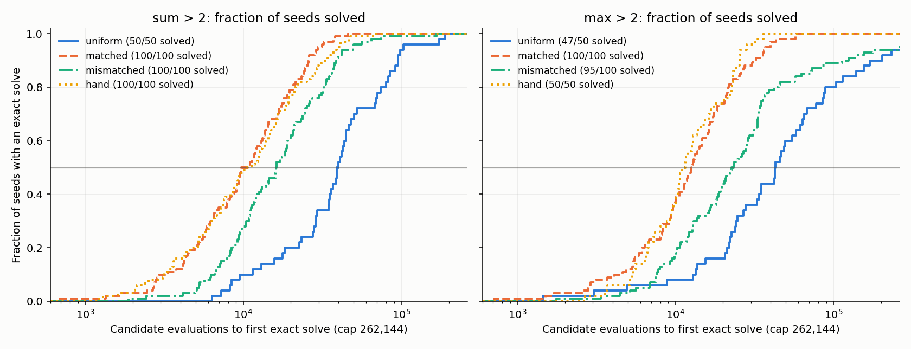

# Analysis: 2026-10-05-1705 evolve-bias

Reviewer analysis, written before opening `plan.md` (the last section was added after).
Data: `experiments/output/2026-10-05/2026-10-05-1705-evolve-bias`, commit `9abc25c`, clean
tree. All numbers below are recomputed from the per-run files in `runs/main/`, not copied from
`report.md`, unless marked.

## Summary

- The data is complete and the harness's six verdicts reproduce.
- **Matched is faster than uniform in both families**: 4.3× on sum>2 and 3.6× on max>2 in
  median evaluations to an exact solve (50 paired seeds each, both resolved at look 1).
- **Matched vs mismatched is unresolved in both families** after 100 seeds: 1.66× and 1.80×.
  The matched vector is probably somewhat faster than the other family's vector, but the
  point estimates are below the 2× threshold and the intervals do not exclude 2×.
- **Hand-set scaffold ≈ matched** in both families (ratios 0.93 and 1.08, intervals inside
  0.5–2).
- The harness labels the outcome **Partial**. That fits the proposal's wording "faster than
  uniform but not [shown faster] than mismatched".
- Not registered, but the most informative number: the **mismatched vector, which has no
  sampling lift, is itself 3.3× (sum>2) and 1.9× (max>2) faster than uniform** on the same
  50 seeds. Most of the matched speed-up is therefore not family-specific and is not
  predicted by exact-solve supply.

## Data completeness

| Check | Result |
|---|---|
| Queue entry | 1 of 1 done, exit 0, 1,197 s wall (budget 28,800 s), `COMPLETE` = `finished` |
| Expected outputs | all 11 present |
| Pilot | 80 of 80 runs complete (2 tasks × uniform/hand × P256/P1024 × 10 seeds), all solved |
| Hand sampling | 125,000,000 of 125,000,000 tapes per vector, both complete |
| Main runs | 650 files, 650 progress lines, no duplicate (task, arm, seed), 0 errors, 0 incomplete |
| Seeds | replicate indices contiguous from 0 in every cell; pilot and main seeds disjoint |
| Pairing | within a task, each seed has one training set and one evolution seed across all arms; 100 distinct training sets per task |
| Arm wiring | every run's `op_weights` equals the frozen vector for its arm |
| Endpoint | `time = gen × 1024 + position + 1` holds for all 642 solves; all 8 censored runs sit at the cap |

Seeds per cell (design: P1024, cap 262,144 for both tasks):

| Cell | Seeds | Why |
|---|---|---|
| sum2 uniform | 50 | its only comparison resolved at look 1 |
| sum2 matched, mismatched, hand | 100 | both other sum2 comparisons unresolved at look 1 |
| max2 uniform, hand | 50 | their comparisons resolved at look 1 |
| max2 matched, mismatched | 100 | matched vs mismatched unresolved at look 1 |

This follows the frozen two-look rule. Two things to keep in mind when reading tables:

- Cells have different seed counts, so cell medians in `result.json` are not all comparable.
  Its `pass_through` values divide a 100-seed median by a 50-seed uniform median. I report
  the first 50 paired seeds wherever uniform is involved.
- The run used 20 minutes of an 8-hour budget. The 100-seed limit came from the design, not
  from time.

Censoring is light: 8 of 650 runs, all on max2 (uniform 3/50, mismatched 5/100). Matched and
hand solved every run (250 of 250 and 150 of 150 across both tasks).

## Key numbers

### Registered comparisons

Ratio = median evaluations of the first arm ÷ median of the second, paired seeds. The interval
is the registered 99.58% bootstrap interval (α = 0.05/12). My recomputation with a different
bootstrap seed matches to two decimals.

| Comparison | Look | n pairs | Medians | Ratio | 99.58% interval | Verdict | Second arm faster in |
|---|---|---|---|---|---|---|---|
| sum2 uniform ÷ matched | 1 | 50 | 39,092 / 9,038 | 4.33 | 2.60 – 6.92 | faster | 46/50 pairs |
| max2 uniform ÷ matched | 1 | 50 | 42,649 / 11,903 | 3.58 | 1.91 – 6.00 | faster | 44/50 |
| sum2 mismatched ÷ matched | 2 | 100 | 16,148 / 9,706 | 1.66 | 0.96 – 2.34 | unresolved | 70/100 |
| max2 mismatched ÷ matched | 2 | 100 | 22,698 / 12,638 | 1.80 | 1.23 – 2.80 | unresolved | 71/100 |
| sum2 matched ÷ hand | 2 | 100 | 9,706 / 10,486 | 0.93 | 0.61 – 1.57 | no difference | 50/100 |
| max2 matched ÷ hand | 1 | 50 | 11,903 / 11,040 | 1.08 | 0.71 – 1.56 | no difference | 24/50 |

Sensitivity check (not registered): the paired geometric-mean ratio over pairs where both
arms solved gives the same picture — 4.10 and 3.44 for uniform ÷ matched, 1.64 (95% interval
1.33–2.02) and 1.82 (1.41–2.35) for mismatched ÷ matched, 0.95 and 0.92 for matched ÷ hand.

Matched vs mismatched moved between looks on sum2: 1.33 on the first 50 seeds, 1.61 on the
second 50, 1.66 on all 100. On max2 it was steady (1.86, 1.96, 1.80).

### Solve curves

Each curve uses all seeds in the cell (50 or 100, see legend). Fraction solved by a fixed
number of evaluations:

| Evaluations | sum2 uniform | sum2 matched | sum2 mismatched | sum2 hand | max2 uniform | max2 matched | max2 mismatched | max2 hand |
|---|---|---|---|---|---|---|---|---|
| 4,096 | 0/50 | 12/100 | 2/100 | 16/100 | 2/50 | 9/100 | 2/100 | 3/50 |
| 16,384 | 8/50 | 69/100 | 52/100 | 68/100 | 8/50 | 65/100 | 33/100 | 35/50 |
| 65,536 | 36/50 | 100/100 | 98/100 | 99/100 | 35/50 | 100/100 | 85/100 | 50/50 |
| 262,144 (cap) | 50/50 | 100/100 | 100/100 | 100/100 | 47/50 | 100/100 | 95/100 | 50/50 |

Only 2 of 650 runs solved in generation 0 (one matched run per task), so the speed-ups are
not initial-population hits.

### Unregistered contrasts (descriptive, 95% intervals, no multiplicity control)

| Contrast | n pairs | Ratio | 95% interval | Second arm faster in |
|---|---|---|---|---|
| sum2 uniform ÷ mismatched | 50 | 3.26 | 2.18 – 3.93 | 38/50 |
| max2 uniform ÷ mismatched | 50 | 1.93 | 1.30 – 2.79 | 36/50 |
| sum2 uniform ÷ hand | 50 | 3.47 | 2.49 – 5.92 | 46/50 |
| max2 uniform ÷ hand | 50 | 3.86 | 2.52 – 5.30 | 40/50 |

### Sampling and pass-through (descriptive)

Sampling hits are exact programs per 125M random tapes. Speed-up is uniform median ÷ arm
median on the first 50 paired seeds. Pass-through is speed-up ÷ sampling lift.

| Task | Arm | Hits / 125M | Sampling lift | Evolution speed-up | Pass-through | Evolution vs random-search median |
|---|---|---|---|---|---|---|
| sum2 | uniform | 173 | 1.00 | 1.00 | — | 12.8× |
| sum2 | matched | 852 | 4.92 | 4.33 | 0.88 | 10.5× |
| sum2 | mismatched | 176 | 1.02 | 3.26 | 3.20 | 30.5× |
| sum2 | hand | 943 | 5.45 | 3.47 | 0.64 | 8.8× |
| max2 | uniform | 69 | 1.00 | 1.00 | — | 29.4× |
| max2 | matched | 612 | 8.87 | 3.58 | 0.40 | 11.2× |
| max2 | mismatched | 92 | 1.33 | 1.93 | 1.45 | 41.5× |
| max2 | hand | 764 | 11.07 | 3.86 | 0.35 | 10.3× |

- **The product model overpredicts the hand-set sampling lift.** It predicted 17× on sum>2
  and 22× on max>2. The measured lifts are 5.45× (95% interval 4.6–6.5) and 11.07× (8.7–14.4),
  so the prediction is off by 3.1× and 2.0×.
- The hand-set vector samples slightly better than the fitted one: 1.11× (1.01–1.22) on
  sum>2 and 1.25× (1.12–1.39) on max>2.
- In every arm, evolution reaches its median solve 9–40× sooner than random search with the
  same vector would. The random-search medians come from the sampling rates, not from runs.

### Shortcuts

A shortcut candidate is a genome that is perfect on the 64 training cases but not exact on
all 10,000 lists.

| Cell | Runs that met ≥ 1 shortcut | Total shortcut candidates | Largest in one run |
|---|---|---|---|
| sum2 uniform | 27/50 | 20,592 | 3,203 |
| sum2 matched | 53/100 | 84,217 | 14,568 |
| sum2 mismatched | 73/100 | 254,331 | 114,590 |
| sum2 hand | 48/100 | 63,848 | 21,268 |
| max2 uniform | 6/50 | 239,078 | 131,717 |
| max2 matched | 16/100 | 26,412 | 9,980 |
| max2 mismatched | 30/100 | 1,114,531 | 169,011 |
| max2 hand | 7/50 | 1,257 | 484 |

- Six of the 8 censored runs (1 uniform, all 5 mismatched) ended with 643–735 of 1,024
  genomes training-perfect but none exact. These populations were stuck on a shortcut for
  most of the run.
- The other 2 censored runs (max2 uniform) never left training fitness ≈ 0.5.
- Every reported solve is exact on all 10,000 lists, so no shortcut is counted as a solve.

## What the data shows

1. **A fitted frequency vector speeds evolution on a held-out member of its family** by
   about 4× over uniform, in both families, with intervals whose lower ends are 2.6× and 1.9×.
   This is a clear effect at 50 paired seeds; verdict B (supply changes but evolution does
   not speed up) is ruled out for these two tasks.
2. **A simple hand-set scaffold does as well as the fit.** Raising only INPUT, GT and the
   family aggregator gives the same median speed within the 0.5–2 margin, on both tasks.
3. **Family specificity is small and not resolved.** Matched beats mismatched by an estimated
   1.7–1.8×. On max>2 the registered interval excludes 1 (1.23–2.80). On sum>2 it just does
   not (0.96–2.34). Neither meets "point ≥ 2", and neither fits inside 0.5–2. So the data
   supports "probably a real but modest family-specific gain" and cannot say whether it
   reaches 2×.
4. **Most of the gain is generic** (unregistered). The mismatched vector has no sampling
   lift on these tasks (1.02× and 1.33×, both intervals include 1) yet speeds evolution 3.3×
   and 1.9×. Splitting the matched speed-up multiplicatively: sum>2 is 4.3× ≈ 3.3× generic ×
   1.3× specific on the first 50 seeds; max>2 is 3.6× ≈ 1.9× × 1.9×.
5. **Sampling lift does not predict evolution speed-up.** Pass-through ranges from 0.35 to
   3.2 across arms. A lift of 1.0 came with a 3.3× speed-up, and a lift of 11 came with 3.9×.

## What the data does not show

- **Why the mismatched vector helps.** The two fits share raised INPUT (2.9× / 2.6× uniform)
  and GT (3.2× / 3.0×) and many suppressed ops. That is a candidate explanation only. No arm
  isolates "INPUT + GT without an aggregator", so this run cannot separate shared-scaffold
  ops from suppression of junk ops or from any other shared feature.
- **Whether the family-specific part matters.** Unresolved is not "no difference". The
  frozen design stopped at 100 seeds; sum>2 moved from 1.33 to 1.66 between looks, which
  shows how soft the estimate still is.
- **Any single op's effect.** The hand-set arm changes three or four ops at once and dilutes
  14–15 others.
- **A search mechanism.** Evolution beating random search by 9–40× and the pass-through
  numbers are descriptive. The random-search side is computed, not run.
- **Why mismatched meets more shortcuts.** Mismatched runs met shortcuts more often than
  matched (73 vs 53 of 100 on sum>2; 30 vs 16 of 100 on max>2) and account for 5 of the 8
  censored runs. For sum>2 there is a plausible reason: max>2 is perfect on the training
  cases in 76 of the 100 training sets, so the max-fit vector feeds a ready-made shortcut.
  The reverse does not hold: sum>2 is training-perfect on 0 of 100 max>2 training sets (mean
  accuracy 0.59), so this cannot explain the max>2 shortcuts. I did not decode the shortcut
  genomes, so even the sum>2 half is a hypothesis.
- **Generality.** Two holdouts that differ from their fit members only in a constant, one
  fitted vector per family, one evolution setup (TAG, L 64, P1024, lexicase, 64 training
  cases). Median speed only: tails differ (max>2 uniform and mismatched have unsolved runs,
  matched and hand have none), and the median ratio does not capture that.

## Caveats on the statistics

- The registered estimator is a ratio of medians. It is insensitive to the 8 censored runs,
  all of which fall in the slower arm of their comparison, so censoring does not inflate any
  verdict.
- The evolution seed is shared across arms, but runs diverge as soon as op draws differ.
  The pairing that matters is the shared training set.
- The unregistered contrasts and the generic/specific split have no multiplicity control and
  use 50 seeds. The direction is clear (mismatched faster than uniform in 38/50 and 36/50
  pairs); the sizes are rough.

## Against the predictions

Read after the analysis above was written. `plan.md` adds no rule that changes any number;
its routing grid and the harness agree.

**Routing.** Per family the plan's grid gives M = F (uniform ÷ matched) and S = U
(mismatched ÷ matched), i.e. "unresolved specificity" in both families. The cross-product
rule sends "U in a contrast needed for A, with an already-resolved gain" to **Partial**
("PASS — partial"). The harness's label is correct under the frozen rule. The plan's next
step for Partial is strategy, with 08's last slot unspent.

One wording caution for the steward: the plan's Partial row lists "only one family gains,
generic gain, or resolved reverse effects". None of these is what happened in the registered
contrasts. Both families gain, and specificity is unresolved (S = U), not shown generic
(S = E). The "mostly generic" reading rests on the unregistered uniform ÷ mismatched contrast.

| Prediction (proposal / plan) | Observed | Verdict |
|---|---|---|
| A: matched faster than uniform **and** mismatched, both families | faster than uniform in both (4.33×, 3.58×); vs mismatched unresolved in both (1.66×, 1.80×) | half met; A not established |
| Speed-up over uniform of 2–4× | 4.33× (2.60–6.92) and 3.58× (1.91–6.00) | at or just above the top of the range |
| Low pass-through ("2–4× of a 5–9× lift") | 0.88 on sum>2, 0.40 on max>2 | met on max>2; on sum>2 nearly the whole lift passes through |
| A' likely: hand-set does as well as matched | no difference in both families (0.93, 1.08) | the cell-level result holds; A' as an outcome needs A, so it is not awarded |
| Reason given for A': the fits suppress CONST_2, the hand vector restores it | hand is not faster than matched in either family | the stated reason gets no support |
| ~30% on B | uniform ÷ matched is F in both families | B ruled out for these tasks |
| Product model: hand sampling lift ≈ 17× / 22× | 5.45× (4.6–6.5) / 11.07× (8.7–14.4) | failed out of sample, by 3.1× and 2.0× |
| Pilot: uniform solves ≥ 80% at the chosen cap | main runs: 50/50 and 47/50 | met |
| Two looks affordable | estimated 10,414 s; actual 1,197 s for everything | met with a wide margin |

**Plan compliance.**

- Design selection follows the frozen pilot rule: both sizes passed at the smallest cap for
  both tasks, and P1024 had the later hand median (10,360 vs 7,941; 15,358 vs 8,967).
- Look 2 added seeds 50–99 only to cells in unresolved comparisons, and the four look-1
  verdicts kept their 50-seed numbers. `look1.json` and `look2.json` agree on them.
- Significance level, estimator and the F/E/U predicates are as registered. All bootstrap
  resamples had finite medians (finite fraction 1.0 in all six).

**Degenerate-success guard (the plan's advisory inspection).**

- I re-executed all 642 saved solver genomes on the full 10,000-list domain: 642 of 642 are
  exact.
- Generation-0 solves: 2 of 650. No arm is at a time-resolution ceiling; the earliest
  medians are about 9 generations in.
- Every solver tape contains GT and its family's aggregator (SUM or REDUCE_ADD for sum>2,
  REDUCE_MAX for max>2), 642 of 642. This is op presence on a 64-cell tape, where any given
  op is likely to appear by chance, so it is a consistency check and not evidence about
  which ops execute.
- Training-perfect shortcuts are common and are never counted as solves (table above). The
  plan's audit note that max>2 can be a perfect training proxy for sum>2 applies to 76 of
  the 100 actual sum>2 training sets.

**Surprises not covered by any prediction.**

1. The mismatched vector speeds evolution 3.3× / 1.9× with no sampling lift. Neither the
   proposal nor the plan anticipated a large generic component, and the 1558 sampling
   specificity result (4.8× / 6.7× matched over mismatched) does not carry over to evolution
   at anything like that size (1.7× / 1.8×).
2. Evolution is 9–40× faster than computed random search in every arm, including uniform.
   On these two tasks that does not look like "evolution is mostly a worse sampler" (§28),
   though the random-search side is computed from sampling rates and was not run.
