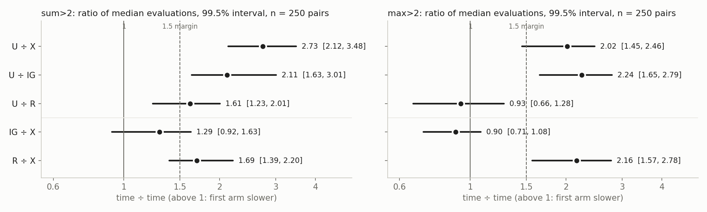
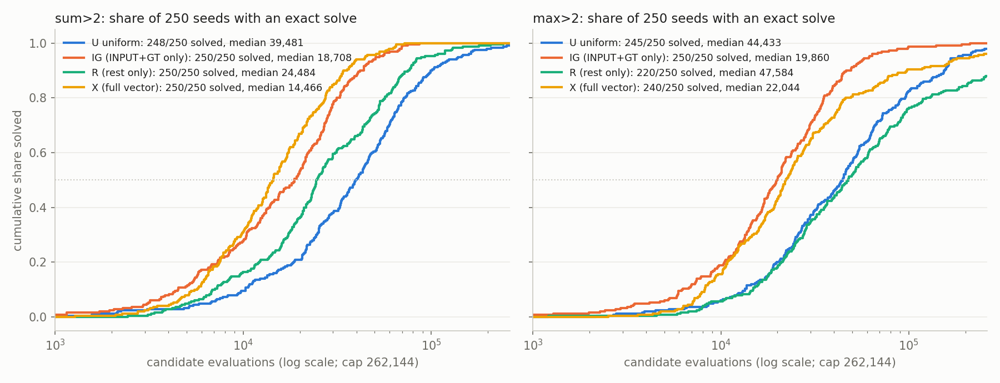

# Analysis: 2026-10-05-1814 component sufficiency (U / IG / R / X)

Reviewer analysis, written before opening `plan.md` (the last section was added after).
Data: `experiments/output/2026-10-05/2026-10-05-1814-evolve-bias-components`, commit
`31d4408`, clean tree. All numbers are recomputed from the 2,000 per-run files in
`runs/main/` with my own bootstrap (different seed), unless marked "harness".

## Summary

- The data is complete, and all 10 registered contrasts and all 4 arm labels reproduce.
- **X replicated on fresh seeds in both tasks**: uniform takes 2.73× (sum>2) and 2.02× (max>2)
  as many evaluations as X to the first exact solve (250 pairs each).
- **max>2: IG carries, R falls short.** IG is as fast as X (IG÷X 0.90, interval 0.71–1.08). R
  is 2.16× slower than X and is not faster than uniform (U÷R 0.93).
- **sum>2: both arms are unresolved by the frozen rule.** Both are faster than uniform (IG
  2.11×, R 1.61×). IG÷X is 1.29 with an upper bound of 1.63, just over the 1.5 margin. R÷X is
  1.69 with a lower bound of 1.39, just under it.
- **The tasks do not give the same verdict, so the frozen rule says park 09.** The harness
  says the same.
- Not registered, but the most useful number: **X's "no sampling lift" is a cancellation.**
  IG alone raises the exact-solver rate 3.2× and 3.9×; R alone lowers it to 0.23× and 0.35×.
  The arm that carries the speed-up is the one that adds exact solvers.

## Data completeness

| Check | Result |
|---|---|
| Queue entry | 1 of 1 done, exit 0, 3,572 s wall (timeout 10,800 s), `COMPLETE` = `finished`, `stderr.log` empty |
| Expected outputs | all 12 present |
| Runs | 2,000 files, 2,000 progress lines, 250 per cell in all 8 cells, no duplicate (task, arm, seed), 0 errors, 0 incomplete |
| Seeds | 202610151814–202610152063, contiguous, the same 250 in every arm |
| Pairing | within a task, each seed has one training set and one evolution seed across the four arms; 250 distinct training sets per task; no evolution seed shared between tasks |
| Fresh seeds | no seed label shared with 1705 (its labels are 202610151705–…804), and the master seed differs |
| Arm wiring | every run's `op_weights` equals its arm's vector in `vectors.json`; X equals the frozen other-family fit in both tasks |
| Fixed setup | P1024, cap 262,144, L 64, lexicase, crossover 0.7, mutation 0.015 in all 2,000 runs |
| Endpoint | `time = gen × 1024 + position + 1` for all 1,953 solves; all 47 censored runs sit at the cap |
| Solvers | I re-ran all 1,953 solver genomes on the full domain: 1,953 of 1,953 are correct on all 10,000 lists |
| Sampling | 125,000,000 of 125,000,000 tapes for each of the four IG/R vectors |
| Looks | one, as registered; n = 250, not raised |

Solves by the cap:

| Task | U | IG | R | X |
|---|---|---|---|---|
| sum>2 | 248/250 | 250/250 | 250/250 | 250/250 |
| max>2 | 245/250 | 250/250 | 220/250 | 240/250 |

Censoring is at most 12% in any cell, so every median is observed and every bootstrap
resample gave a finite ratio (finite fraction 1.0 in all 10 contrasts).

## Key numbers

### Registered contrasts

Ratio = median evaluations of the first arm ÷ the second, 250 paired seeds, 99.5% bootstrap
interval. Above 1 means the first arm is slower. My intervals match the harness to two
decimals (largest difference 0.01).

| Contrast | Medians | Ratio | 99.5% interval | Second arm faster in |
|---|---|---|---|---|
| sum>2 U÷X | 39,481 / 14,466 | 2.73 | 2.12 – 3.48 | 200/250 pairs |
| sum>2 U÷IG | 39,481 / 18,708 | 2.11 | 1.63 – 3.01 | 186/250 |
| sum>2 U÷R | 39,481 / 24,484 | 1.61 | 1.23 – 2.01 | 151/250 |
| sum>2 IG÷X | 18,708 / 14,466 | 1.29 | 0.92 – 1.63 | 141/250 |
| sum>2 R÷X | 24,484 / 14,466 | 1.69 | 1.39 – 2.20 | 164/250 |
| max>2 U÷X | 44,433 / 22,044 | 2.02 | 1.45 – 2.46 | 169/250 |
| max>2 U÷IG | 44,433 / 19,860 | 2.24 | 1.65 – 2.79 | 189/250 |
| max>2 U÷R | 44,433 / 47,584 | 0.93 | 0.66 – 1.28 | 116/247 (3 ties at the cap) |
| max>2 IG÷X | 19,860 / 22,044 | 0.90 | 0.71 – 1.08 | 103/250 |
| max>2 R÷X | 47,584 / 22,044 | 2.16 | 1.57 – 2.78 | 173/248 (2 ties) |

### Labels under the frozen rule

| Task | X replicated | IG | R |
|---|---|---|---|
| sum>2 | yes (lower 2.12) | **unresolved** (vs X open; faster than U) | **unresolved** (vs X open; faster than U) |
| max>2 | yes (lower 1.45) | **carries** (within 1.5× of X; faster than U) | **falls short; improvement over U not resolved** |

The verdicts differ between tasks, so 09 parks. Stated per task:
- max>2: raising INPUT and GT, with the rest thinned evenly, reproduces X's speed-up within
  1.5×. The shape of the rest alone does not, and shows no gain over uniform.
- sum>2: X improves, and each component alone improves on uniform. Neither is shown to be
  within 1.5× of X, and neither is shown to be more than 1.5× slower.

### Share of X's gain, sampling lift, pass-through

Share = log(U÷C) ÷ log(U÷X) on medians. Lift = exact-solver rate ÷ uniform's rate, per 125M
random tapes. Pass-through = evolution speed-up ÷ lift. U and X counts are historical (run
1558), IG and R are new. All descriptive.

| Cell | Speed-up over U | Share of X's log gain | Exact tapes per 125M | Sampling lift | Pass-through |
|---|---|---|---|---|---|
| sum>2 IG | 2.11 | 0.74 | 555 | 3.21 | 0.66 |
| sum>2 R | 1.61 | 0.48 | 40 | 0.23 | 6.97 |
| sum>2 X | 2.73 | 1 | 176 | 1.02 | 2.68 |
| max>2 IG | 2.24 | 1.15 | 270 | 3.91 | 0.57 |
| max>2 R | 0.93 | −0.10 | 24 | 0.35 | 2.68 |
| max>2 X | 2.02 | 1 | 92 | 1.33 | 1.51 |

Uniform's counts are 173 (sum>2) and 69 (max>2). The lift intervals for IG (2.5–4.1 and
2.7–5.7) and R (0.14–0.37 and 0.18–0.67) all exclude 1. The component lifts multiply to
about X's lift: 3.21 × 0.23 = 0.74 against 1.02 on sum>2, and 3.91 × 0.35 = 1.36 against 1.33
on max>2.

The harness's descriptive interaction, (m_IG × m_R) ÷ (m_U × m_X), is 0.80 on sum>2 and 0.96
on max>2. No interval was registered for it.

### Sensitivity checks (not registered)

- **Other quantiles agree with the medians.** For example sum>2 IG÷X is 1.07 at the 25th
  percentile and 1.19 at the 75th; sum>2 R÷X is 1.88 and 2.13; max>2 R÷X is 1.97 and 2.34.
- **Paired geometric-mean ratio** over pairs where both arms solved: sum>2 IG÷X 1.09
  (99.5% interval 0.88–1.34), sum>2 R÷X 1.80 (1.46–2.22), max>2 IG÷X 0.83 (0.66–1.03),
  max>2 R÷X 1.74 (1.39–2.20, and it drops 38 pairs in which R or X was censored).
- **Halves agree.** Every contrast has the same direction in seeds 1–125 and 126–250.
- **The first 50 seeds alone would have misled.** They give sum>2 IG÷X 1.72 and R÷X 2.55,
  against 1.29 and 1.69 on all 250. That is the scale of noise in 1705's 50-pair contrasts.
- **Against 1705.** U÷X was 3.3 and 1.9 there on 50 pairs; it is 2.73 and 2.02 here. The
  sum>2 estimate shrank but stayed inside 1705's interval (2.18–3.93).

## What the data shows

1. **The 1705 surprise is real.** The other family's fitted vector roughly halves time to an
   exact solve in both tasks, on seeds and training sets it had never seen.
2. **IG alone is faster than uniform in both tasks**, by about 2.1–2.2×, in 186 and 189 of 250
   pairs.
3. **On max>2, IG is at least as good as X and R contributes nothing measurable.** IG solved
   all 250 seeds; X left 10 unsolved, all of which IG solved (10 against 0 discordant pairs,
   exact p = 0.002, unregistered). R left 30 unsolved against uniform's 5 (27 seeds solved by
   U and not R, 2 the reverse). So on max>2 the rest of the vector looks neutral at the
   median and harmful in the tail. The second point is an unregistered observation.
4. **On sum>2, both components help and X is the fastest arm.** R is resolved slower than X
   (lower bound 1.39 > 1). IG is not resolved slower than X (lower bound 0.92).
5. **X's flat sampling rate hides two opposite effects.** Raising INPUT and GT adds exact
   solvers (3.2× and 3.9×). Reshaping the other 20 ops removes them (to 0.23× and 0.35×).
6. **Supply still does not predict speed across arms.** On sum>2, R has about a quarter of
   uniform's exact tapes and is 1.61× faster. IG's speed-up is smaller than its lift in both
   tasks (pass-through 0.66 and 0.57).

## What the data does not show

- **It does not show that IG "carries" on sum>2, or that it fails to.** The upper bound
  missed the margin by 0.13. The point estimate (1.29) and the geometric mean (1.09) lean
  towards "close to X", but that is a lean, not a result.
- **It does not show that R falls short on sum>2.** The design's chance of resolving "short"
  was 0.815 for an arm 2.25× slower than X. R came out 1.69× slower, a size the run was not
  powered to classify.
- **It does not identify a mechanism.** Initialization and mutation stay coupled. IG also
  thins the other 20 ops by 0.82×. R also raises and lowers task-relevant ops (on sum>2 it
  raises REDUCE_MAX 3.5×).
- **It does not show that IG works *through* exact-solver supply.** IG's lift and its
  speed-up coincide; the run has no arm that separates them. What changes is the framing of
  09: the IG part of X is not a "no-lift" intervention. The no-lift (in fact negative-lift)
  speed-up is now confined to R on sum>2, one task.
- **The interaction is not established.** 0.80 on sum>2 has no interval.

## Shortcuts and decoding (descriptive)

- **sum>2 has a common shortcut.** max>2 is training-perfect on 201 of the 250 sum>2 training
  sets. sum>2 is training-perfect on 0 of the 250 max>2 training sets.
- **R and X meet far more shortcuts on sum>2.** Median training-perfect but inexact
  candidates per run: U 58, IG 67, R 637, X 627. Runs that met at least one: 158, 150, 194 and
  194 of 250. R and X are the two arms with REDUCE_MAX raised.
- **Splitting sum>2 seeds by whether max>2 fits the training set does not separate the
  arms.** U÷R is 1.67 on the 201 shortcut-admitting seeds and 1.46 on the other 49. U÷IG is
  2.08 and 2.55. With 49 seeds in the smaller group these differences are noise-sized. The
  shortcut stepping-stone idea (G3) is neither supported nor excluded.
- **Training-accuracy timing follows the solve times.** Median generation of the first
  training-perfect genome on sum>2: U 38, IG 15, R 21, X 10. On max>2: U 41, IG 18, R 40, X 19.
  The exact solve follows within 0–2 generations at the median in every cell. The arms differ
  in how soon a training-perfect program appears, not in how long it takes to turn one into
  an exact one.
- **Unsolved max>2 runs are often stuck on shortcuts.** 16 of R's 30 censored runs and 7 of
  X's 10 had reached training accuracy 1.0 without an exact solve.
- **The decode does not discriminate.** INPUT and GT are on the output dependency path in
  all 1,953 new solvers, all 642 solvers from 1705 and all 16,941 saved shortcuts, in every
  arm including uniform. That is expected for any program that thresholds a list, and the
  slice is conservative. The mean number of GT ops on the path is a little higher in X
  solvers (1.55 and 1.72) than in U solvers (1.17 and 1.18).
- Saved shortcuts are the first 20 distinct per run, and most runs that met any hit that
  limit, so shortcut composition by arm is not comparable.

## Caveats

- U and X sampling counts come from run 1558 with a different screening set. The screen is
  only a prefilter before full-domain validation, so the counts are comparable, but the lift
  denominators (173 and 69 tapes) are small.
- "Carries" on max>2 means within 1.5× of X. Here the point estimate is stronger than that
  (IG is 10% faster than X at the median), but the label claims only the margin.
- All claims are about these two tasks, this harness (TAG, L 64, P1024, lexicase) and these
  two fitted vectors.

## Against the predictions

Read after the analysis above was written. The plan froze gates, a label grid and six
outcome rows. It made no directional prediction: its hypothesis says IG or R "may suffice"
and that every other outcome "remains possible".

**Did the run follow the plan?**

| Plan item | What happened |
|---|---|
| n = 250 per cell, one look, no escalation | followed; 2,000 runs, one look |
| Precision check on 1705 data only, both probabilities ≥ 0.80 | followed; 0.845 / 0.815 (sum>2) and 0.88 / 0.90 (max>2) |
| 10 contrasts, 99.5% intervals, 100,000 resamples | followed; all 10 reproduce |
| Reliability guard (≥ 99% finite bootstrap medians) | met; 100% in all 10 |
| Fresh master, paired seeds, shared training sets | followed (checked from the run files) |
| 125M tapes for each of 4 component vectors | followed |
| Diagnostics do not alter labels | followed; labels are a pure function of the 10 intervals |
| Infrastructure outcome | not triggered; no missing or incomplete runs |

**Gates and grid.**

| Task | U÷X lower > 1 | IG: vs X / vs U | R: vs X / vs U | Grid cell |
|---|---|---|---|---|
| sum>2 | yes (2.12) | open (0.92–1.63) / faster (1.63) | open (1.39–2.20) / faster (1.23) | O / O: "component sufficiency unresolved" |
| max>2 | yes (1.45) | within (upper 1.08) / faster (1.65) | short (lower 1.57) / not resolved (0.66) | C / S: "IG sufficient; R falls short" |

**Outcome row.** The carrying set is empty on sum>2 and {IG} on max>2, so this is
**PARTIAL — task disagreement**: report task-local labels, park 09, return to strategy. The
row "INCONCLUSIVE — replicated (no carrying arm in one task)" also matches literally. The two
rows overlap here and route identically, so the overlap changes nothing. No PASS row applies,
and neither nonreplication nor infrastructure applies.

**Against the three explanations in 09's question file** (the plan does not test these; they
are advisory):

- G1 (INPUT/GT scaffold supply) expected IG ≈ X. That holds on max>2 and is not resolved on
  sum>2 (point estimate 1.29).
- G2 (the rest of the vector helps) expected R ≈ X. That fails on max>2, where R shows no
  gain over uniform. On sum>2 R gains 1.61× but is resolved slower than X.
- G3 (max>2 as a stepping stone on sum>2) could only ever apply to sum>2, and R helping only
  on sum>2 fits it. The split by shortcut-admitting training sets (1.67 against 1.46, with 49
  seeds in the smaller group) does not confirm it.

**What the plan did not anticipate.**

- The plan treated sampling as a side description. It turned out to change the question: X's
  flat sampling rate is IG's 3–4× lift cancelled by R's 3–4× loss. The carrying component is
  not a no-lift intervention.
- The plan's guard listed "inert INPUT/GT on the tape" as a risk the decoder would catch. The
  decoder found INPUT and GT on the output path in every saved genome in every arm, so it
  rules that risk out but cannot tell the arms apart.
- R's worse solve rate on max>2 (220/250 against uniform's 245/250) has no registered test.
  It is an observation for the steward, not a finding.

**Precision caveat, as the plan itself stated.** The check was per comparison and for two
specific effect sizes (an exact match to X and 2.25× slower). Both sum>2 component arms
landed between those sizes (1.29 and 1.69), which is the range the plan said it did not
guarantee. "Unresolved" on sum>2 therefore reflects the design's limit at n = 250, and the
plan forbids a follow-up run to strengthen it.
