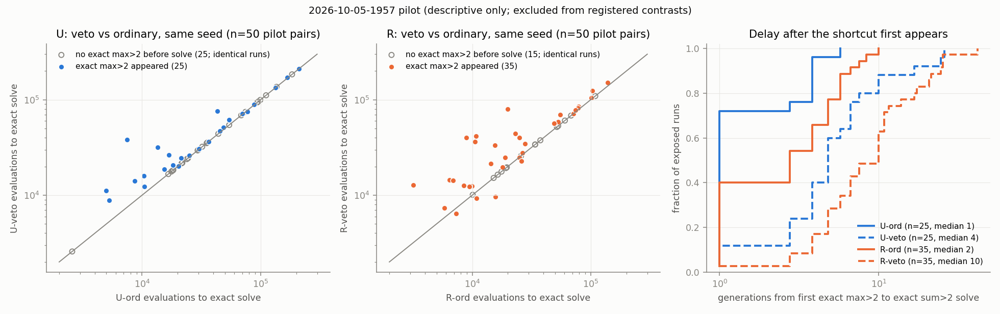

# Analysis — 2026-10-05-1957 shortcut-veto reproduction

Reviewer analysis of commit `2a002a8`, output
`experiments/output/2026-10-05/2026-10-05-1957-shortcut-veto/`. Written before opening `plan.md`.

**Short version.** The main stage never ran. The 50-seed pilot finished cleanly, the power
simulation put power (c) at 0.48 (n=600) and 0.53 (n=800), below the 0.80 gate, and the run
stopped as the proposal requires. So there are **no registered contrasts and no outcome label**.
The stop follows the frozen rule, but the power estimate behind it is unstable (see
"The power gate"), so it is weak evidence that n=800 could not have decided. The pilot itself
shows, descriptively, that the exact max>2 phenotype is used as the last step to the solve in
almost every run where it appears, and that vetoing it slows those runs. With 50 seeds it does not
show whether that explains R's advantage.

## Data completeness

| Check | Result |
|---|---|
| Queue entry | exit 0, 223 s wall, `COMPLETE` = `pilot_only`, all nine expected outputs present, `stderr.log` empty |
| Stage reached | pilot → power → **stop**. `runs/` contains only `pilot/`; 0 main seeds were run |
| Pilot seeds | 50/50 present, 50 unique (202610061958–202610062007), pilot master 202610051958 (separate from main master) |
| Cells | 200/200 runs complete (4 cells × 50), no errors, no deadline truncation |
| Censoring | 0/200; every run reached an exact solve before the 262,144 cap. No fully vetoed population (0/100 veto runs) |
| Identity check | 100/100 pair checks passed (2 arms × 50). Unexposed pairs have identical times: U 25/25, R 15/15 |
| Pairing | Within each seed all four cells share one training set hash and one evolution seed; 50 distinct training sets, 50 distinct evolution seeds |
| A property | All 50 training sets have 32 positives and sum>2 labels equal to max>2 labels on every case |
| Vectors | Logged `probs` equal `ec.vectors(spec, "sum2")` U and R in all 200 runs |
| Solvers | I re-evaluated all 200 saved solver genomes on the 10,000-list domain: 200/200 are exact sum>2. Times equal `gen × 1024 + position + 1` in all 200 |
| Veto enforcement | 0/100 veto-cell solvers have an exact-max>2 immediate parent; the in-run assertion on vetoed parents never fired |

The pilot is complete and I found no wiring fault. What is missing is the whole confirmatory
stage, by design of the gate.

## The power gate

Powers from `power.json` (300 trials each, pilot pairs resampled with injected effects):

| Power | Definition | n=600 | n=800 |
|---|---|---|---|
| (a) interaction | I lower > 1 when I = 1.6 | 300/300 | 300/300 |
| (b) R penalty | P_R lower > 1 when P_R = 1.6 | 300/300 | 300/300 |
| (c) null small | P_R upper < 1.25 when P_R = 1 | 143/300 = 0.48 | 159/300 = 0.53 |
| complete route (not a gate) | C1, P_R and I lower all > 1 | 219/300 = 0.73 | 250/300 = 0.83 |

(c) fails at both sizes, so the rule "none qualifies → stage 2 does not run" was applied
correctly. Three things limit what this stop means:

1. **The (c) estimate is driven by pilot granularity.** The simulation resamples 600–800 rows
   from 50 pilot rows, so the bootstrap median can only land on the few pilot values near the
   median. The simulated P_R upper bound takes a handful of discrete values (at n=800 the median
   upper bound is 1.184 and the 80th percentile is 1.282; from n=1600 it is stuck at 1.163 or
   1.184). Whether power clears 0.80 depends on whether one particular gap between neighbouring
   pilot points straddles 1.25. I resampled the 50 pilot seeds 16 times and recomputed (c) at
   n=800 (60 trials each): the values ran from 0.05 to 1.00, with 11/16 at or above 0.80. This
   check is rough (resampled pilots are coarser still), but it shows the 0.48–0.53 figure is one
   draw from a very wide distribution. The binomial interval in `power.json` (0.47–0.59 at
   n=800) covers simulation noise only, not this.
2. **Runtime was not the constraint.** The design's own estimate is 12.9 worker-seconds per
   seed, so n=800 would have taken about 65 min and about 2.85 h remained. The stop reason says
   "below .80 at affordable sizes"; "at the two registered sizes" is the accurate reading. My
   rerun of the same null simulation (150 trials) gives (c) = 0.54 at n=800, 0.81 at 1600,
   0.86 at 2400 and 0.95 at 3200. n=1600 would have fitted the queue by the same cost formula
   (about 2.4 h). Point 1 applies to these numbers as well.
3. **The route outcome was well powered; the null outcome and the gate were not.** (a) and (b)
   are 300/300, so a full-size effect would have been detected. The design could not promise the
   "no practically meaningful contribution" label, and "complete route" at 0.73/0.83 says the C1
   gate itself was not safe at these sizes if R's gain on A is near the pilot's 1.3.

None of this is a reason to overturn the stop: sizes, τ and the rule were frozen, and running
the main stage after seeing the pilot would be a second look. It is a reason not to describe
the result as "an affordable design cannot decide".

## Key numbers (pilot, n = 50 seeds; descriptive, outside the registered family)

Evaluations to first exact sum>2 solve:

| Cell | Solved | Median | IQR |
|---|---|---|---|
| U-ord | 50/50 | 30,040 | 18,131–69,844 |
| U-veto | 50/50 | 31,901 | 20,939–73,692 |
| R-ord | 50/50 | 23,196 | 11,755–53,112 |
| R-veto | 50/50 | 33,942 | 16,731–60,102 |

The registered ratios computed on the pilot, with the run's own bootstrap (98.75% intervals,
100,000 draws). These are not the confirmatory contrasts and carry no label:

| Ratio | Pilot value | 98.75% interval |
|---|---|---|
| C1 = U-ord ÷ R-ord | 1.30 | 0.71–2.32 |
| P_R = R-veto ÷ R-ord | 1.46 | 0.99–2.08 |
| P_U = U-veto ÷ U-ord | 1.06 | 1.00–1.46 |
| I = P_R ÷ P_U | 1.38 | 0.82–2.00 |

Every interval includes 1 or touches it. R was faster than U in 30/50 seeds on ordinary cells
and in 27/50 on veto cells.

Exposure and paired effect of the veto (a pair is "exposed" when an exact max>2 program was
present at a reproduction step in the ordinary run):

| | U | R |
|---|---|---|
| Exposed pairs | 25/50 | 35/50 |
| Among exposed: veto slower / faster / tied | 20 / 1 / 4 | 29 / 5 / 1 |
| Among exposed: median veto ÷ ord (IQR) | 1.14 (1.01–1.56) | 1.25 (1.04–1.75) |
| Among exposed: geometric mean veto ÷ ord | 1.30 | 1.43 |
| All 50 pairs: geometric mean veto ÷ ord (98.75% bootstrap) | 1.14 (1.04–1.29) | 1.28 (1.11–1.52) |
| Solver had an exact-max>2 immediate parent, ordinary cell | 21/25 exposed | 34/35 exposed |
| Generations from first exact max>2 to solve, ord → veto (median) | 1 → 4 | 2 → 10 |
| Median generation at which exact max>2 first appears | 21 | 13 |

Population composition (individual-generations as a share of all evaluated candidates):

| Cell | Exact max>2 | Other training-perfect, inexact |
|---|---|---|
| U-ord | 0.71% | 0.86% |
| U-veto | 0.004% | 2.09% |
| R-ord | 2.73% | 2.30% |
| R-veto | 0.04% | 7.49% |

In ordinary exposed runs the exact max>2 phenotype reaches a median peak of about half the
population (U 0.52, R 0.51). In veto cells its peak is at most 8.7% of one generation and
typically 1–2 individuals; it keeps being regenerated (168 generations with at least one in
R-veto) but never reproduces. The saved examples of other training-perfect programs in R-veto
(881, at most 20 per run, first seen, so a biased sample) are mostly near-max: the typical one
agrees with max>2 on 99.25% of the domain and with sum>2 on 98.89%; 91% agree with max>2 more
than with sum>2.

Figure: `analysis_pilot_pairs.png` — paired veto vs ordinary times for U and R, and the delay
from first exact max>2 to the solve.

## What the data shows

- **The route is used, and it is short.** In ordinary runs where exact max>2 appears before
  the solve, the first exact sum>2 solver has an exact-max>2 parent in 55/60 cases (U 21/25,
  R 34/35), and the solve follows within a median of 1–2 generations. Exact max>2 is not an
  early scaffold that the population sits on; it shows up late (median generation 13 in R, 21
  in U) and the solve comes almost at once.
- **Blocking it delays the solve in exposed runs, in both arms.** Veto was slower in 49 of 55
  untied exposed pairs (U 20/21, R 29/34). The direction is clear at n=50. Unexposed pairs are
  byte-identical, so this comes only from the veto.
- **Blocking it does not stop the solve.** 100/100 veto runs solved, with no censoring. The
  cost is a delay of a few generations (median 4 in U, 10 in R), not a lost route.
- **Near-max programs fill the gap.** The share of inexact training-perfect programs is about
  2.4× higher in U-veto than U-ord and 3.3× higher in R-veto than R-ord, and the sampled ones
  are mostly max-like. The veto removes one phenotype out of a family.
- **R meets the shortcut more often and earlier** (35/50 vs 25/50 runs; generation 13 vs 21),
  and R-ord carries about 4× the exact-max share of U-ord. This matches 1814's association.

## What the data does not show

- **No registered result.** C1, P_R, P_U and I were never estimated on main data. None of the
  proposal's five rows applies.
- **Whether R's gain holds on A.** Pilot C1 is 1.30 with an interval of 0.71–2.32, and R wins
  only 30/50 seeds. This neither reproduces nor contradicts 1814's 1.61.
- **Whether the veto costs R more than U.** Pilot I is 1.38 (0.82–2.00). The per-exposed-pair
  cost looks larger in R (geometric mean 1.43 vs 1.30) and R is exposed more often, but on
  35 and 25 pairs this is unclear, not a finding. Row 3 against row 4 is undecided.
- **Whether the cost to R is practically small.** Pilot P_R of 1.46 sits above τ = 1.25 with
  an interval reaching both 1 and 2, so rows 1 and 2 are neither supported nor excluded. The
  paired geometric-mean ratio (1.28, 1.11–1.52) is a different estimand from the registered
  median ratio and was chosen after seeing the data; I report it only to show the direction.
- **Need versus use.** Immediate-parent counts show the exact phenotype was the usual last
  step, not that it was required; veto runs solved anyway through near-max programs. The
  experiment tests the exact phenotype only, as the proposal states.
- **Selection in the exposed subset.** Exposure is an outcome of the run. Exposed R-ord runs
  are faster than unexposed ones (median 19,937 vs 33,942), but max>2 appears just before the
  solve, so this cannot be read as "runs that find the shortcut are faster because of it".
- **That an affordable design cannot decide.** See the power gate section. The estimate that
  triggered the stop moves between 0.05 and 1.0 under resampling of the pilot.

## Notes for the decision

- The proposal commits to stopping this line after one run, with the pilot as the result if
  stage 2 does not run. The data give no reason to depart from that, and the budget is spent.
- If a later slot ever returns to this design, the main fix is to the gate, not the experiment:
  a power estimate from a smoothed or model-based null rather than a 50-point empirical one, and
  a size grid that uses the runtime available. The pilot's own cost figures put n≈1600 within
  a 3 h queue.
- The digest can record, at pilot strength: exact max>2 is the usual immediate parent of the
  solver when present (55/60), vetoing it delays but never prevents the solve (100/100), and
  near-max programs take over. It should not record any statement about R's advantage.

## Against the predictions

Read after the analysis above was written. `plan.md` adds no numerical predictions of its own
beyond the proposal's outcome table; what can be checked is whether the run followed it.

| Plan item | What happened | Verdict |
|---|---|---|
| Outcome rows (trap / no practical contribution / route supported / partial / inconclusive) | No main data, so no confirmatory contrasts were computed | **No row applies.** This is not the plan's INCONCLUSIVE row, which is a main-stage outcome |
| "Pilot power/runtime infeasibility is a completed feasibility result … `next: stop`, not evidence against G3" | Stage `pilot_only`, `next: stop`, `COMPLETE` written, exit 0 | As planned. The result must not be logged as a null on G3 |
| Power procedure: 300 simulations, 2,000 inner draws, n = 600 then 800, injection into exposed veto times only, bisection to 1e-6, first n with all three marginal powers ≥ 0.80 | Implemented as written. Achieved targets are exact (null P_R = P_U = 1.0; alternative P_R = 1.6, P_U = 1.0). Exposure counts 25 (U) and 35 (R). (a) and (b) 300/300 at both sizes; (c) 0.48 and 0.53 | Rule followed; gate failed on (c) only |
| Joint route power "descriptive per critique, not an added gate" | 0.73 at n=600, 0.83 at n=800; not used for the decision | As planned |
| Runtime gate: stop if the power-selected n cannot fit | Never reached, because no n was selected. By the plan's own formula n=800 costs about 3,870 s + 774 s reserves against 10,278 s remaining | Runtime did not cause the stop. The `design.json` reason "at affordable sizes" should be read as "at the two registered sizes" |
| Identity rule: pairs match through first exposure; unexposed pairs match entirely | 100/100 checks passed; 40/40 unexposed pairs identical in time | Holds |
| Fully vetoed population expected never | 0/100 veto runs | Holds |
| Degenerate-success guard: identical veto and ordinary results could mean no exposure or a failed veto | Exposure occurred in 60/100 arm-seed pairs, the veto changed 55 of those 60 times, and exact-max share in veto cells fell from 0.71% to 0.004% (U) and 2.73% to 0.04% (R). The smoke runs had no exposure, so this pilot is the first live exercise of the detector and veto | Guard satisfied on real trajectories |
| "No optimistic correlation is supplied"; paired log-time correlations reported | 0.95 (U), 0.87 (R), descriptive only | As planned |
| Scope tag: n = 600 or 800 | Actual n is 50 pilot seeds, outside the confirmatory family | Any summary statement needs the tag changed to **pilot, n=50, exploratory** |

Where my reading differs from what the plan anticipated:

- The plan treats the pilot power estimate as a sound basis for a feasibility verdict. It
  reports Monte Carlo intervals for the simulation, but the dominant uncertainty is the 50-point
  pilot distribution itself, which the procedure cannot see. Under resampling of the pilot, power
  (c) at n=800 ranged from 0.05 to 1.00. The stop is procedurally correct and should stand; the
  claim that goes with it is "the registered gate was not met", not "this design cannot decide
  at an affordable size".
- Neither document predicted how short the route is. Exact max>2 appears late and the solver
  follows in 1–2 generations with an exact-max parent in 55/60 exposed ordinary runs. The plan's
  caution that immediate ancestry "does not identify necessity" is borne out directly: all 100
  veto runs solved without it, through a larger pool of near-max inexact programs.
- The proposal expected a high paired correlation to make the design efficient. The correlation
  is high, but the exposed pairs diverge by factors from 0.6 to 5, and those pairs carry all the
  information. That spread, with only 35 exposed R pairs setting the simulated null, is why (c)
  was fragile.

Bottom line for the steward: record a completed feasibility stop with no confirmatory result,
keep the pilot observations at exploratory strength, and do not close or narrow G3 on this run.
