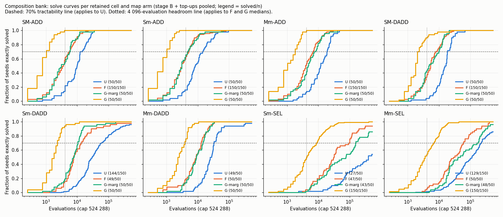

# Analysis: composition bank, decoder harness and headroom feasibility

Data: `experiments/output/2026-10-05/2026-10-05-2247-composition-bank/` (commit `0995d33`, clean tree,
exit 0, 1 153 s wall). All counts below were recomputed from `searches.jsonl` and `sampling.jsonl`
and agree with `result.json`.

## Data completeness

- **Stage A** completed to depth 6 (233 905 distinct typed states, 357 distinct output vectors).
  8 of 9 cells retained. SM-SEL is rejected in both orientations (a 6-token program solves
  `S>0 ? S : M` exactly; the other orientation has a 94.4% shorter alias).
- **Stage B**: 1 600 runs = 8 cells × 4 arms × 50 seeds (22471000–22471049). Every cell × arm has
  exactly the 50 expected seeds, no duplicates, all at cap 524 288 and population 256. Each seed
  uses one training set across all cells and arms (50 distinct sets of 64 cases); one table hash
  per arm.
- **Stage C**: 8 top-ups × 100 fresh seeds (22472000–22472099) = 800 runs, all finished.
  Six were for headroom (F on SM-ADD, SM-DADD, Sm-ADD, Mm-ADD; G on Sm-SEL, Mm-SEL) and two for
  borderline inner budgets under U (Sm-DADD, Mm-SEL). No cell was in the
  30–39/50 tractability band, so no tractability top-up ran.
- **Sampling**: 2·10⁸ genotypes per arm (8 000 blocks), complete; every cell × arm has ≥ 3 hits.
- **Failures**: none. 64 of 2 400 runs hit the cap unsolved (44 of them Sm-SEL or Mm-SEL under U).
- Decoder validation passed (10⁵ genotypes, 6.25·10⁷ executions identical). `stderr.log` is empty.

## Key numbers

Solved = exact on all 625 inputs. Median = evaluations to solve, censored runs at the cap.
Rows with n = 150 are stage B + top-up pooled.

| Cell | U solved | U median (95%) | F solved | F median | G-marg solved | G-marg median | G solved | G median (95%) |
|---|---|---|---|---|---|---|---|---|
| SM-ADD | 50/50 | 9 728 (8 192–12 032) | 150/150 | 3 584 | 50/50 | 3 072 | 50/50 | 768 (512–1 024) |
| Sm-ADD | 50/50 | 7 936 (6 400–11 264) | 150/150 | 3 072 | 50/50 | 3 072 | 50/50 | 768 (512–1 024) |
| Mm-ADD | 50/50 | 11 520 (8 960–16 384) | 150/150 | 3 840 | 50/50 | 4 608 | 50/50 | 1 024 (768–1 536) |
| SM-DADD | 50/50 | 15 360 (12 032–17 920) | 150/150 | 5 376 | 50/50 | 4 608 | 50/50 | 1 792 (1 536–2 048) |
| Sm-DADD | 144/150 | 29 696 (23 552–37 632) | 49/50 | 7 680 | 50/50 | 7 424 | 50/50 | 1 792 (1 536–2 048) |
| Mm-DADD | 49/50 | 24 832 (20 480–30 720) | 50/50 | 8 704 | 50/50 | 8 960 | 50/50 | 2 304 (2 048–3 072) |
| Sm-SEL | **27/50** | 390 912 (152 576–>cap) | 47/50 | 30 464 | 43/50 | 75 008 | 150/150 | 4 096 (3 328–5 120) |
| Mm-SEL | 129/150 | 112 128 (68 864–151 552) | 50/50 | 28 416 | 48/50 | 40 448 | 150/150 | 3 584 (2 816–4 352) |

**Tractability (U ≥ 35/50 or ≥ 105/150).** Seven of eight retained cells pass. Sm-SEL fails at
27/50 (54%, 95% interval 39–68%). It was not in the top-up band. Its curve is still rising at the
cap (17/50 by 131k, 21/50 by 262k, 27/50 by 524k).

**Split eligibility.** Two of the six transversals need the rejected SM-SEL. Of the other four:
- two hold out Sm-SEL, which is not tractable;
- two hold out Mm-SEL, and then the only other SEL cell (Sm-SEL) is dropped from training, so
  training has no SEL cell and the "holdout's combiner appears in training" rule fails.

So 0 of 6 transversals are eligible. The whole result turns on one cell: Sm-SEL under U.

**Headroom, ignoring tractability (4 structurally eligible transversals).**

| Holdouts | F medians | F < 4 096 | G medians | G < 4 096 |
|---|---|---|---|---|
| SM-ADD, Sm-DADD, Mm-SEL | 3 584 / 7 680 / 28 416 | 1 of 3 | 768 / 1 792 / 3 584 | 3 of 3 |
| SM-ADD, Sm-SEL, Mm-DADD | 3 584 / 30 464 / 8 704 | 1 of 3 | 768 / 4 096 / 2 304 | 2 of 3 |
| SM-DADD, Sm-ADD, Mm-SEL | 5 376 / 3 072 / 28 416 | 1 of 3 | 1 792 / 768 / 3 584 | 3 of 3 |
| SM-DADD, Sm-SEL, Mm-ADD | 5 376 / 30 464 / 3 840 | 1 of 3 | 1 792 / 4 096 / 1 024 | 2 of 3 |

All four lack headroom, and in every case because of G. F alone leaves headroom everywhere. The
two SEL medians under G sit on the line (4 096 and 3 584, intervals spanning it), but the ADD
and DADD medians under G are far below it, so the verdict does not depend on the SEL cells.

**Map arms, descriptively (paired seeds, median-speed ratio with paired-bootstrap 95%).**
- F/U: 1.9–3.5× on the seven resolved cells; Sm-SEL 12.8× with no interval (U median censored in
  most resamples).
- G/U: 8.6–13.1× on ADD and DADD, 31× (18–44) on Mm-SEL, about 100× on Sm-SEL (no interval).
- G/G-marg: 2.6–4.5× on ADD and DADD, 9.9× (4.7–28) on Mm-SEL, 19.5× (4.6–36) on Sm-SEL. All
  eight intervals exclude 1.
- G-marg and F are close on ADD and DADD (medians within 25% of each other); on SEL, G-marg is
  slower than F, with wide intervals.
- Sampling rates per million genotypes: U 2.5–4.9 (ADD) and 0.015–0.04 (DADD, SEL; 3–8 hits
  each); F 51 / 1.2 / 0.4; G-marg 37–59 / 1.2–2.0 / 0.26–0.54; G 570–590 / 25–27 / 12–13.
  G raises supply 120–1 650× over U; the search speed-up is about ten times smaller.
- G solved in the initial population in 9/50 seeds on SM-ADD and Sm-ADD and 7/50 on Mm-ADD.
- One allele mutation changes 1.65 emitted tokens on average under G, against 0.94–0.95 under the
  tied arms.

**Shortcuts.** Training-perfect but inexact individuals appeared in 43 of 2 400 runs, mostly
under G (20 runs) and in a few long runs (192 480 individuals in one Mm-SEL U run, 84 787 across
Sm-SEL G). All were caught by the exact check, so no solve count includes one. They show that 64
training cases do not pin these targets down; a solve criterion without the full check would be
wrong here.

**Cost.** Mean seconds per run, censored included: 0.03–0.4 for G, 0.3–0.4 for U on ADD, 1.3–1.9
for U on DADD, 4.2 (Mm-SEL) and 6.7 (Sm-SEL) for U on SEL. No experiment-2 cost was computed
because no split was selected.

## What the data shows

1. The bank survives the alias screen with 8 of 9 cells. SM-SEL is a real alias, not a search
   failure.
2. At 524 288 evaluations no split meets the pre-stated rules, because Sm-SEL under U is 27/50
   and it is the only SEL cell that could sit in training opposite Mm-SEL.
3. The hand-set grammar G solves every retained cell in all seeds, with medians of 768–4 096
   evaluations. Under the 4 096 rule no structural split has headroom against G.
4. A token-frequency bias (F, or G's own marginals) gives a 2–3.5× speed-up on ADD and DADD; G's
   context adds a further 2.6–4.5× there and more on SEL.

## What it does not show

- **Not "Sm-SEL is unreachable".** 54% at the cap with a rising curve is an operational miss of a
  70% line. The interval's upper end (68%) is just below the line, so a rerun at the same cap would
  most likely fail again, but a 2–4× larger cap may well pass. That was not run here.
- **Not a failure of a tractable design existing.** Fixing tractability alone would not rescue
  the bank: all four structural splits already lack headroom against G. That second problem is
  the binding one, and it comes from 150-seed or tight 50-seed medians, not from a borderline
  count.
- **Nothing about learned transfer.** No decoder was adapted. G is a hand-written grammar whose
  rows (INPUT → reducer; integer → INPUT/ADD/DUP/IF_GT) describe the syntax of every canonical
  program in this bank. That G is fast says these cells share one shallow syntactic family that
  a generic prior nearly covers; it does not say whether a learned decoder would find it or
  transfer it.
- **G vs G-marg is not a mechanism.** The ratio mixes higher supply (10–47× more hits when
  sampling) with a different variation structure (1.65 vs 0.94 tokens changed per mutation).
  The data cannot separate them.
- **The SEL medians under G are not resolved against 4 096**: both intervals contain it.
- Cross-cell comparisons share seeds and training sets, so cells are correlated; the per-cell
  intervals should not be combined as if independent.
- Inner-budget and cost figures for experiment 2 are undefined, not zero.

## Reviewer notes for the steward

- Two independent obstacles point the same way: the SEL column is thin (one cell aliased, one
  slow under U), and the ADD/DADD cells are too easy for a generic grammar. A larger cap fixes
  only the first.
- Whether "no headroom against G" should block experiment 2 depends on whether G is a fair
  control or an oracle for this bank. The rule was pre-stated with G as a control, so by the
  rule it blocks. A deeper tier (three-reducer or nested cells), where G's rows no longer spell
  out the canonical form, addresses both obstacles.

## Against the predictions

The plan applies the proposal's rows in order, missing data first.

| Row | Condition | Data | Fires? |
|---|---|---|---|
| U | Stage A, stage B (50 seeds per retained cell × arm) or a top-up incomplete | All complete: 1 600 + 800 runs, 8/8 top-ups finished | No |
| 1 | < 7 retained cells, or no structural split | 8 retained; 4 of 6 transversals structurally eligible | No |
| 2 | No transversal eligible once tractability is applied | 0 of 6 eligible; Sm-SEL under U is 27/50 | **Yes** |
| 3 | Every eligible split lacks headroom | Not reached. As a diagnostic, 4 of 4 structural splits lack headroom under G | (would fire) |
| 4a, 4, 5 | Inner budget and cost | Not reached; no split selected, no cost computed | — |

The outcome is **row 2**, in the plan's narrowed sense: no split passes the operational threshold
at 524 288 evaluations, and larger caps are untested. The run's own `summary.md` reports the same
row.

Points where the data meets the plan's specifics:

- The plan's review revision expected this result and required the structural headroom table
  whichever row fired. It is present and complete. It shows that row 3 would fire if
  tractability were waived, so the two rows do not disagree about the next step: both send the
  bank back to strategy, and the deeper-tier remedy of row 3 covers both.
- The pre-run reviewer pilot (different seeds) gave Sm-SEL 26/50 under U; this run gives 27/50.
  The two agree, so the miss is not a seed accident at this cap. The pilot's 36/50 at 2M
  evaluations is the only evidence on larger caps and is not part of this run.
- Row 2 asks to "note whether F or G make the cells tractable". They do: Sm-SEL is 47/50 under
  F, 43/50 under G-marg and 150/150 under G, against 27/50 under U. Every retained cell is
  ≥ 43/50 under every biased arm.
- The inner-budget top-ups the plan added ran (Sm-DADD and Mm-SEL under U) but decide nothing,
  because rows 4a–5 were not reached. Both cells were therefore judged for tractability on the
  pooled count (144/150 and 129/150), which passes either way (stage B alone: 49/50 and 47/50).
- The plan's expected wall time of about 30 minutes was met (19 minutes). The queue used 11% of
  its 3 h timeout; neither the deadline nor the sampling cut was triggered.
- The plan says no unresolved median may be shown as an observed 524 288. That holds: only
  Sm-SEL under U has a censored interval, and its ratios are reported without intervals.
