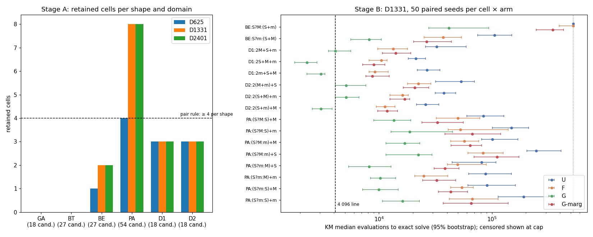

# Analysis: assembly-family bank — exhaustive 9-token alias screen, 10-token search calibration

Data: `experiments/output/2026-10-06/2026-10-06-0001-assembly-family/` (commit `a65ded0`, clean
tree, exit 0, 2 089 s wall, peak RSS 4.9 GB, `stderr.log` empty). Every count below was recomputed
from `stage_a.json`, `pairing.json`, `search.jsonl` and `sampling.json`; all agree with
`result.json` and `summary.md`.

## Data completeness

- **Stage A** completed on all three domains (`complete: true` each, depth 8 stored + depth 9
  output-only). Stored depth-8 states: 12.20 M (D625), 12.28 M (D1331), 12.24 M (D2401); distinct
  output vectors reached at depth 9: 8 974 / 11 629 / 10 325. About 90 s and 4.5–4.9 GB per domain.
  All 162 canonical programs reproduced their label vector on the Rust executor on every domain
  (`canonical_verified` true for 486/486 cell-domain records). Every best alias witness was re-executed
  and its agreement count matched the screen's count (asserted in code).
- **Pairing**: 45 shape-pair × domain rows, 0 eligible, 45 failures with reasons recorded.
- **Stage B**: 3 200 runs = 16 cells × 4 arms × 50 seeds (260601000–260601049) on D1331, the
  pre-stated fallback domain (most retained post-addition cells, tie to the smaller domain). Every
  cell × arm has exactly 50 seeds, no duplicate (cell, arm, seed). One table hash per arm, equal to
  the hashes in `maps.json`; the frozen 2247 source file passed its hash check and the equality check
  against `base_tables()`. All runs at cap 524 288 and population 256. Unsolved runs all have
  evaluations = cap; solved runs never do. Total 2.40 CPU-h; 5 balanced blocks of 640 runs at
  197–249 s wall each.
- **Top-ups**: none requested. No cell had F in the 30–39/50 band (`topup_requests.json` is `[]`).
  The hard cell BE:S?M:(S+m) has F = 22/50, below the band.
- **Stage C**: not triggered (no eligible pair); recorded complete by rule. `contrasts` is empty.
- **Sampling**: 10⁸ genotypes per arm, complete (1 000 chunks × 4 arms), 578–678 CPU-s per arm.
- **Stage D**: not computed (`split_specific: null`, reason "no eligible split"); per-cell cost curves
  for U and G are present.
- **Failures**: none. 216 of 3 200 runs hit the cap unsolved (U 104, F 61, G-marg 36, G 15).

## Key numbers

### Stage A — retained cells per shape (of candidates), by domain

| Shape (candidates) | D625 | D1331 | D2401 | Failure mode of the rest |
|---|---|---|---|---|
| GA gate (18) | 0 | 0 | 0 | 12–13 exact identities, 5–6 near-aliases (0.88–0.98) |
| BT branch-then (27) | 0 | 0 | 0 | 18 exact identities, 9 near-aliases (0.81–0.94) |
| BE branch-else (27) | 1 | 2 | 2 | 21 exact identities, 4–5 near-aliases |
| PA post-add (54) | 4 | 8 | 8 | 30 exact identities, 16–20 near-aliases |
| D1 linear `2X+Y+Z` (18) | 3 | 3 | 3 | 15 exact identities (6 of them also duplicates) |
| D2 linear `2(X+Y)+Z` (18) | 3 | 3 | 3 | 15 exact identities |

Every retained branch cell has condition S. All 18 cells per shape with condition M or m are
identities or near-aliases on every domain (a reducer-max or reducer-min condition can be folded
into a shorter program). Retained cells and their best ≤ 9-token agreement on D1331: BE:S?M:(S+m)
0.736, BE:S?m:(S+M) 0.628, the eight PA cells 0.628–0.736, the six linear cells 0.249.

**Why BE has only two cells.** The exact identities decode to two mechanisms, both visible in the
witnesses (`stage_a.json`): (i) addition distributes out of the branch when a summand equals the
"then" value, e.g. `S?M:(M+m)` = `M + (S>0 ? 0 : m)` via CONST_0 in 9 tokens; (ii) DUP reuses the
condition when S is also a branch value, e.g. `S?S:(M+m)`. The near-aliases are constant
substitutions, e.g. `S?M:(S+m)` ≈ `S>0 ? 5 : (S+m)` at 0.944 on D625 (M ≈ 2 or 5 when S>0 on a
small domain); this cell survives only on the two wider domains (0.736, 0.663). BT fails the same
way plus `S?(X+Y):S` ≈ `(X+Y)>0 ? (X+Y) : S` (DUP on the sum, 0.82–0.88).

**Why no pair.** On D1331 and D2401, PA (8 cells) has a valid holdout split (`PA:(S?M:S)+M`,
`PA:(S?M:S)+m` held out; 6 training cells) and shares a token multiset with BE. The pair fails
only because BE has 2 < 4 retained cells. On D625 PA has 4 cells but no role-covering holdout pair.
D1/D2 have exactly 3 cells each on every domain (the three permutations with distinct reducers), so
the linear pair can never meet the ≥ 4 rule; this is a split-rule failure, not aliasing. GA and BT
have 0 cells everywhere.

**Cutoff sensitivity (recomputed from stored agreements).** Moving the 80 % cutoff anywhere in
0.70–0.85 changes no shape's eligibility on any domain; no pair is eligible before 0.90 (D1331:
BT/PA) or 0.95 (D625, D2401: BT/PA). Nearest agreements to 0.80 are 0.741/0.840 (D625),
0.736/0.822 (D1331), 0.687/0.808 (D2401). The verdict does not sit on the threshold.

### Stage B — D1331, 50 paired seeds per cell × arm

Solved = exact on all 1 331 inputs. Median = Kaplan–Meier median evaluations (censored at cap
524 288) with 95 % bootstrap interval. Mean seconds include capped runs.

| Cell | U solved | U median | F solved | F median | G solved | G median (95 %) | G-marg solved | G-marg median |
|---|---|---|---|---|---|---|---|---|
| BE:S?M:(S+m) | **8/50** | > cap | **22/50** | > cap (≥ 394k) | 42/50 | 41 728 (27.6k–94.0k) | 34/50 | 346 368 |
| BE:S?m:(S+M) | 48/50 | 104 448 | 49/50 | 36 864 | 50/50 | 8 192 (5.6k–10.2k) | 48/50 | 25 600 |
| D1:2M+S+m | 50/50 | 31 744 | 50/50 | 13 312 | 50/50 | 4 096 (3.3k–5.4k) | 50/50 | 13 312 |
| D1:2S+M+m | 50/50 | 20 480 | 50/50 | 10 240 | 50/50 | 2 304 (1.8k–2.6k) | 50/50 | 8 704 |
| D1:2m+S+M | 50/50 | 26 624 | 50/50 | 9 216 | 50/50 | 3 072 (2.6k–3.8k) | 50/50 | 8 704 |
| D2:2(M+m)+S | 50/50 | 53 248 | 50/50 | 21 504 | 50/50 | 5 120 (4.4k–7.4k) | 50/50 | 20 480 |
| D2:2(S+M)+m | 49/50 | 36 864 | 50/50 | 15 360 | 50/50 | 5 120 (4.4k–6.1k) | 50/50 | 16 384 |
| D2:2(S+m)+M | 50/50 | 25 600 | 50/50 | 11 264 | 50/50 | 3 072 (2.6k–3.8k) | 50/50 | 11 264 |
| PA:(S?M:S)+M | 46/50 | 83 968 | 43/50 | 49 152 | 49/50 | 13 568 (8.4k–18.7k) | 49/50 | 32 768 |
| PA:(S?M:S)+m | 43/50 | 148 480 | 43/50 | 52 224 | 48/50 | 18 688 (12.5k–44.3k) | 47/50 | 66 560 |
| PA:(S?M:m)+M | 44/50 | 100 352 | 48/50 | 56 320 | 50/50 | 16 896 (11.8k–22.8k) | 48/50 | 63 488 |
| PA:(S?M:m)+S | 35/50 | 246 784 | 45/50 | 82 944 | 47/50 | 22 272 (11.8k–29.2k) | 45/50 | 110 592 |
| PA:(S?m:M)+S | 46/50 | 80 896 | 44/50 | 49 152 | 49/50 | 8 192 (5.6k–12.8k) | 49/50 | 37 888 |
| PA:(S?m:M)+m | 46/50 | 88 064 | 49/50 | 24 576 | 50/50 | 10 240 (8.4k–13.8k) | 50/50 | 31 744 |
| PA:(S?m:S)+M | 47/50 | 90 112 | 48/50 | 53 248 | 50/50 | 9 984 (7.4k–14.8k) | 49/50 | 43 008 |
| PA:(S?m:S)+m | 34/50 | 190 464 | 48/50 | 66 560 | 50/50 | 16 128 (10.5k–22.8k) | 45/50 | 65 536 |

Pooled solves: U 696/800, F 739/800, G 785/800, G-marg 764/800.

**Headroom against the 4 096 line.** G medians: 3 of 16 cells below 4 096 (D1 cells 2 304, 3 072;
D2:2(S+m)+M 3 072), one on it (D1:2M+S+m 4 096), and all ten branch cells above it: PA
8 192–22 272 (2–5× the line), BE 8 192 and 41 728. F and G-marg medians are above the line on all
16 cells (F minimum 9 216, G-marg minimum 8 704). So, unlike 2247's 5–7-token bank where G sat at
768–4 096, 10-token post-addition and branch-else cells leave 2–10× room above G at the frozen
cap. U solves no run within 4 096 evaluations; G solves 259/800 runs within it (mostly linear cells).

**Tractability.** Under U, 13 of 16 cells have ≥ 35/50 solves; the three below are
PA:(S?M:m)+S (35/50, on the line), PA:(S?m:S)+m (34/50) and BE:S?M:(S+m) (8/50). Under F, G and
G-marg every cell except BE:S?M:(S+m) solves ≥ 43/50. BE:S?M:(S+m) is hard for every arm except G:
U 8/50, F 22/50, G-marg 34/50, G 42/50.

**Paired ratios (capped-time, paired bootstrap 95 %, 50 seeds; speed-up = 1/ratio).**
- G/U: 8.4–11.3× faster on every cell; geometric mean by shape BE 10.9, D1 9.4, D2 9.1, PA 8.4.
  All 16 intervals exclude 1. This matches 2247's 8.6–13× on ADD/DADD.
- F/U: 1.0–3.6×; geometric mean BE 1.6, D1 2.7, D2 2.5, PA 2.0. Four intervals include 1
  (BE:S?M:(S+m), where both arms are mostly censored, and three PA cells).
- G/G-marg: 1.5–6.0×; geometric mean BE 5.4, D1 3.8, D2 3.7, PA 3.8. One interval includes 1
  (PA:(S?M:S)+m). Context rows, not token frequencies, carry most of G's advantage, as in 2247.

**Shortcuts (training-perfect, domain-wrong programs).** Almost absent under U (96 across 800 runs,
all PA) and small elsewhere, except BE:S?M:(S+m) under G: 404 552 shortcut hits (272 322 distinct
within seeds), of which 322 234 come from one unsolved seed that sat on training-perfect wrong
programs for the whole run and 82 144 from one seed that solved at 296 704. The 64-case training
sample underdetermines this cell for G's program distribution in a few seeds; the other 7 unsolved
G runs on this cell and all unsolved U/F/G-marg runs on it have zero shortcuts, so they are
plain search failures, not shortcut traps.

**Cost per run (mean seconds including capped runs).** U 4.28 s, F 2.83 s, G-marg 2.53 s, G 1.14 s;
capped runs cost 13.5–24 s each. At budget 131 072 the mean is 0.67 s (G) and 2.1 s (U). This is
below the proposal's 4 s probe mean because the linear cells are fast.

**Per-cell cost curves (solves / 50 at budget 32k / 65k / 131k).** G reaches ≥ 25/50 on 15 cells at
32k and on all 16 at 65k and 131k (BE:S?M:(S+m): 22, 29, 35). U reaches ≥ 25/50 on 12 cells at 131k
and 15 at 262k; BE:S?M:(S+m) never (0, 0, 2, 6, 8). A G-start adaptation study on these cells would
be tractable at B ≥ 65k; a U-start would not at any budget on the hard BE cell.

**Sampling (10⁸ decoded genotypes per arm, exact on the full domain).** U: 0 hits on all 16 cells
(one-sided 95 % upper bound 3.0×10⁻⁸ each). F: 0–2 hits per cell (6 total). G-marg: 0–1 hits per
cell (5 total). G: hits on every cell: 13–24 per 10⁸ on BE, 15–27 on PA, 26–37 on D2, 137–180 on
D1. G's supply is therefore at least 4× U on the hardest cell and at least 45× on D1 (lower bounds
against U's upper bound); the true ratios are unknown because U, F and G-marg are at or near
zero hits. Supply rates are 10–100× lower than 2247's 5–7-token cells, as expected for 10 tokens.

## What the data shows

1. **No same-primitive assembly pair survives the frozen rules on any domain.** Of 162 candidates,
   11/16/16 cells are retained on D625/D1331/D2401, all with condition S or linear. Gate and
   branch-then have zero survivors everywhere; branch-else has at most 2; only post-addition (8) and
   the linear shapes (3 + 3) reach a usable roster size, and the linear roster size is fixed at 3 by
   construction. The verdict is insensitive to the alias cutoff over 0.70–0.85 and to the domain.
2. **The semantic obstacle is identifiable from witnesses**: addition distributes out of an IF_GT
   branch with a CONST_0 (or the condition reducer is reused by DUP), so most 10-token branch
   assemblies have a 9-token equivalent; the remainder are near-aliases through constant
   substitution and sign correlation between S and S+X. This is a property of {ADD, IF_GT, CONST_0,
   DUP} over {S, M, m}, not of the finite domain.
3. **10-token cells are searchable and leave room above G.** Post-addition and branch-else cells
   have G medians 2–10× the 4 096 line and are solved ≥ 42/50 under G; F and G-marg are above the
   line on every cell. G beats U 8–11× and G-marg 1.5–6× with intervals excluding 1 on 15/16 cells.
4. **Measured costs**: 1.1–4.3 s per run by arm; 16 cells × 4 arms × 50 seeds in 19 min on 8 workers;
   the depth-9 screen is 90 s and 4.9 GB per domain.

## What the data does not show

- It does not show that *every* same-primitive family of length ≤ 10 on this alphabet aliases;
  only the six enumerated shapes, with conditions and summands drawn from {S, M, m}, on three finite
  domains, under the ≥ 80 % and ≥ 4-cell/role-coverage rules. Families using other tokens, longer
  canonicals, or a relaxed split rule were not screened.
- It does not show that an alphabet change is *necessary*; it shows the specific identities that a
  change would have to break (CONST_0 distribution, DUP condition reuse, S-sign correlation).
- No contrast between family grammars, no learned decoder and no transfer was measured; stage C
  and D did not run. The headroom statement is about the four frozen controls only.
- The PA-only split on D1331 (6 training, 2 holdout cells) is valid by the split rule, but a
  one-shape roster is not the two-family contrast the plan asked for.
- Sampling gives a lower bound on G's supply advantage only; U/F/G-marg rates are unresolved at
  10⁸ draws.
- 50 seeds resolve G/U and G/G-marg per cell; F/U is unresolved on 4 cells, and the hard BE cell's
  U and F medians are censored. A 100-seed top-up would not change any outcome rule here because
  no rule depends on them once stage A fails.

## Against the predictions

The plan's first applicable outcome is **row 1**: stage A complete on all three domains, and no
pair passes the frozen alias, duplicate and split rules. Stage B is also complete (50 seeds on
every cell × arm, no top-up owed, C not triggered), so the calibration is resolved, not U.

- **Proposal's prediction ("probes predict row 1") held**, and the three-domain screen agrees
  with the unreviewed one-run probe cell for cell: gate 0/18 and branch-then 0/27 on every domain,
  branch-else 2/27 on D1331 and D2401 (the probe's `S?m:(S+M)`, `S?M:(S+m)`), post-addition 4/54 on
  D625 and 8/54 on the wider domains, linear 3 + 3 by distinct-reducer permutation only. The probe's
  claim that gate and branch-then "cannot be rescued by a wider input range" is confirmed.
- **Plan's qualification of row 1 applies as written**: this is failure of the enumerated 162
  candidates under the stated rules. The failing pair (BE/PA) misses only the ≥ 4-cell rule for BE;
  the linear pair misses it by construction. The witnesses name the responsible identities
  (CONST_0 distribution of ADD out of IF_GT, DUP reuse of the condition, S-sign correlation), which
  is the "specific semantic obstacle" the proposal promised the strategist.
- **Headroom/tractability/cost deliverables for row 1 are in hand**: 10-token branch cells sit
  2–10× above the 4 096 line under G and above it under F and G-marg on all 16 cells; G beats U
  8–11× and G-marg 1.5–6×; mean run cost 1.1–4.3 s by arm; screen cost 90 s and 4.9 GB per domain.
  The probe's "G medians 2–8× the line" on 12 cells is reproduced on 10 branch cells (2–10×); its
  "10-token search uneven under U" is reproduced: U < 35/50 on 3 of 16 cells, 8/50 on BE:S?M:(S+m).
- **Rows 2–5 were not reachable** and nothing in the data speaks to them. Stage C grammars were
  frozen and hashed (`maps.json`) but never searched; the BT/BE identical-table caveat is moot.
- **Timing**: 35 min wall against a 90–110 min proposal estimate and the smoke's 40–55 min; the
  linear cells are fast and no top-up ran. The run spent 11 of its 35 min on sampling, which
  yielded a bound only.
- **Rule-neutral observation for the steward**: the run exposes one cell (BE:S?M:(S+m)) where G's
  64-case lexicase training set admits hundreds of thousands of training-perfect wrong programs in
  two seeds. This did not affect any outcome rule but matters if that cell is reused as a holdout.
