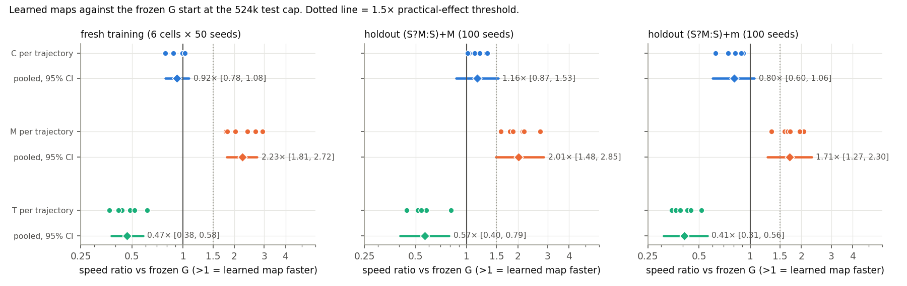
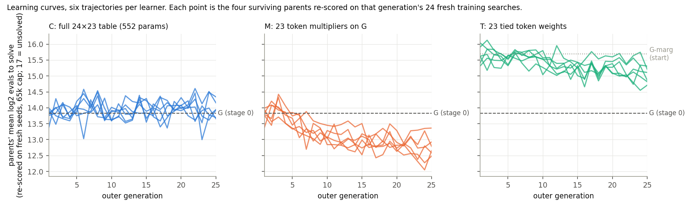
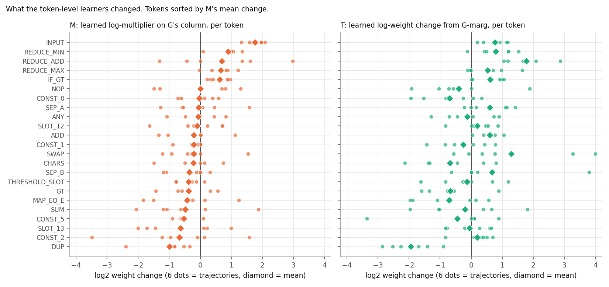

# Analysis: outer-loop decoder learning on six post-addition tasks (0132)

Results from commit `02cf76f` (worktree `research/2026-10-06-0132`). Raw data:
`experiments/output/2026-10-06/2026-10-06-0132-post-addition-map-learning/`
(`search.jsonl` 197 528 searches, `generations.jsonl`, `final_maps.json`, `result.json`,
`stage0.json`, `schedule.json`). My scan scripts and intermediate tables are in
`analysis_tmp/` in this folder; the plots referenced below are in this folder.

## 1. Data completeness

The queue entry finished with exit 0 after 5 h 46 min (20 782 s), under the 7 h 40 min
internal deadline. `status.json` reports `state: complete`, `stop_reason: null`, and all 18
planned trajectories finished. I re-counted everything from `search.jsonl` rather than trusting
`result.json`:

| phase | rows found | rows expected | note |
|---|---:|---:|---|
| calibration (stage 0) | 2 304 | 3 learners × 2 gens × 16 maps × 24 | ok |
| repeatability (G, two sets) | 240 | 2 × 120 | ok |
| timing benchmarks | 144 | 4 × 32 + 2 × 8 | ok |
| learning | 172 800 | 18 traj × 25 gens × 16 maps × 24 | ok; 384 rows in every one of the 450 trajectory-generations |
| selection | 8 640 | 18 × 4 maps × 120 | ok |
| test (stage 2) | 13 400 | 24 maps × 500 + G, G-marg × 500 + U, F × 200 | ok; every (map, cell) has exactly the planned seed set |
| **total** | **197 528** | **197 528** | 0 duplicate (phase, map, cell, seed) keys |

Seeds: the 150 learning seed sets (6 trajectories × 25 generations) are identical across C/M/T
for the same trajectory index and generation, and pairwise disjoint across trajectories and
generations. All 28 tested maps were scored on the same 50 test seeds per training cell and
100 per holdout cell. No arm is missing; no run failed; `stderr.log` is empty.

**Stage-0 gate.** Harness repeatability passed: two fresh 120-run G training sets scored 13.86
(SE 0.14, 93% solved) and 13.81 (SE 0.16, 88% solved), a difference of 0.05 log2 against the
0.6 stop threshold. These match the steward's probe values of 13.75 and 13.94. The schedule
projection was 427 min for the full design with sampling and 413 min without, against the 420
min gate, so the gate **dropped stage-3 sampling** and kept everything else (C6/M6/T6, 25
generations). The run actually took 346 min. Sampling was projected at 12 min, so the full
design would have fitted; the drop was the headroom stacking noted as minor point 1 in
`code_review.md`. Consequence: no sampled holdout solver rates for the learned maps. Nothing
else was cut.

**Frozen G reproduces run 0001.** On the two holdouts G solved 97/100 and 97/100 at the 524k
cap with Kaplan–Meier medians 10.9k and 16.1k evaluations; run 0001 had 49/50 and 48/50 with
medians 13.6k and 18.7k on different seeds. Same regime.

**Marginal checks.** All six C-marg tables passed the agreement rule (`C*_marginal.json`,
`agreement_passed: true`).

## 2. Key numbers

Metric: mean log2 evaluations to an exact solve, unsolved runs scored at log2(2 × cap). Speed
ratio A/B = 2^(cost_B − cost_A); > 1 means A is faster. Intervals are the run's two-level
bootstrap (trajectories, then shared seeds, 10 000 resamples). I recomputed every contrast with
an independent bootstrap (4 000 resamples, my own seed resampling) and got the same point
estimates to two decimals and interval ends within ±0.03; the per-trajectory ratios below are
from my recomputation (`analysis_tmp/scan.json`).

### 2.1 The three learners against their starts

| contrast | fresh training, 65k cap | fresh training, 524k cap | holdout (S?M:S)+M | holdout (S?M:S)+m |
|---|---|---|---|---|
| **C / G** (contextual, 552 params) | 0.94 [0.81, 1.09] no practical gain | 0.92 [0.78, 1.09] no practical gain | 1.16 [0.86, 1.54] unresolved | 0.80 [0.60, 1.07] no practical gain |
| **M / G** (23 token multipliers on G) | 2.21 [1.81, 2.71] faster | 2.23 [1.82, 2.75] faster | 2.01 [1.47, 2.81] faster | 1.71 [1.26, 2.32] faster |
| **T / G-marg** (23 tied weights) | 1.88 [1.56, 2.27] faster | 2.12 [1.70, 2.66] faster | 1.69 [1.26, 2.27] faster | 1.97 [1.44, 2.69] faster |
| T / G | 0.49 [0.40, 0.59] | 0.47 [0.37, 0.58] | 0.57 [0.41, 0.80] | 0.41 [0.31, 0.55] |

Per-trajectory ratios against G at the 524k cap (six values each):

| | training | holdout (S?M:S)+M | holdout (S?M:S)+m |
|---|---|---|---|
| C1..C6 | 0.88 0.88 0.98 0.99 1.03 0.78 | 1.03 1.01 1.30 1.32 1.11 1.19 | 0.91 0.74 0.63 0.82 0.88 0.88 |
| M1..M6 | 1.78 2.39 2.02 2.66 1.82 2.93 | 1.59 1.79 2.13 2.17 1.88 2.71 | 1.60 1.67 1.33 2.07 1.71 1.96 |
| T1..T6 | 0.49 0.44 0.52 0.61 0.37 0.42 | 0.57 0.81 0.58 0.51 0.44 0.54 | 0.43 0.45 0.35 0.52 0.37 0.39 |

Every M trajectory is faster than G on training and on both holdouts; no C trajectory is
faster than G on training, and C is split between the holdouts. Between-trajectory sd of the
log2 difference is 0.13–0.30 for all contrasts, in line with the 0.3 assumed in the proposal's
power sketch.

### 2.2 Controls and secondary contrasts (524k cap)

| contrast | holdout (S?M:S)+M | holdout (S?M:S)+m | training |
|---|---|---|---|
| C / M | 0.57 [0.46, 0.71] | 0.47 [0.38, 0.58] | 0.41 [0.33, 0.51] |
| C / C-marg | 3.41 [2.76, 4.32] faster | 3.51 [2.65, 4.71] faster | 3.92 [3.43, 4.50] |
| C-marg / G-marg | 1.01 [0.79, 1.30] | 1.10 [0.79, 1.52] | 1.06 [0.92, 1.23] |
| G / G-marg (frozen pair) | 2.98 [2.13, 4.08] | 4.80 [3.47, 6.73] | 4.55 [3.86, 5.37] |
| G / U | 6.58 [4.74, 9.10] | 8.00 [5.51, 11.46] | — |
| G / F | 2.68 [1.97, 3.60] | 4.64 [3.19, 6.69] | — |

### 2.3 Pooled costs, solve counts and the training–holdout gap (524k cap)

| maps | training cost | holdout cost | gap (holdout − training) | training solves 65k | training solves 524k | holdout solves 524k |
|---|---:|---:|---:|---:|---:|---:|
| C1..6 | 13.96 | 14.01 | +0.05 (−0.27 … +0.24) | 1 594 / 1 800 | 1 776 / 1 800 | 1 178 / 1 200 |
| M1..6 | 12.68 | 13.06 | +0.38 (+0.14 … +0.58) | 1 753 / 1 800 | 1 799 / 1 800 | 1 194 / 1 200 |
| T1..6 | 14.94 | 15.01 | +0.07 (−0.35 … +0.37) | 1 359 / 1 800 | 1 750 / 1 800 | 1 157 / 1 200 |
| C-marg1..6 | 15.93 | 15.80 | −0.13 | 983 / 1 800 | 1 686 / 1 800 | 1 099 / 1 200 |
| G | 13.84 | 13.95 | +0.12 | 279 / 300 | 300 / 300 | 194 / 200 |
| G-marg | 16.02 | 15.87 | −0.15 | 153 / 300 | 283 / 300 | 188 / 200 |
| U | — | 16.81 | — | — | — | 176 / 200 |
| F | — | 15.77 | — | — | — | 189 / 200 |

M is the only learner whose holdout cost sits noticeably above its training cost (+0.38 log2 on
average, every trajectory positive): roughly a third of M's training gain over G (1.16 log2) is
not carried to the holdouts (0.78 and 1.00 log2 on the two cells after subtracting G's own gap).
Pooled holdout solve fraction by budget (1 200 runs per learner family, 200 for frozen maps):

| budget | 4 096 | 8 192 | 16 384 | 32 768 | 65 536 | 131 072 | 524 288 |
|---|---|---|---|---|---|---|---|
| M | 0.29 | 0.51 | 0.70 | 0.87 | 0.96 | 0.98 | 0.99 |
| G | 0.09 | 0.36 | 0.56 | 0.76 | 0.89 | 0.94 | 0.97 |
| C | 0.13 | 0.29 | 0.53 | 0.75 | 0.88 | 0.94 | 0.98 |
| T | 0.03 | 0.13 | 0.33 | 0.55 | 0.74 | 0.85 | 0.96 |
| G-marg | 0.01 | 0.04 | 0.15 | 0.41 | 0.54 | 0.73 | 0.94 |
| C-marg | 0.01 | 0.06 | 0.17 | 0.36 | 0.60 | 0.77 | 0.92 |
| F | 0.00 | 0.04 | 0.18 | 0.40 | 0.56 | 0.78 | 0.94 |
| U | 0.00 | 0.01 | 0.02 | 0.14 | 0.34 | 0.60 | 0.88 |

### 2.4 Learning curves and drift

`learning_curves.png` plots, per generation, the mean score of the four surviving parents on
that generation's 24 fresh training searches (parents are re-scored every generation, so this
is not inflated by selection on the same seeds).

- **C never moves.** Parents' mean stays at 13.4–14.5 for all 25 generations in all six
  trajectories, scattered around G's 13.8. Mean paired child-minus-parent difference across all
  1 800 children per trajectory is −0.03 to +0.07 log2 (noise). Final L1 probability drift from
  G: 1.1–1.5 summed over 24 rows (a row can drift at most 2.0), so on average each row moved
  about 0.06 in total variation. Every row drifted by about the same small amount; no row
  stands out (`analysis_tmp` output). Consistently, C-marg is indistinguishable from G-marg
  (1.01–1.10) and C beats C-marg by the same 3.4–3.9× that G beats G-marg: C is G plus noise.
- **M descends steadily** from 13.8 to 12.4–13.4 over 25 generations, all six trajectories,
  with the curves still sloping down at generation 25. L1 drift 11–14.
- **T descends slowly** from 15.6 to 14.7–15.3 (G-marg start 15.7–16.0 on these seeds), L1
  drift 10–15, still sloping at generation 25.

In every learner the selection step replaced about three of the four parents per generation
(2.8–3.3 children selected on average), which is what a near-flat noisy landscape produces: for
C that is churn without direction, for M and T it accompanies a trend.

### 2.5 What M and T learned

`learned_token_weights.png` shows the final 23 log-weight changes per trajectory.

M (multipliers on every row of G; log2 change, mean over six trajectories, sign agreement):

| token | mean log2 multiplier | all six agree? |
|---|---:|---|
| INPUT | +1.76 (×3.4) | yes, all up (range ×2.5–4.3) |
| REDUCE_MIN | +0.91 | 5 of 6 up by > ×1.8; one unchanged |
| REDUCE_ADD | +0.69 | mixed (−1.3 … +3.0) |
| REDUCE_MAX | +0.66 | 5 of 6 up |
| IF_GT | +0.62 | yes, all up (×1.2–2.0) |
| DUP | −1.00 (×0.5) | yes, all down (×0.19–0.79) |
| CONST_5 | −0.53 | 5 of 6 down |
| others | within ±0.7 | no consistent sign |

In table terms, INPUT's mean row probability rises from 11.8% under G to 22–33% under the M
maps; DUP falls from 9.8% to 1.7–6.0%; ADD falls in 5 of 6 (9.8% → 2.9–8.0%). No multiplier
reached the ±log 16 bound. T, starting from the tied G-marg, agrees on DUP down (all six, mean
−1.9 log2) and INPUT up (all six, +0.8), adds REDUCE_ADD up (all six, +1.8) and ADD up (5 of 6),
and otherwise scatters. One T coordinate hit the bound.

### 2.6 Adaptation cost (kept separate from the transfer numbers)

| learner | inner evaluations per trajectory | wall minutes per trajectory (10 workers) | total |
|---|---|---|---|
| C | 223–240 M | 13.6–14.6 | 1.39 B, 85 min |
| M | 141–180 M | 9.1–11.1 | 0.94 B, 59 min |
| T | 396–451 M | 22.1–24.9 | 2.53 B, 141 min |

M is cheapest because its maps solve the training searches sooner. The whole run used 5.79 B
inner evaluations; stage 2 (13 400 searches at the 524k cap) took most of the remaining time.

### 2.7 Shortcut check

The search rejects training-perfect programs that fail the exact 1 331-input check, and the
`shortcuts` counter records them. On the holdouts a handful of single seeds per map (0–5 of 100)
spent tens of thousands of evaluations cycling through such programs; these are the same kind
of event under G, G-marg and the learned maps, and they do not inflate solve counts. M's gain is
not a degenerate table either: the largest single-token share in any M map is INPUT at 33%, and
no M coordinate is at the bound.

## 3. What the data show

1. **The contextual learner C did not improve training search at this budget.** C vs G on
   fresh training is 0.92–0.94 with the interval upper end at 1.09, below the 1.5× practical
   threshold. The learning curves show no trend at all. This is the proposal's row 1.
2. **The restricted control M did improve, and the improvement carried to both withheld
   compositions.** M vs G is 2.2× on fresh training (lower bound 1.8) and 2.0× / 1.7× on the
   two holdouts (lower bounds 1.47 and 1.26). All 6 trajectories agree in direction on every
   set. By the proposal's classification M is "faster" than G everywhere, but the holdout lower
   bounds sit below 1.5, so a ≥1.5× holdout gain is not established; a gain somewhere in
   1.3–2.8× is.
3. **Frequency-only learning helps a frequency-only start but does not catch the contextual
   prior.** T beats its start G-marg by 1.7–2.1× on all sets, yet remains 1.8–2.4× slower than
   frozen G. G-marg → T recovers roughly half of the G/G-marg gap in log terms (0.9–1.1 of 1.6–2.3
   log2).
4. **The learners that moved agree on what to change:** more INPUT, less DUP, more IF_GT and the
   reducers (REDUCE_MIN/REDUCE_MAX in M; REDUCE_ADD in T). The agreement across six independent
   trajectories per learner is the strongest signal in the run that these are real preferences
   on this task family rather than drift.
5. **M transfers with shrinkage.** M's holdout cost is 0.38 log2 above its training cost (all
   six trajectories positive), against +0.12 for G and +0.05 for C. About a third of the
   training gain does not reach the holdouts.

## 4. What the data do not show

- **Nothing about whether contextual preferences can be learned.** C's failure is a property
  of this operator at this budget: three of 552 coordinates per child, each moving one table
  cell by about e^±0.5, against a per-run score sd of 1.6 log2 and 24 runs per candidate. The
  resulting per-generation table change is roughly 1/24 of M's (M's three coordinates each
  rescale a whole 24-row column). C's total drift after 25 generations is 1.1–1.5 L1; M's is
  11–14. The critic flagged exactly this risk (note 2), and the data confirm it: C had no
  detectable signal to climb. The experiment does not say whether a C that could move (larger
  or row-wise steps, more generations, or a smarter optimizer) would transfer.
- **No mechanism.** Supply (how many solvers exist among random genotypes) and mutation effects
  still move together; stage-3 sampling, which would have given at least a supply-side
  descriptive, was dropped by the gate.
- **No family specificity.** Only the PA family was trained and tested. M's preferences (INPUT
  up, DUP down) could be generic improvements to G on this alphabet rather than PA-specific;
  nothing here separates the two.
- **Not an estimate of M's holdout gain to 1.5× precision.** The holdout intervals span
  1.26–2.81. At the measured between-trajectory sd (0.22–0.27 log2) the run's own heuristic says
  six trajectories suffice for a ±0.29 log2 half-width from trajectory spread alone, so the
  remaining width is seed noise on 100 holdout runs; more seeds per holdout, not more
  trajectories, would narrow it.
- **The M maps were selected on the 65k training objective and are still improving at
  generation 25.** The reported M gain is a lower bound on what this learner reaches; the
  training-versus-holdout shrinkage might grow or shrink with more generations.
- **Nothing on hand-set grammars.** The steward's probe found a hand-set PA grammar
  (IF_GT→INPUT/ADD, ADD→DUP) did not beat G; the learned M maps go the other way on DUP and
  ADD, which is a hint that the hand-set direction was wrong rather than that contextual
  structure cannot help, but that is interpretation, not a measurement here.

## Against the predictions

`plan.md` was read after sections 1–4 were written.

**Outcome rule: row 1.** The plan's first rule fires: fresh-training C/G at the 524k test cap is
"no practical gain" (0.92, upper bound 1.09), and the plan says this means "no practical
training gain at the larger test cap, not zero gain and not a rejection of contextual
learning". The 65k contrast the plan asks for alongside is the same (0.94 [0.81, 1.09]), so
there is no objective/cap discrepancy: the selected objective itself was not improved, and the
bootstrap puts any true C gain below 1.09×. The run's own `result.json` reaches the same row.
Rows 2–4 are not reached because they all require C faster on training. The outcome is a clean
row 1, not row 5: no interval the rule depends on straddles the decision boundary.

**Predicted versus observed, item by item.**

- *"Rows 1 and 2 are the most likely"* (proposal). Row 1 observed. The proposal's reason was
  that G is near a local optimum on training and a hand-set grammar did not beat it. The data
  reject that reason: M found a 2.2× training improvement over G with the same operator and
  budget, from the same start. G is not near an optimum of the 23-multiplier family; C simply
  could not move.
- *Critic note 2 ("a failure of sparse C mutations in 552 dimensions would diagnose this
  procedure, not contextual learning generally")*. This is the observed situation. Stage 0
  recorded a 100% integer-table change rate for C's mutations, so the operator did change the
  decoder every time; the paired child-minus-parent score sd was 1.67 log2 (C), 2.03 (M), 1.58
  (T) with 24 runs per candidate. The effect of a three-cell change in C is far below that
  noise, and 25 generations of selection on it produced an L1 drift of 1.1–1.5, about a tenth
  of M's. The plan's "no outcome establishes … performance of a better optimizer" applies
  directly: the next design question is the operator and step scale for C, not whether
  contextual learning exists.
- *Secondary results the proposal said to report if M or T beat their starts.* Both did. M
  faster than G on training and on both holdouts (2.0× and 1.7×, lower bounds 1.47 and 1.26);
  T faster than G-marg on all sets (1.7–2.1×) but still 1.8–2.4× slower than G. The plan's
  caution for row 4 ("report M/G before asserting M transfers") is satisfied: M/G is reported
  on every set, with the per-trajectory values, and all six trajectories agree in sign.
- *Power sketch.* The proposal assumed a between-trajectory sd of 0.3 log2 and a paired SE of
  about 0.2 per holdout. Measured between-trajectory sd was 0.13–0.30; the holdout intervals for
  M/G are ±0.46 and ±0.43 log2 wide (ratio span 1.47–2.81 and 1.26–2.32), roughly 1.3× the
  predicted half-width of 0.33. The design would have called a true 1.5× C gain "faster" on
  training, as predicted, and the true-null C came out "no practical gain" on training, as
  predicted. The 1.5× threshold is not cleared for M on the holdouts, which the proposal did not
  anticipate because M was a control.
- *Runtime.* Projected 405 min in the plan, 413–427 min by stage 0, 346 min observed. The
  stage-0 gate dropped sampling because the full design projected 7 min over the 420-min gate
  with 15% headroom; actual time left 74 min unused. This matches code review minor note 1.
  The only planned output missing is therefore the stage-3 sampled solver counts for C and M.
- *Stage-0 repeatability gate* (stop if two G sets differ by more than 0.6 log2): difference
  0.05. *Marginal agreement rule*: all six C-marg passed. *Incomplete-study rule*: not
  triggered, no missing IDs.

**What this means for the plan's scope statement.** The plan says no outcome establishes
mechanism, family specificity, or a better optimizer's performance, and that the bank is reused
rather than untouched. All of that stands. The one thing the run adds beyond row 1 is a
positive, replicated, held-out result for the restricted learner: retuning G's token weights
(mainly INPUT up and DUP down) speeds exact search on the withheld M/S compositions by
somewhere between 1.3× and 2.8×. Whether that is PA-specific or a generic improvement to G is
the open question row 1 leaves for strategy.
