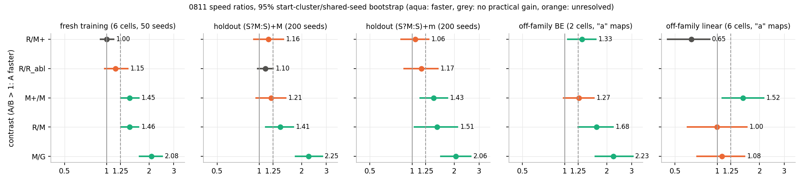
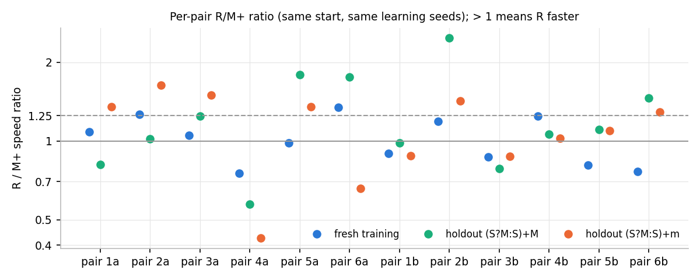
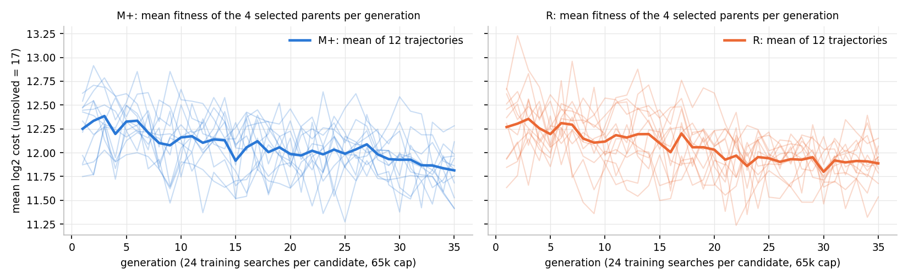

# Analysis: contextual moves versus continued token learning from the six M maps (0811)

Results from commit `0709104` (worktree `research/2026-10-06-0811`). Raw data:
`experiments/output/2026-10-06/2026-10-06-0811-contextual-continuation/` (`search.jsonl`
376 796 searches, `generations.jsonl` 840 generation records, `final_maps.json`, `result.json`,
`stage0.json`, `schedule.json`, `sampling.json`). Plots referenced below are in this folder
(`contrasts.png`, `learning_curves.png`, `per_pair_ratios.png`); the run's own `curves.png` is
in the output folder.

## 1. Data completeness

The single queue entry finished with exit 0 after 4 h 50 min (17 377 s), well inside the
7 h 40 min internal deadline. `status.json`: `state: complete`, `stop_reason: null`, 12 of 12
planned pairs completed, 36 learned/ablated maps finished. `stderr.log` is empty. I re-counted
every phase from `search.jsonl` rather than trusting `result.json`:

| phase | rows found | rows expected | note |
|---|---:|---:|---|
| harness check (G, training, 65k) | 120 | 6 cells × 20 seeds | ok |
| calibration (stage 0) | 4 752 | 6 starts × (24 parent + 16 M+ children × 24 + 16 R children × 24) | ok |
| timing | 144 | 4 tables × 36 | ok |
| frozen references, PA (G, M1–M6) | 4 900 | 7 × (300 training + 400 holdout) | ok |
| frozen references, non-PA | 2 800 | 7 × 8 cells × 50 | ok |
| learning | 322 560 | 24 trajectories × 35 generations × 16 candidates × 24 | 384 rows in every one of the 840 trajectory-generations |
| final selection | 11 520 | 24 × 4 parents × 120 | ok |
| pair tests, PA (M+, R, R_abl) | 25 200 | 12 pairs × 3 maps × 700 | ok |
| learned off-family (M+ka, Rka) | 4 800 | 12 maps × 8 cells × 50 | ok |
| **total** | **376 796** | **376 796** | 0 duplicate (map, cell, seed) keys among the 37 700 test rows; no row carries an error |

Seeds, checked directly:

- Every tested map was scored on the identical seed set per cell: 50 per training cell, 200 per
  holdout cell, 50 per non-PA cell (43 maps on PA, 19 maps on non-PA, one distinct seed set per
  cell in every case).
- Within each pair, M+ and R saw the same 24 (cell, seed) pairs in all 35 generations and the
  same 120 in the final selection (420 of 420 generation checks identical). Seed sets differ
  between pairs and between the two continuations of a start; selection seeds do not overlap
  learning seeds. Mutation streams differ per arm (`817000000 + pair×100 + {0,1}`).
- Zero-residual R vectors reproduced all six saved M tables (`stage0.json`, asserted at start-up).

**Stage-0 gates.** Harness: G scored 13.96 on the 120-run training set (103 solved) against the
0132 reference 13.84, a difference of 0.12 log2 versus the 0.6 stop threshold. Pass. Timing
projection: the full design (35 generations, sampling, learned off-family) was projected at
5.85 h (21 075 s), under the 7.0 h cap, so **nothing was cut**. Actual 4.83 h. Stages 4 and 5
ran to completion (`learned_off_family_complete: true`, `sampling_complete: true`, 18 maps
× 10⁸ genotypes).

**Stage-0 calibration (descriptive only; the spread gate was removed by the code review as
unstable).** 96 children per operator (16 per start), each paired with its start on the same
24 training searches. Child-minus-parent mean log2 cost (negative = child faster):

| operator | n | mean effect | observed sd | estimated noise sd | estimated true-effect sd [approx. 95%] | children better by > 0.5 |
|---|---:|---:|---:|---:|---|---:|
| M+ token step (3 multipliers, σ 0.5) | 96 | +0.04 | 0.47 | 0.50 | 0.00 [0.00, 0.36] | 10/96 |
| R row step (one row, 23 residuals, σ ∈ {0.5, 1.0}) | 96 | −0.05 | 0.30 | 0.38 | 0.00 [0.00, 0.11] | 4/96 |

On the actual run's calibration the variance subtraction gives zero true-effect spread for
*both* operators, with the R interval topping out at 0.11. The steward's probe had put the
row step at 0.18–0.34 and the M step at 0.32. Had the original gate (row sd ≥ 0.15) still been
in force it would have fired on this calibration, and so would an equivalent gate on M+'s
own operator. I read this the way the code review asked: the estimator is unstable at n = 96,
so these numbers neither establish nor rule out usable variation. They do not gate anything.
(The R interval is narrower than M+'s because R children were less spread, 0.30 versus 0.47.)

## 2. Key numbers

Metric: mean log2 evaluations to an exact solve on all 1 331 inputs; unsolved runs count as
log2(2 × cap). Speed ratio A/B = 2^(cost_B − cost_A), > 1 means A is faster. Intervals are
the run's two-level bootstrap (six start clusters with both continuations retained, then the
shared seed indices jointly across maps, 10 000 resamples). I recomputed every PA contrast
with my own implementation (4 000 resamples, different seed stream): point estimates agree to
two decimals and interval ends within ±0.01 (e.g. holdout (S?M:S)+M R/M+ 1.16 [0.91, 1.48]
versus my 1.16 [0.91, 1.48]).

### 2.1 Primary contrasts

| contrast | fresh training, 524k cap (6 cells × 50 seeds) | holdout (S?M:S)+M (200 seeds) | holdout (S?M:S)+m (200 seeds) |
|---|---|---|---|
| **R / M+** (contextual moves allowed vs continued token learning, 12 pairs) | 1.00 [0.90, 1.11] **no practical gain** | 1.16 [0.91, 1.48] **unresolved** | 1.06 [0.83, 1.31] **unresolved** |
| **R / R_abl** (R vs its own multipliers with residuals removed) | 1.15 [0.97, 1.41] unresolved | 1.10 [0.97, 1.25] no practical gain | 1.17 [0.88, 1.53] unresolved |
| M+ / M (did continuing help) | 1.45 [1.26, 1.69] faster | 1.21 [0.95, 1.54] unresolved | 1.43 [1.14, 1.78] faster |
| R / M | 1.46 [1.26, 1.69] faster | 1.41 [1.11, 1.75] faster | 1.51 [1.04, 2.11] faster |
| M / G (frozen, 6 starts, replicates 0132) | 2.08 [1.72, 2.49] faster | 2.25 [1.81, 2.81] faster | 2.06 [1.60, 2.63] faster |

The 65k-capped training numbers are the same to two decimals (R/M+ 1.00 [0.90, 1.11]).

Per-pair R/M+ ratios (same start, same learning seeds; `per_pair_ratios.png`):

| pair | 1a | 2a | 3a | 4a | 5a | 6a | 1b | 2b | 3b | 4b | 5b | 6b |
|---|---|---|---|---|---|---|---|---|---|---|---|---|
| training | 1.08 | 1.26 | 1.05 | 0.75 | 0.98 | 1.34 | 0.90 | 1.19 | 0.87 | 1.25 | 0.81 | 0.76 |
| holdout (S?M:S)+M | 0.81 | 1.02 | 1.25 | 0.57 | 1.79 | 1.75 | 0.98 | 2.48 | 0.78 | 1.06 | 1.11 | 1.46 |
| holdout (S?M:S)+m | 1.35 | 1.63 | 1.49 | 0.42 | 1.35 | 0.66 | 0.88 | 1.42 | 0.87 | 1.03 | 1.10 | 1.29 |

R was faster than M+ in 6 of 12 pairs on training, 8 of 12 on the first holdout and 9 of 12
on the second. The between-pair sd of the log2 difference is 0.29 on training and 0.59 / 0.56
on the holdouts, about twice the 0.3 the proposal assumed; the between-start sd of R/M+ is
0.16 on training and 0.45 / 0.41 on the holdouts. Start 4 contributes most of the spread:
R4a is slower than M+4a everywhere (training 12.55 vs 12.14; holdout (S?M:S)+m 13.95 with
194/200 solved vs 12.72; BE 13.04 vs 12.94; linear 12.68 vs 10.80), while its final-selection
score (12.07 on 120 searches) gave no warning. R4b, from the same start, is normal. I note this
as a single degenerate trajectory; no analysis below excludes it.

**Classification.** Training R/M+ is "no practical gain" (upper bound 1.11 < 1.25, lower bound
0.90 ≤ 1); both holdouts are "unresolved" (intervals span 1 and 1.25). Row 3 of the proposal
needs "no practical gain" on all three; row 2 needs "faster" on training. Neither matches, so
`result.json` reports **row 4, unresolved**, and I agree.

**Follow-up sizing at the observed spread** (run's normal approximation, six-start clusters,
shared-seed term retained; "pairs" means two continuations per start):

| contrast | to bound a true null below 1.25 | to resolve the observed point as faster | to bound the observed point below 1.25 |
|---|---:|---:|---:|
| holdout (S?M:S)+M R/M+ (1.16) | 9 starts (18 pairs) | 20 starts (40 pairs) | 190 starts |
| holdout (S?M:S)+m R/M+ (1.06) | 7 starts (14 pairs) | not reachable (point ≈ 1) | 14 starts (28 pairs) |
| training R/M+ (1.00) | 6 starts (done) | — | 6 starts (done) |

Added continuations are not added starts; the between-start term dominates on the holdouts.
A replication with the 12 existing pairs plus 8 new starts would bound a true null; resolving
a true 1.16× needs roughly 20 starts, i.e. a new M-map screen first.

### 2.2 Residual ablation and shrinkage

R/R_abl is unresolved on training (1.15 [0.97, 1.41]) and on the second holdout, and bounded
below 1.25 on the first holdout (1.10 [0.97, 1.25]). Per-start R/R_abl on training: 1.05,
1.75, 1.20, 0.94, 0.89, 1.27. Removing the residuals hurts in four starts and helps in two.
The learned multipliers co-adapted with the residuals, so this is a dependency check only.

Training-to-holdout shrinkage of the log2 gain over M (descriptive):

| arm | gain over M on training (log2) | lost on holdout (S?M:S)+M | lost on holdout (S?M:S)+m |
|---|---:|---:|---:|
| M+ | 0.54 | 0.26 (48%) | 0.03 (5%) |
| R | 0.54 | 0.05 (8%) | −0.05 (none; gained) |

Both arms gained the same 0.54 log2 on training over their starts. M+ kept less of it on the
first holdout, R kept more on both; this difference is what the holdout R/M+ points of 1.16
and 1.06 express, and it is not resolved.

### 2.3 Learning curves, operator acceptance, drift

Per-generation fitness is measured on that generation's own 4 seeds × 6 cells, so single
curves are noisy (sd of a candidate's 24-search mean is about 0.4). The 12-trajectory means
fall from 12.3 to 11.8 (M+) and 12.3 to 11.9 (R) over 35 generations, still sloping at the
end in both arms. On the final 120-search selection, the chosen parents score 11.7–12.5 in
both arms.

Selection into the next parent set, by operator (12 children per generation compete with
4 re-scored parents; 25% is the rate for an operator whose children are indistinguishable
from the field):

| operator | children offered | selected | rate |
|---|---:|---:|---:|
| M+ token step | 5 040 | 1 196 | 23.7% |
| R token step | 2 518 | 623 | 24.7% |
| R row step, σ 0.5 | 1 260 | 325 | 25.8% |
| R row step, σ 1.0 | 1 262 | 301 | 23.9% |

All four operators are accepted at the chance rate; 96–110 of the 140 parent slots per
trajectory were filled by children. Per-generation selection on 24 searches does not
distinguish row moves from token moves, nor either from re-scored parents. The slow descent
of the means is the accumulated effect of a weak bias, as in 0132.

Drift from the start map (L1 of the count table / 23 000, summed over 24 rows):

| arm | total L1 | multiplier part | residual part | rows with non-zero residuals |
|---|---|---|---|---|
| M+ (12) | 5.1–11.1 | = total | 0 | — |
| R (12) | 6.1–12.4 | 3.6–11.0 | 3.4–6.1 | 7–13 of 24 per map |

R's residual drift is a third to a half of its total; its multiplier drift is comparable to
M+'s. Which rows R changed (`result.json: map_changes.rows`, rows indexed as decoder context
rows, columns labelled as in 0132): no row was changed in all 12 R maps. Rows changed in
≥ 7 of 12 maps: SEP_A (9), SLOT_13 (8), NOP, CONST_0, SWAP, CONST_2, SEP_B (7 each). Within
those rows a few cells agree in sign among the maps that changed them (e.g. row CONST_2 ×
column NOP up in 7/7, row SLOT_13 × column CHARS down in 7/8, row SEP_A × column CHARS up in
7/9), but each is a minority of the 12 continuations and none was pre-registered; I report
them as candidates, not as learned context. Token-multiplier directions (sign agreement over
12 continuations): M+ moved IF_GT up (12/12), DUP down (11/12), REDUCE_MIN up (11/12),
REDUCE_ADD up (11/12), ADD up (10/12); R moved SLOT_13 down (11/12), DUP down (9/12), ADD up
(8/12), and otherwise scattered. IF_GT up and DUP down continue 0132's M directions.

### 2.4 Adaptation cost (separate from test cost)

| | per trajectory | all 24 |
|---|---|---|
| inner evaluations (learning + selection) | 1.07–1.62 × 10⁸ | 3.22 × 10⁹ |
| wall at 10 workers | 435–640 s | 13 400 s (3.7 h of the 4.8 h run) |
| searches | 13 920 | 334 080 |

Pairs took 1 053–1 298 s including their three test batteries. M+ and R cost the same within
noise (same search counts; R's decode is 24 × 23 instead of 23 parameters).

### 2.5 Off-family check (descriptive; selects nothing)

Frozen M maps versus G on the eight retained non-PA cells (50 seeds each, 524k cap):

| cells | M / G | per start M1–M6 |
|---|---|---|
| BE (2 cells, 100 searches per map) | 2.23 [1.66, 3.06] faster | 1.72 3.14 2.09 2.21 1.92 2.59 |
| linear (6 cells, 300 per map) | 1.08 [0.72, 1.57] unresolved | 0.49 1.40 1.09 1.58 0.72 1.89 |
| of which D1 (3 cells) | 1.18 [0.78, 1.72] unresolved | |
| of which D2 (3 cells) | 1.00 [0.65, 1.47] unresolved | |

M's gain on the two BE cells is the size of its PA gains (2.1–2.3×). On linear cells M is on
average no faster than G, with starts split (M1 and M5 slower, M4 and M6 faster). G solved
every linear search; its mean cost there (11.7–12.2 log2) is near the population floor the
proposal described, so linear ratios carry little information either way.

Learned "a" maps on the same cells (6 starts, one continuation each):

| cells | R / M+ | M+ / M | R / M |
|---|---|---|---|
| BE | 1.33 [1.05, 1.66] faster | 1.27 [0.98, 1.62] unresolved | 1.68 [1.25, 2.21] faster |
| linear | 0.65 [0.44, 0.88] (R slower; upper bound < 1) | 1.52 [1.09, 2.14] faster | 1.00 [0.61, 1.62] unresolved |

Continued token learning (M+) made the maps faster on linear cells too (1.52×); allowing row
moves (R) gave that back: R is 0.65× M+ on linear (slower in 6 of 6 starts: 0.91, 0.63, 0.63,
0.27, 0.80, 0.99) and back at M's level. On BE, R is faster than M+ (6 of 6 starts: 1.43,
1.47, 1.52, 0.94, 1.38, 1.34). These are six maps and 100–300 searches each, with no
pre-registered threshold, so they are patterns to test, not findings.

### 2.6 Sampled solver rates (descriptive; 10⁸ genotypes per map)

Exact solvers per 10⁸ random genotypes, summed over cell groups:

| map | PA training (6) | PA holdout (2) | BE (2) | D1 (3) | D2 (3) |
|---|---:|---:|---:|---:|---:|
| G (reused from 0001) | 112 | 47 | 37 | 482 | 93 |
| M1–M6 | 587–3 133 | 99–1 345 | 115–1 343 | 86–8 370 | 2–1 221 |
| M+1a–6a | 2 208–4 689 | 588–1 311 | 697–1 466 | 846–11 881 | 60–1 760 |
| R1a–6a | 2 584–10 204 | 336–2 315 | 588–2 381 | 586–5 547 | 35–602 |

Per start, R raised PA solver supply over M+ in 5 of 6 (ratios 2.3, 2.1, 1.9, 0.9, 2.2, 2.2 on
training cells) and lowered linear supply in 5 of 6 (D1: 1.5, 0.2, 0.4, 0.05, 0.6, 0.9). The
PA supply increase did not turn into a resolved PA search-cost gain; the linear supply loss
matches the linear search-cost loss. Supply and mutation neighbourhoods move together, so
this is not a mechanism.

## 3. What the data shows and does not show

Shows:

1. **Allowing row-level contextual moves gave no practical gain over continued token learning
   on fresh training searches**: R/M+ 1.00 [0.90, 1.11] on 12 matched pairs, bounded below
   1.11×. Both arms improved their start by the same 1.45× on training.
2. **On the two withheld compositions the comparison is unresolved**: 1.16 [0.91, 1.48] and
   1.06 [0.83, 1.31]. The between-start spread (0.4–0.45 log2) is twice what was assumed.
   R kept more of its training gain on the holdouts than M+ did, but not resolvably.
3. **Continued token learning from the M maps still helps**: M+/M 1.45× on training and
   1.43× on one holdout, unresolved (1.21×) on the other. M's gains were not its ceiling at
   25 generations.
4. **The frozen M maps' gain extends to the two BE cells** at the same size as the PA holdouts
   (2.2×), and is unresolved on linear cells where G is near the floor.
5. **Per-generation selection on 24 searches accepts every operator at the chance rate.** The
   outer loop works by weak cumulative bias, not by discriminating steps; at this budget it
   cannot tell a row move from a token move.
6. **The residual ablation is unresolved** (training 1.15 [0.97, 1.41]); on one holdout any
   residual contribution is bounded below 1.25.

Does not show:

- Whether contextual preferences exist that a better optimizer could learn: R's operator
  found none that beat token steps, with twelve pairs and 35 generations.
- Mechanism or family specificity. The BE and linear patterns for learned maps (R better on
  BE, worse on linear) come from six maps with no pre-registered rule.
- Anything about G's token-weight optimum; this experiment started from M, not G.
- The stage-0 calibration's zero true-effect spread for both operators is an unstable
  estimate, not evidence that either operator lacks variation; the learning stage shows that
  both operators did move the maps.

## Against the predictions

Read `plan.md` after writing the sections above.

- **Outcome row.** The plan's first-match table gives row 4 ("everything else"): training
  R/M+ is "no practical gain", both holdouts are "unresolved". Rows 1–3 each need a
  classification the holdouts did not deliver. The run's own `result.json` chose row 4 by the
  same rule. The plan's row-4 instruction (report every interval, cluster spread, coverage and
  sensitivity; assert neither equality nor optimization failure) is what §2.1 does.
- **Row 0 did not fire.** Harness G cost differed from the 0132 reference by 0.12 against the
  0.6 threshold. The calibration spread, as amended, selected nothing; had the original gate
  survived the code review it would have fired on the actual calibration (R true-effect sd
  estimated 0.00, upper 0.11, and the same for M+). The amendment was therefore decisive for
  this experiment existing, and the plan's reasoning for it (the estimator fails on resampled
  pilots) is consistent with what the full run's calibration shows.
- **Precision against the plan's conservative sensitivity.** The plan assumed a start-mean
  contrast sd of 0.30 and a shared-seed term of 0.13, giving a half-width factor of 1.27.
  Observed for R/M+: between-start sd 0.16 on training (seed SE 0.04), 0.45 and 0.41 on the
  holdouts (seed SE 0.04–0.05). Training came in tighter than the plan's best regime
  (half-width factor 1.11); the holdouts came in worse than its worst (factors 1.27 and
  1.25 around the point, intervals 0.91–1.48 and 0.83–1.31). The plan said the approved size
  "cannot guarantee a null will be bounded"; on the holdouts it was not, because the
  between-start spread, not the seed term, dominated. The plan's own sizing distinctions
  (continuations versus starts versus seeds) apply: more seeds would not help, more starts
  would (§2.1 table).
- **Coverage.** All 12 pairs and all 200 holdout seeds ran, so the "do not classify an
  incomplete study" clause does not apply.
- **Required reports.** M+/M and R/M, shrinkage per arm, learning curves, adaptation cost,
  drift split into multiplier and residual parts, changed rows and across-continuation
  directions, off-family M/G with BE and linear separate, and sampling as bounds are all in §2.
- **The proposal's expectation** was row 3 or 4 at about 60%, row 1 at about 25%. Row 4 is
  within that expectation. The specific reason the proposal gave (row steps mostly harmful at
  σ 1.0, R giving up half its token steps) is not what the data show: σ-1.0 row children were
  accepted at the same rate as every other operator (23.9% versus 24–26%), and R's multiplier
  drift matched M+'s despite half the token steps. The arms tied on training because neither
  operator's children were distinguishable from re-scored parents at 24 searches per
  candidate, not because row moves were selected against.
