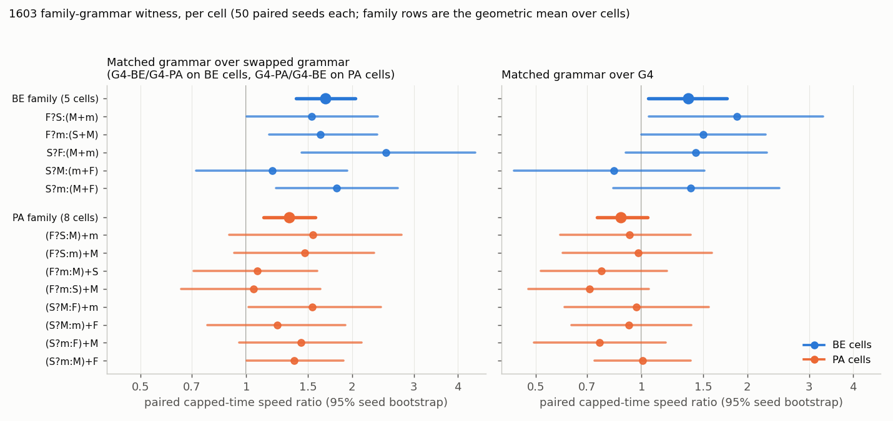

# Analysis — 2026-10-06-1603 (four-reducer FIRST bank)

Reviewer: Claude (fable 5.1), independent of the researcher (codex). Inputs: proposal.md,
queue.yaml, execution.md, code at `92ba7c5`, and the run folder
`experiments/output/2026-10-06/2026-10-06-1603-four-reducer-family/`. Every number below was
recomputed from `search.jsonl` and `stage_a.json` with my own script and an independent
bootstrap seed; where the run's own `summary.json` is quoted, I say so. plan.md was not read
until the section "Against the predictions".

## 1. Data completeness

Complete. Nothing is missing, duplicated or failed.

| Check | Result |
|---|---|
| Queue entry | 1/1 done, exit 0, wall 2 621 s (43.7 min) of a 14 400 s timeout; internal deadline 12 600 s never approached |
| Expected outputs | 16/16 present; `stderr.log` empty; no `interruption.json` |
| Validation (stage A) | passed: brute force vs semantic machine to depth 4 (137 561 programs, 4 115 typed states); 100 000 random 32-token programs Python = Rust; 36/36 canonicals per domain reproduce their labels in Rust (`canonical_verified` true for all 108) |
| Screens | 3/3 domains complete to depth 9 (D625 105 s, D1331 108 s, D2401 109 s; peak RSS 4.9–5.5 GB) |
| Calibration rows | 5 200 = 13 cells × 8 arms × 50 seeds; 0 duplicates; every cell × arm has exactly the 50 seeds 1603100–1603149 |
| Pairing | one seed set shared by all 104 cell × arm groups; training-case indices identical across arms for a given cell × seed (0 mismatches); one decoder-table hash per arm |
| Blocks | 5 balanced blocks of 1 040, walls 428 / 456 / 480 / 450 / 479 s |
| Stage C | not started (gates failed), so `fresh_scores.json` and `pilot` are empty by design, not by failure |
| Shortcut solutions | A "shortcut" is an individual perfect on the 64 training cases that fails the exact 1 331-input check; the harness keeps searching and never credits it. 77/5 200 runs saw ≥ 1 shortcut; 0 runs are marked solved without an exact check. Solve counts are not inflated. |

The run matches the design: 24-token alphabet `v2_rmin_first`, R = 24 000, P = 256, length 32,
cap 524 288, lexicase on 64 cases, exact check on all 1 331 inputs.

## 2. Stage A: screen and split (the deciding readout)

Retention (≥ 80 % agreement with any ≤ 9-token program, or identical labels, drops the cell):

| Domain | Retained / 36 | BE | PA | BE split | PA split |
|---|---|---|---|---|---|
| D625 | 10 | 4 | 6 | none | none |
| **D1331 (selected)** | **13** | **5** | **8** | **none** | yes |
| D2401 | 13 | 5 | 8 | none | yes |

All 23 D1331 drops are near-aliases (0.839–0.952 agreement); no two cells share labels.
Every cell conditioned on MAX or MIN dies, as the probe predicted, because M > 0 and m > 0 are
near-constant on these domains. The 13 retained D1331 cells are exactly the probe's 13.

**BE has no valid holdout pair under the frozen rule.** Retained BE cells: `F?S:(M+m)`,
`F?m:(S+M)`, `S?F:(M+m)`, `S?M:(m+F)`, `S?m:(M+F)`. In the `then` role, S, F and M each occur
in exactly one cell, so any pair containing one of those three leaves its `then` reducer
uncovered. The only pair avoiding that is the two `then = m` cells, and then no training cell
has `then = m`. All 10 pairs fail (`stage_a.json` → `obstacles.BE.pair_obstacles`). One BE
cell can be held out alone with all its roles covered: `S?m:(M+F)`. This is identical to the
probe's unreviewed finding; it is now Rust-checked and exact.

**PA splits.** First valid pair in lexicographic order: holdouts `(F?S:M)+m` and `(S?M:m)+F`,
training the other 6. 6 of 8 PA cells are individually coverable; 7 of 28 pairs are valid.

Table A therefore stops at **row 1**: a family has no valid split. Gates (b)–(d) were not
evaluated by the run (`headroom: null`, `tractability: null`). Section 4 reports what they
would have said, as information for the strategist only.

## 3. Stage B: search calibration (13 cells × 8 arms × 50 seeds)

Solves / 50 and Kaplan–Meier median evaluations (from `summary.json`; unobserved medians would
be shown as "> cap", none occurred):

| Cell | U | F4 | G4 | G4-marg | G4-BE | G4-PA | G4-BE-marg | G4-PA-marg |
|---|---|---|---|---|---|---|---|---|
| BE F?S:(M+m) | 34 · 202k | 40 · 61k | 45 · 15.9k | 36 · 87k | 48 · 9.2k | 48 · 13.8k | 38 · 45k | 37 · 91k |
| BE F?m:(S+M) | 36 · 211k | 47 · 53k | 49 · 12.3k | 46 · 82k | 50 · 9.2k | 49 · 13.6k | 48 · 56k | 49 · 60k |
| BE S?F:(M+m) | 37 · 114k | 37 · 54k | 45 · 9.7k | 38 · 48k | 45 · 7.7k | 44 · 19.5k | 39 · 57k | 39 · 51k |
| BE S?M:(m+F) | 30 · 410k | 40 · 245k | 49 · 15.9k | 41 · 55k | 44 · 15.6k | 48 · 22.3k | 43 · 70k | 45 · 71k |
| BE S?m:(M+F) | 35 · 110k | 47 · 40k | 47 · 8.7k | 45 · 48k | 49 · 6.4k | 49 · 12.5k | 43 · 45k | 45 · 48k |
| PA (F?S:M)+m † | 35 · 103k | 39 · 30k | 49 · 10.8k | 45 · 41k | 45 · 23.0k | 48 · 14.1k | 41 · 59k | 42 · 42k |
| PA (F?S:m)+M | 41 · 124k | 43 · 85k | 50 · 16.4k | 43 · 49k | 48 · 17.4k | 50 · 17.2k | 38 · 55k | 40 · 82k |
| PA (F?m:M)+S | 41 · 61k | 45 · 36k | 50 · 9.2k | 43 · 51k | 50 · 12.8k | 50 · 11.3k | 48 · 50k | 42 · 53k |
| PA (F?m:S)+M | 38 · 148k | 47 · 49k | 50 · 13.3k | 50 · 35k | 49 · 15.6k | 49 · 26.1k | 50 · 35k | 47 · 73k |
| PA (S?M:F)+m | 29 · 370k | 46 · 72k | 50 · 28.7k | 42 · 95k | 48 · 40.7k | 50 · 28.9k | 40 · 90k | 44 · 118k |
| PA (S?M:m)+F † | 34 · 225k | 46 · 61k | 50 · 17.9k | 47 · 39k | 50 · 23.3k | 50 · 17.9k | 47 · 90k | 46 · 62k |
| PA (S?m:F)+M | 38 · 138k | 46 · 47k | 49 · 14.6k | 48 · 45k | 49 · 22.5k | 49 · 18.4k | 45 · 50k | 44 · 66k |
| PA (S?m:M)+F | 49 · 45k | 50 · 21.8k | 50 · 9.5k | 49 · 26.9k | 50 · 11.0k | 50 · 7.2k | 50 · 27.4k | 50 · 27.4k |

† PA holdouts under the frozen split. Solve curves at 4k / 32k / 131k / 524k per cell × arm
are in `summary.json`; the family-averaged curves are `curves.png` in the run folder.

Censoring (fraction of runs hitting the cap unsolved), per family:

| Family | U | F4 | G4 | G4-marg | G4-BE | G4-PA | G4-BE-marg | G4-PA-marg |
|---|---|---|---|---|---|---|---|---|
| BE (250 runs/arm) | 0.312 | 0.156 | 0.060 | 0.176 | 0.056 | 0.048 | 0.156 | 0.140 |
| PA (400 runs/arm) | 0.237 | 0.095 | 0.005 | 0.083 | 0.028 | 0.010 | 0.102 | 0.113 |

Only U on BE cells exceeds 25 % censoring; no grammar or marginal arm does, so Table B's
cap-limited reading C does not apply anywhere.

**Control ratios** (paired capped-time speed ratio, geometric mean over the family's cells,
95 % seed bootstrap within cells; my recomputation, which matches `summary.json` to the second
decimal):

| Contrast | BE (5 cells) | PA (8 cells) |
|---|---|---|
| G4 / U | 10.3 [7.9, 13.5] | 8.1 [6.8, 9.6] |
| F4 / U | 2.20 [1.80, 2.68] | 2.39 [2.04, 2.81] |
| G4 / G4-marg | 4.38 [3.43, 5.63] | 3.29 [2.72, 3.99] |

G4 is the fastest fixed arm on 11 of 13 cells; the contextual grammar beats its own tied
marginals by 3–4× in both families, as G did over G-marg in 0001.

**Cost.** Mean 4.34 s per search over all 5 200 (U 8.1 s, G4 1.85 s, G4-BE 2.3 s, G4-PA 1.9 s,
marginal arms 4.9–5.6 s); 22 557 CPU-s of search, 2 293 s of block wall on 10 workers
(38 min). Stage A + B + report: 43.7 min.

## 4. Gates (b)–(d), had BE split

Not evaluated by the run; computed here from the same rows so the strategist can see where
the design would have stopped next.

- **(b) headroom on the PA holdouts:** every F4, G4 and G4-marg KM median is ≥ 10 752, far
  above 4 096 (G4 solves at 4 096: 14 % and 8 %). Would pass for PA; BE holdouts do not exist.
- **(c) tractability on PA training cells:** G4 solves 49–50/50 with medians 9 216–28 672
  (≤ 65 536). Would pass for PA. On BE cells G4 solves 45–49/50 with medians 8 704–15 872, so
  (c) would also pass there if a BE split existed.
- **(d) cost:** first-block projection already blocked C (`checkpoint_b1.json`:
  `c_skipped_if_projection_overruns: true`). Final projection 16 881 s against 9 800 s left
  before the internal deadline. The projection multiplies the worst training cell's mean G4
  seconds (1.21 s per 65k-cap inner search, 4.25 s per full-cap search) by a 2× candidate
  slowdown allowance and a 1.25 worker-overhead factor. Without the 2× allowance it is 8 531 s,
  which would have fit. So gate (d) was decided by a pre-registered safety factor, not by a
  measured overrun. The code review's note that stage C could never fit this queue is confirmed
  in direction; its 8–10 h estimate from the 2-seed benchmark was pessimistic (the benchmark's
  G4 times were 2× the full run's).

Rows 4 and 5 of Table A were therefore unreachable in this queue regardless of the split.

## 5. Table B: family-grammar witness (descriptive, gates nothing)

Ratios are speed of the first-named arm over the second, i.e. T(second) / T(first). The
run's `summary.json` reports the same values to three decimals with its own bootstrap seed.

| Family | Contrast | Ratio [95 %] | Reading |
|---|---|---|---|
| BE | matched G4-BE over swapped G4-PA | **1.68 [1.39, 2.05]** | **W, large** |
| BE | G4-BE-marg over G4-PA-marg | 1.11 [0.90, 1.36] | X |
| BE | context over marginal (ratio of the two above) | 1.51 [1.09, 2.09] | resolved > 1 |
| BE | matched G4-BE over G4 | 1.36 [1.04, 1.75] | resolved > 1 (barely) |
| PA | matched G4-PA over swapped G4-BE | **1.32 [1.12, 1.57]** | **W, not large** |
| PA | G4-PA-marg over G4-BE-marg | 0.91 [0.76, 1.10] | B (upper < 1.25) |
| PA | context over marginal | 1.46 [1.16, 1.82] | resolved > 1 |
| PA | matched G4-PA over G4 | 0.87 [0.75, 1.04] | not resolved; point estimate < 1 |

Per-cell matched-over-swapped ratios (left panel) are > 1 on 13 of 13 cells, resolved on 4 of
5 BE cells and 2 of 8 PA cells. Leaving any single BE cell out keeps the BE ratio between 1.52
and 1.83 with lower bounds ≥ 1.24, so the BE witness is not carried by one cell.

**What the W readings do and do not mean.** By the proposal's definition, W in both families
establishes the crossed preference: a previous-token decoder's two row replacements change
search speed in opposite directions on the two families. Pooled over all 13 cells the two
grammars are indistinguishable (G4-BE over G4-PA 1.03 [0.91, 1.16]), so neither is simply a
better prior; the contrast is family-dependent. However the decomposition against G4 matters:

| Arm vs G4 | on BE cells | on PA cells |
|---|---|---|
| G4-BE / G4 | 1.36 [1.04, 1.75] | 0.66 [0.56, 0.77] |
| G4-PA / G4 | 0.81 [0.64, 1.005] | 0.87 [0.75, 1.04] |

G4-BE helps on BE and hurts on PA. **G4-PA does not help on PA**: its point estimate is below
G4 on 7 of 8 PA cells (right panel), and the PA witness arises because the BE grammar hurts
PA cells more than the PA grammar does. This is the same pattern 0001 saw for a hand-set PA
grammar not beating G. It is a statement about these two hand-set priors only; the proposal
is explicit that it says nothing about learned token multipliers, and I agree.

**Context vs marginals.** Both directly paired context-over-marginal contrasts are resolved
above 1 (BE 1.51 [1.09, 2.09]; PA 1.46 [1.16, 1.82]), and the marginal pairs themselves are
X (BE) and B (PA). So for these priors the family contrast sits in the previous-token context,
not in token frequencies. The proposal's caveat stands: discovered-solution frequencies can
differ even when canonical token counts are equal, so this does not rule token-only learning
out. The family-marginal arms are slow in absolute terms (G4-BE-marg over G4 0.25 [0.19, 0.32];
G4-PA-marg over G4 0.23 [0.19, 0.28]), as expected for marginals of a contextual table.

## 6. What the data shows

1. **The FIRST candidate fails the frozen split rule in BE on every domain** (D625, D1331,
   D2401), by role coverage in the `then` slot. This is exact and reviewed. Under Table A it
   is row 1: this candidate is rejected; the question of learned specificity is untouched.
2. **PA splits** (2 holdouts, 6 training) on D1331 and D2401, with G4 tractable on all its
   training cells and ample 4 096-headroom on both holdouts.
3. **A fixed previous-token grammar can carry a family preference in both directions on this
   bank** (BE W large, PA W), with the preference located in context rather than marginals.
   The PA half of it is "the BE grammar hurts PA", not "the PA grammar helps PA".
4. **Search costs under the 24-token alphabet:** G4 ≈ 1.9 s per full-cap search, U ≈ 8 s;
   G4 inner (65k-cap) searches 0.4–1.2 s per training cell. Any slot-7 learner must be sized
   from these, and a 24-token × 25-generation × 4-trajectory pilot does not fit a 3.5 h
   deadline with a 2× candidate allowance (≈ 4.7 h) and barely fits without it (≈ 2.4 h).

## 7. What it does not show

- Nothing about decoder capacity for learned specificity, or about whether multipliers learned
  on PA would transfer. Stage C never ran and could not have in this queue.
- Nothing about BE as a *training-only* family or about the single BE holdout `S?m:(M+F)`.
  Those asymmetric designs change a frozen rule after seeing data and are for the strategist.
- The per-cell PA grammar contrasts are mostly unresolved individually (2/8); the PA W is a
  family-level statement.
- Stage-B solve rates on F-conditioned cells are new measurements, not replications; one
  block of 50 seeds each.

## Against the predictions

plan.md was read only after sections 1–7 were written. The plan is an implementation plan
for the approved design and carries its predictions as outcome rules and cost estimates
rather than as numeric forecasts; the numeric solve forecast lives in the proposal and is
compared in the last bullet.

- **Routing.** The plan says "the predicted BE failure" leads to Table A row 1 and that this
  "is not grounds to stop before B". Observed: BE has no role-covered pair on D1331 (nor on
  D625 or D2401), PA splits, and stage B ran to completion. Row 1, as predicted. No U
  condition applies: validation passed, three complete screens, exactly 50 seed IDs per cell
  × arm, C never started.
- **Wall time.** Plan: 60–78 min without C. Observed 43.7 min. Faster than planned, because
  the planning estimate used the smoke benchmark's 5.5 s per search and the full run averaged
  4.34 s.
- **Stage C cost rule.** Plan: project C from the worst cell's measured G4 mean to 65 536 and
  full cap, each with a 2× slowdown allowance and 25 % worker overhead, counting 38 784 inner,
  1 440 selection and 4 250 final searches; a first-block overrun permanently excludes C. The
  run did exactly this (`gates.json` and `checkpoint_b1.json` carry those counts) and the
  first block already excluded C (projected total 19 218 s against a 12 420 s limit). Section
  4 shows the exclusion hinges on the 2× allowance: without it C would have fit with about
  20 min to spare. The plan did not say that rows 4/5 were unreachable in this queue under its
  own rule; the code review did, and the data confirms it.
- **Table B rules.** Plan: W if the matched/swapped lower bound > 1 (large if ≥ 1.5), else C
  if either arm > 25 % capped, else B if upper < 1.25, else X; "W in contextual grammars but
  not marginals alone does not attribute the advantage to context"; attribution needs the
  directly paired ratio-of-ratios lower bound > 1; "opposite matched advantages in both
  families establish crossed preference". Observed: BE grammar W large (1.68 [1.39, 2.05]),
  BE marginal X; PA grammar W (1.32 [1.12, 1.57]), PA marginal B. Both direct
  context-over-marginal contrasts have lower bounds > 1 (BE 1.09, PA 1.16), so under the
  plan's own rule the context attribution is permitted for both families. Crossed preference
  is established under the plan's definition. The plan does not ask whether the matched
  grammar beats G4; section 5 adds that G4-PA does not (0.87 [0.75, 1.04] on PA cells), which
  qualifies how the PA half of the crossed preference should be read.
- **Censoring.** Plan: "cap saturation is censoring, not incapacity"; unobserved medians as
  `> cap`. No cell × arm had an unobserved median; worst censoring is U on BE cells (31 %).
  No Table B arm exceeds 25 %.
- **Ceiling check.** Plan: "a perfect/fast calibration would indicate a ceiling and be
  evaluated by the frozen headroom rule". Not triggered: the fastest G4 median is 8 704 and no
  arm solves more than 24 % of seeds by 4 096 evaluations on any cell.
- **Proposal's provisional solve forecast** (not in plan.md): G4 and family grammars ≥ 40/50
  on most cells, U ≥ 30/50 with one or two hard cells, about 3 s per run and 25–50 min of
  stage B. Observed G4 45–50, G4-BE 44–50, G4-PA 44–50 on all 13 cells; U 29–49 with two cells
  below 30; 4.34 s per run and 38 min. All inside the proposal's stated 2× cost budget.

**Outcome label: `1`.** The plan's row 1 condition is met; no U condition is.
