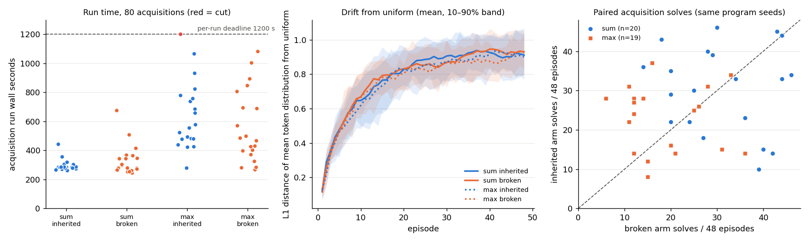

# Analysis: 2026-10-08-0918 — inherited token frequencies at equal exposure

**Headline.** The experiment did not produce its primary data. The acquisition stage ran all 80
acquisitions, 79 completed, and one (max / inherited / replicate 14) was cut by a hard-coded
1 200 s per-acquisition deadline inside `acquire()` at episode 31 of 48. The stage-level
completeness check then refused the whole roster, no `ACQUISITIONS_COMPLETE` marker was written,
and the three downstream entries (sum scoring, max scoring, analysis) failed on their `test -f`
gate in 0.01 s each. Zero frozen searches ran, so R_u, L and S cannot be computed. The outcome
label `unresolved` here means *no primary measurement*, not a wide interval.

Code `511711c`; outputs under `experiments/output/2026-10-08/2026-10-08-0918-*`.

## 1. Data completeness

| Stage | Expected | Present | Usable |
|---|---|---|---|
| Acquisition rows | 80 (2 families × 2 arms × 20) | 80, no duplicates, all `phase: main`, master `202610080843` | 79 complete; 1 `complete=false` |
| Sum frozen searches | 1 280 learned + 96 reference | 0 | 0 |
| Max frozen searches | 1 280 learned + 96 reference | 0 | 0 |
| Analysis (`result.json`, `report.md`, plots) | 1 | 0 | 0 |

The cut run (`acquisition/main/max/inherited/14.json`) reached 31 episodes, 3 855 of 6 144
reproductions, 20 solves, and its `error` field reads `acquisition timing deadline; not censoring`.
Of its 1 200 s, 1 035 s were in the exact-solution verifier. Its partial θ is on disk but the
engine (correctly) refuses to extract a vector from an incomplete schedule, so it is not a
usable data point.

**Why it failed.** Not the queue timeout: the stage's wall time was 3 742 s against a 5 824 s
timeout, and the summed worker time of all 80 runs (36 501 s, i.e. 3 650 s on 10 workers)
shows the stage would have finished inside its timeout. The binding limit was the per-job
`job.get("seconds", 1200)` default in `acquire()`, which plan.md and the proposal do not mention
(the proposal says "Acquisition is never cut"). The code review listed this deadline under
*minor notes* as "unlikely to bind" with a 2.8× margin over the slowest 0843 timing run. That
judgement was wrong: at 10 workers the max tail reached 1 065 s and 1 081 s in two other runs
and crossed 1 200 s in this one. The exception name (`acquisition timing deadline`) suggests
the deadline was meant for the stage-0 timing probe and leaked into the main stage.

## 2. Runtime against the projection

Per-run wall seconds, complete rows only (the cut run would be > 1 200 s):

| Cell | n | 0843 timing (1 run, 4 workers) | Projected mean | Mean here | Median | Min | Max |
|---|---|---|---|---|---|---|---|
| sum inherited | 20 | 181 | 181 | 295 | 284 | 261 | 442 |
| sum broken | 20 | 175 | 175 | 331 | 289 | 244 | 675 |
| max inherited | 19 | 396 | 396 | 609 | 554 | 278 | 1 065 |
| max broken | 20 | 433 | 433 | 560 | 475 | 267 | 1 081 |

Runs were 1.3–1.9× slower per run than the single-run timing at 4 workers. Reproduction time
(≈ 205 s per run in every cell, versus 126–139 s in the timing run) accounts for most of the
sum slowdown, consistent with CPU contention at 10 workers plus un-pinned Rayon threads as the
code review noted. Max runs are dominated by the verifier: 385 s (inherited) and 310 s (broken)
of their ≈ 600 s mean. Per-episode cost in max is 7.4 s for a solved episode and 16.5 s for an
unsolved one, with a tail to 167 s; so a run's wall time is set by how many episodes stall with
training-perfect but wrong candidates, which is a property of the program seed, not of the arm.
The 1 200 s deadline sits at roughly 2× the max-cell mean, so some run among 40 max runs
crossing it was likely, not unlucky.

The stage timeout (5 824 s) and the overall queue ceiling would both have held. The max-scoring
timeout (3 162 s) was priced on old-law vectors and remains unvalidated, and `score()` carries
the same kind of hidden 600 s per-search deadline.

## 3. What the acquisition data shows (descriptive only)

These are the pre-stated descriptives (solves, θ trajectories); they are not the primary
comparison and none of them is a finding.

**Solves during acquisition** (exact, full-domain verified; 48 episodes per run):

| Cell | n runs | solves/48 mean (sd) | min–max | threshold 1 (of 24) | threshold 5 (of 24) |
|---|---|---|---|---|---|
| sum inherited | 20 | 30.6 (11.0) | 10–46 | 17.2 | 13.3 |
| sum broken | 20 | 31.1 (10.1) | 14–46 | 17.1 | 14.1 |
| max inherited | 19 | 22.8 (8.3) | 8–37 | 14.3 | 8.6 |
| max broken | 20 | 18.9 (8.5) | 6–36 | 11.9 | 7.0 |

Paired inherited − broken (same program and training seeds), bootstrap over pairs:

| Family | pairs | mean diff | 95% interval | inherited better / worse / tie |
|---|---|---|---|---|
| sum | 20 | −0.6 | [−7.5, +6.0] | 10 / 9 / 1 |
| max | 19 | +4.1 | [−1.3, +9.5] | 11 / 6 / 2 |

Between-run SD of solves (≈ 10 of 48) is large relative to any arm difference. Both are
unclear; the max difference leans positive but its interval includes zero.

**Solve rate falls over the 48 episodes in every cell.** Fraction solved per block of 12
episodes:

| Cell | ep 1–12 | 13–24 | 25–36 | 37–48 |
|---|---|---|---|---|
| sum inherited | 0.81 | 0.60 | 0.59 | 0.55 |
| sum broken | 0.79 | 0.60 | 0.61 | 0.60 |
| max inherited | 0.59 | 0.49 | 0.44 | 0.39 |
| max broken | 0.47 | 0.41 | 0.35 | 0.35 |

**The token distribution drifts far from uniform in both arms, identically.** L1 distance of
the population-mean token distribution from uniform rises from ≈ 0.12 after episode 1 to
≈ 0.9 by episode 30 and plateaus (final: sum inherited 0.91, sum broken 0.93, max inherited
0.90, max broken 0.93; the maximum possible is ≈ 1.9). The broken arm shuffles θ rows every
census and carries no linkage, so a drift of this size and shape in both arms is what the
σ = 0.03 random walk over 6 144 generations with a ±3 clip produces on its own
(0.03 × √6 144 ≈ 2.3 log units). The co-occurring decline in solve rate in both arms is
consistent with that drift hurting search, but the design cannot separate drift from any
episode-order effect, and the frozen scoring that would have measured the cost never ran.

**Weak cross-replicate structure in the inherited arm.** Mean pairwise correlation of final
probability vectors across the 20 replicates is 0.09 (sum inherited), 0.09 (max inherited),
0.05 (sum broken), 0.02 (max broken). The replicate-mean inherited vectors of the two families
correlate 0.73 across the 22 tokens, against 0.09 for the broken means. This is post hoc, the
per-replicate signal is small, and it says nothing about usefulness; at most it hints that a
small common selected component rides on a large neutral drift. It would be a reason to look
at the frozen scores, not a result.

## 4. What the data does not show

- Nothing about R_u = uniform ÷ inherited, L = broken ÷ inherited, or S = inherited ÷ scaffold.
  No frozen search ran.
- Nothing about whether the learned vectors are useful, harmful or neutral on fresh populations.
  The within-acquisition solve counts are not a substitute: they measure search under a changing
  distribution with maintenance selection, on the acquisition's own populations.
- The between-run SD of the frozen score, which the proposal's Unresolved branch asks for, was
  not measured. The acquisition solve SD (≈ 10/48) is a different quantity.
- The projected max-scoring runtime remains unvalidated.

## 5. Recovery cost

The 79 complete acquisitions are valid data under the pre-registered schedule, with seeds and
manifests matching commit `511711c`. Two options for the steward:

1. **Re-run the acquisition stage with the per-job deadline removed or set to the stage
   timeout** (a one-line change plus a test). Seeds are fixed and the deadline is the only
   time-dependent branch, so the 79 rows reproduce; cost ≈ 62 min queue plus the researcher's
   cycle. Then sum scoring, max scoring and analysis as queued.
2. **Add a single-job re-run path** that completes only max/inherited/14 under the same seeds
   and merges it, then score. Cheaper in queue time (≈ 20 min for one max run) but needs new
   code and a manifest check, so probably not cheaper overall.

Either way the max-scoring timeout should be repriced from the verifier costs observed here
(verifier ≈ 60% of max acquisition time), and the 600 s per-search deadline in `score()`
should be treated as the same hazard.

## Against the predictions

- **"Do not cut acquisitions"** (plan, and proposal: "Acquisition is never cut"). Violated by
  the code, not by the queue: one acquisition was cut at 1 200 s by a per-job deadline that
  neither document lists. The plan's instruction that a timed-out acquisition "is infrastructure
  missingness and must prevent a full-roster verdict" was honoured exactly, which is why no
  partial verdict exists.
- **Queue price.** Plan: acquisition expected 2 762 s (46 min) with a 5 824 s timeout, whole
  queue ≈ 81 min. Observed: the acquisition stage alone took 3 742 s (62 min) and would have
  needed ≈ 65 min to finish the cut run; still inside its timeout. Per-run times were
  1.3–1.9× the measured means. The plan said ten-worker throughput and verifier tails were
  "not verified"; both were the source of the overrun, so the caveat was right and the 2× stage
  allowance was adequate. The 2× per-job default was not.
- **Primary outcome.** Plan labels Acquired / Bounded / Unresolved could not be applied: the
  frozen-scoring stages never ran. The proposal's expectation (sum: acquired ≈ 45 %, max:
  acquired ≈ 25 %, most likely a modest sum gain that the scaffold beats) is untested.
- **Unresolved branch.** The plan asks that an Unresolved result return the measured between-run
  log-cost SD and the extension price. Neither exists; the acquisition solve SD (≈ 10 of 48
  episodes) is not that quantity. What can be returned is the recovery price in §5
  (≈ 62 min queue for a full acquisition re-run with the deadline removed, then the scoring
  stages as queued, with the max-scoring timeout repriced).
- **Descriptives the plan asked for.** Solve counts and θ / distance-from-uniform trajectories
  are reported in §3. Price covariances and the per-token trajectories (CONST_2, SEP_A, slots)
  are on disk in the 79 complete rows but are not summarised here because the analysis stage
  that renders them did not run and they would not change the decision.
- **Surprise worth carrying forward.** Both arms drift to L1 ≈ 0.9 from uniform with the same
  time course, and solve rate declines over the 48 episodes in both arms. The plan's note that
  "theta movement alone cannot identify" inheritance was correct in the stronger sense that the
  movement is mostly not selection at all. If the re-run finds R_u < 1 in both arms, this drift
  is the candidate explanation and σ or the clip, not inheritance, would be the lever.
