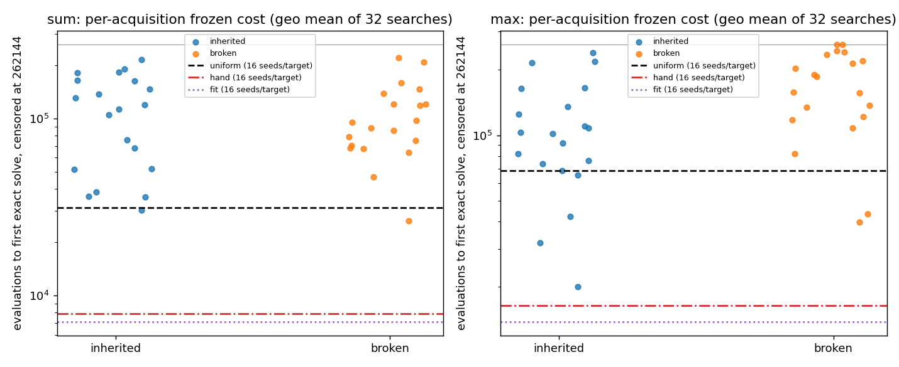

# Analysis: 2026-10-08-1046 — recovery of 0918, then frozen scoring of inherited token frequencies

**Headline.** The recovery worked and the full pre-registered comparison ran: 80 complete
acquisitions, 2 752 frozen searches, no missing cells. The primary comparison is **Bounded in
both families**, and more than that: the inherited vectors are *worse* than uniform. On sum,
uniform search costs 0.33× [0.21, 0.53] what the inherited vectors cost (uniform is 3× cheaper);
on max, 0.73× [0.50, 1.06]. The broken-ancestry control is as bad as inherited on sum (L = 1.00
[0.69, 1.41]) and worse than inherited on max (L = 1.58 [1.04, 2.36]). The hand scaffold beats
the inherited vectors 11.9× (sum) and 5.7× (max); the externally fitted vector beats them
13× and 7×. Nothing here is an acquisition of useful bias; the max linkage signal shows that
persistent ancestry made the vectors *less harmful* than shuffled ancestry, not useful.

Code `a804f4f`; outputs under `experiments/output/2026-10-08/2026-10-08-1046-*`
([execution](execution.md)). Numbers below were recomputed from the 2 752 search files and the
80 acquisition rows; they match `result.json` exactly.

## 1. Data completeness

| Stage | Expected | Present | Usable |
|---|---|---|---|
| Acquisition rows | 80 (2 families × 2 arms × 20) | 80, no duplicates, all `phase: main`, master `202610080843`, all `complete` | 80 |
| Sum frozen searches | 1 280 learned + 96 reference = 1 376 | 1 376, all `complete`, no duplicates | 1 376 |
| Max frozen searches | 1 376 | 1 376, all `complete`, no duplicates | 1 376 |
| Analysis outputs | result.json, report.md, 2 plots, COMPLETE | all present | — |

Every cell has its full count (320 per learned arm × target, 16 per reference × target).
All 16 shared seed indices 0–15 are present once per vector and target; every search has
`0 < time ≤ 262 144` and censored searches sit exactly at the cap. No per-job deadline fired
(`error` is null in all 80 acquisition rows; all search rows are `complete`).

**Recovery gates.** `recovery.json`: the two control replays (sum/inherited/0, max/broken/0)
and the 30 completed episodes of the cut run max/inherited/14 all matched their 0918 rows
exactly (`episodes_match`, `vectors_match` true for all three); `fallback: false`. I recomputed
SHA-256 for the 79 reused source files and all 80 output rows: 0 mismatches. The replayed
max/inherited/14 completed in 889 s at 3 workers with 38/48 solves; its 0918 cut had been at
1 200 s with 20 solves at episode 31. Its `seconds` is a 3-worker value among 79 ten-worker
values and enters only the descriptive `exposure`/`break_even` fields.

**Runtime against the price.**

| Stage | Expected | Timeout | Actual wall |
|---|---:|---:|---:|
| Acquisition (selective) | 1 921 s | 3 600 s (9 000 envelope) | 893 s |
| Sum scoring | 779 s | 2 400 s | 983 s |
| Max scoring | 4 067 s | 5 400 s | 2 585 s |
| Analysis | < 300 s | 300 s | 4 s |

Sum scoring ran 26% over its point price (the inherited/broken vectors call the verifier far
more than the timing roster did: mean verifications per sum search 750–1 750 for learned
vectors vs 60–250 for uniform). Max ran 36% under. The queue total was 75 min against a
5 h timeout sum. No shortcut solutions: every solve is a full-domain exact verification
(`event` only after `verifications ≥ 1` with the exact solver; `shortcut_candidates` are
rejected training-perfect candidates, which is the normal verifier load).

## 2. Primary comparison and controls

Endpoint: geometric mean over the two training targets of evaluations to the first exact solve,
censored at 262 144. Crossed percentile bootstrap, 10 000 draws, over the 20 acquisitions and
the 16 shared seed indices per target. Reference vectors (uniform, hand scaffold, 1558 fit)
have one row each, so their uncertainty comes from seed resampling only.

| Family | R_u = uniform ÷ inherited | Verdict | L = broken ÷ inherited | broken ÷ uniform | S = inherited ÷ scaffold | fit ÷ inherited |
|---|---|---|---|---|---|---|
| sum | **0.333 [0.207, 0.530]** | bounded | 0.998 [0.686, 1.413] | 2.995 [1.930, 4.679] | 11.89 [7.04, 20.44] | 0.076 [0.050, 0.115] |
| max | **0.728 [0.505, 1.061]** | bounded | 1.582 [1.036, 2.359] | 2.174 [1.531, 3.037] | 5.75 [3.66, 8.95] | 0.146 [0.090, 0.232] |

R_u > 1 would mean the inherited vector is cheaper than uniform. Both point estimates are below
1; the sum upper bound excludes 1, so on sum the inherited vectors are resolved to be worse than
uniform. On max the interval touches 1 (upper 1.06): uniform is at least as good, and the
Acquired region (≥ 1.5×) is excluded. `inherited_within_twofold_scaffold` is false in both
families; `scaffold_twofold_disadvantage_not_established` is also false (S lower bounds 7.0 and
3.7), i.e. a greater-than-twofold disadvantage against the scaffold *is* established.

**Per target** (point estimates, same endpoint):

| Target | U ÷ I | B ÷ I | I ÷ scaffold |
|---|---|---|---|
| sum1 | 0.46 | 1.00 | 9.3 |
| sum5 | 0.24 | 1.00 | 15.2 |
| max1 | 0.53 | 2.00 | 4.7 |
| max5 | 1.00 | 1.25 | 7.0 |

The max result is a mixture: on max1 inherited is clearly worse than uniform and clearly better
than broken; on max5 uniform itself is weak (8/16 solved, geometric cost 148 914 ≈ inherited
148 634), so the two are tied there and the family ratio is pulled toward 1.

**Solve counts and cell costs** (geometric cost in evaluations, capped):

| Target | inherited (n=320) | broken (n=320) | uniform (n=16) | hand (n=16) | fit (n=16) |
|---|---|---|---|---|---|
| sum1 | 242 solved, 74 670 | 267, 74 342 | 16, 34 247 | 16, 8 049 | 16, 6 128 |
| sum5 | 179, 118 025 | 214, 117 988 | 16, 28 546 | 16, 7 743 | 16, 8 293 |
| max1 | 257, 60 328 | 160, 120 891 | 16, 31 879 | 16, 12 863 | 16, 9 477 |
| max5 | 123, 148 634 | 89, 185 541 | 8, 148 914 | 16, 21 108 | 16, 20 276 |

Note that on sum the broken arm *solves more often* than inherited (267 vs 242; 214 vs 179)
while the geometric costs are equal: inherited solves are earlier when they happen, and censored
more often. Both learned arms are far from "fully censored", so the linkage contrast is
identified.

**Per-acquisition spread.** Between-run SD of log geometric cost: 0.65 (sum inherited), 0.50
(sum broken), 0.64 (max inherited), 0.55 (max broken), i.e. the 0.5–0.8 log range the 0918
proposal assumed. The spread is large: per-run costs range 30 000–215 000 (sum inherited) and
20 000–240 000 (max inherited). Runs cheaper than the uniform reference: sum inherited 1/20,
sum broken 1/20, max inherited 5/20, max broken 2/20. Runs cheaper than the scaffold: 0/80.

## 3. Descriptive observations (not pre-registered comparisons)

These are post hoc and should motivate hypotheses, not beliefs.

- **Acquisition success predicts frozen value.** Across the 20 runs of a cell, the correlation
  between solves during acquisition (of 48 episodes) and frozen solves (of 32 searches) is
  0.85 (sum inherited), 0.59 (sum broken), 0.78 (max inherited), 0.81 (max broken)
  ([plot](acq_vs_frozen_solves.png)). The learned vectors differ a lot in usefulness, and that
  difference was already visible as acquisition solve rate. The same program seed drives both,
  so this does not separate "good vector" from "lucky lineage".
- **The vectors are concentrated on arbitrary tokens.** Mean maximum token probability is
  0.22 (uniform: 0.045); entropy 2.50 nats vs 3.09 for uniform; L1 from uniform 0.90–0.93 in all
  four cells (0918 §3 already reported this). The top-3 tokens differ from run to run with no
  consistent winner in either arm. The replicate-mean inherited vector correlates only 0.04
  (sum) and 0.18 (max) with the fitted vector and −0.01 / 0.13 with the scaffold; broken: 0.06
  / 0.07. Mean weight on the scaffold's tokens: INPUT 0.057 (sum inherited) and 0.061 (max
  inherited) vs 0.13 / 0.12 in the scaffold; GT 0.054 / 0.087 vs 0.147 / 0.135; the sum
  aggregator 0.023 vs 0.089 and the max aggregator 0.045 vs 0.129. The inherited arm moved the
  aggregator tokens *away* from the scaffold's direction on sum. A pooled 40-run regression of
  log cost on per-token probability (post hoc) gives the most "helpful" tokens as GT, INPUT and
  (on max) token 10, and the most harmful as several SLOT/other tokens; the learned vectors
  concentrated mass on the latter as often as the former.
- **Max linkage.** The inherited arm's replicate-mean max vector has GT at 0.087 vs 0.039 for
  broken, and INPUT 0.061 vs 0.080; its mean correlation with the fitted vector (0.18) exceeds
  broken's (0.07). Together with L = 1.58 [1.04, 2.36] on max, this is consistent with
  persistent ancestry retaining some selected GT supply, which makes the max inherited vectors
  less harmful than shuffled ones. It did not make them better than uniform.
- **Lineage depth.** Inherited runs have mean depth 4 950–6 100 of 6 144 generations, broken
  6 120–6 140. With shuffling every census, every row is a fresh child; without it, the two
  elites' rows persist unmutated. This is the scope caveat ("equal schedule does not equalize
  lineage depth") made concrete; the depth gap is small.
- **Break-even is undefined** in every family and reference: the inherited vectors save
  negative evaluations and seconds per search (−92 609 evaluations per search vs uniform on
  sum, −39 664 on max), so no number of searches amortises the 6.3 M-evaluation acquisition.

## 4. What the data shows

- At σ = 0.03 over 48 × 128 generations with maintenance selection, the inherited
  token-frequency procedure does not produce a frozen vector that helps fresh populations on
  its own training targets. On sum it produces a vector that is resolved to be worse than
  uniform (upper bound 0.53); on max it is at best equal to uniform (upper bound 1.06).
- The inherited vectors are far below both benchmarks: the hand scaffold is 5.7–11.9× cheaper
  and the externally fitted vector 6.8–13× cheaper, with lower bounds above 3.6×.
- Persistent ancestry mattered on max (L lower bound 1.04) but not on sum (L ≈ 1). Where it
  mattered, it reduced harm rather than creating a gain.
- The broken control is not degraded relative to inherited on sum and is worse on max, so the
  "degraded control inflates L" concern does not arise.
- Between-acquisition variability is large (SD ≈ 0.5–0.65 log) and tracks acquisition solve
  counts; 5/20 max inherited runs beat uniform. Individual vectors can be mildly useful; the
  procedure's expected output is not.

## 5. What the data does not show

- Nothing about transfer: all scoring is on the development bank's training targets.
  Threshold 2 was never touched.
- Nothing about self-adaptation at a different σ, schedule, or inheritance rule. The result
  bounds this procedure (explanation E remains open as a redesign hypothesis), and the
  "mostly drift" reading is consistent with but not isolated by this design: broken ancestry
  removes persistent association, it is not a mutation-only control.
- Why uniform is weak on max5 (8/16) is a property of the task, not of this experiment; it
  makes the max R_u interval wider and shifts it toward 1.
- The uniform, scaffold and fit references each rest on 16 searches per target; their point
  values carry seed noise only, with no vector-level replication.
- The acquisition-solve to frozen-solve correlation is confounded by the shared program seed
  and is not evidence that acquisition solve rate could be used to select vectors.

## 6. Figures

- [frozen_costs.png](frozen_costs.png) — per-acquisition geometric cost by arm with reference
  lines.
- [acq_vs_frozen_solves.png](acq_vs_frozen_solves.png) — acquisition solves vs frozen solves.
- Harness plots: `trajectories.png` (replicate-mean token probabilities per episode; inherited
  sum raises SLOT_12/SLOT_13/CONST_1 and lowers CONST_2/CONST_5/aggregator; inherited max raises
  GT and SLOT_12) and `search_trajectories.png` (seed-0 illustrations) in the analysis output
  folder.

## Against the predictions

The plan's decision rule was R_u = uniform ÷ inherited per family: Acquired if lower bound > 1
and point ≥ 1.5; Bounded if upper bound < 1.5; Unresolved otherwise.

- **Primary rule.** Sum: 0.333 [0.207, 0.530] → **Bounded**. Max: 0.728 [0.505, 1.061] →
  **Bounded**. Both families land in the plan's Bounded cell. The plan's stated meaning holds:
  this bounds σ = 0.03 with this 48 × 128 schedule on training targets, not self-adaptation.
- **Proposal expectations.** The proposal gave Bounded 30% (sum) and 25% (max), expecting
  "a modest gain over uniform in one family, with the scaffold clearly better". The scaffold
  part held (S lower bounds 7.0 and 3.7); the modest gain did not appear in either family, and
  on sum the vectors are resolved to be *harmful* relative to uniform, which no expectation
  named. The 0918 decision's prediction ("likely Bounded, R_u ≤ 1 in both arms, because vectors
  are mostly drift") is the one the data matches.
- **Listed surprises.** "Inherited within 2× of the scaffold": no (S upper 20.4 and 8.9).
  "Broken ≈ inherited with both beating uniform": half — broken ≈ inherited on sum (L 1.00), but
  both lose to uniform, so the "generic supply" reading is not raised. "Max inherited beating
  uniform" (0918 list): no.
- **Interpretation controls.** L on max is 1.58 [1.04, 2.36] with broken ÷ uniform 2.17
  [1.53, 3.04]: persistent linkage shows a resolved but small effect, and the control is
  not degraded (it is worse than inherited, not better). L on sum is 1.00 [0.69, 1.41],
  unresolved either way. S lower < 2 is false in both families, so a twofold disadvantage
  against the scaffold is established; the plan's "S upper < 2 supports within twofold" is far
  from met.
- **Pre-stated limits.** Neither learned arm is fully censored (solves 123–267 of 320 per
  cell), so linkage is identified. No interval spans both "no benefit" and 1.5. Between-run
  log-cost SD came out 0.50–0.65, inside the assumed 0.5–0.8.
- **Next action per plan.** "Bounded in both families bounds this sigma/schedule on training
  targets, not self-adaptation", and every outcome returns to the strategist. No threshold-2
  extension is motivated. The proposal's own branch for this case is to park 23 with a bound
  on this σ and schedule; whether a lower-σ or different-exposure redesign (explanation E) is
  worth a slot is the strategist's call. The post hoc max linkage signal and the strong
  acquisition-solve to frozen-solve correlation are the only observations arguing that
  selection acts on these vectors at all.
- **Operational predictions.** The recovery path ran as planned (selective, no fallback, all
  gates passed, 893 s vs 1 921 s modelled). Sum scoring exceeded its point price by 26% (983 s
  vs 779 s) but stayed well under its 2 400 s timeout; max scoring ran at 64% of its price.
  No hidden deadline fired. The 5 h timeout envelope and 7 h total were not approached.
