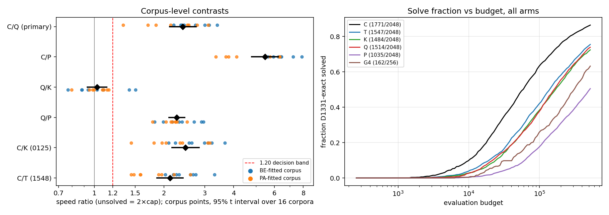

# Analysis: frozen position-matched replacements Q and P on 1548 row F

Reviewer analysis of queue entries `2026-10-09-0306-position-matched-prepare`
and `2026-10-09-0306-position-matched-score` (commit `2bab2c2`, outputs under
`experiments/output/2026-10-09/`). All numbers below were recomputed
independently from the scoring run's `search.jsonl`, the vendored 1548 row F
rows (`experiments/chem_tape/data/then_addition_1548_frozen/`) and the vendored
0125 K rows (`experiments/chem_tape/data/position_matched_0239/K_search.jsonl.gz`),
using the repo's `cost` and t-interval definitions. They agree with
`result.json` to the printed precision.

Arms, for reference: **C** is the frozen 1246 context table (previous-token
bigram); **T** is G4 with 24 pooled token multipliers (1548); **K** is G4
reweighted to C's pooled marginal (0125); **Q** is G4's rows times per-position
multipliers matched to C's emitted marginal at all 32 positions, with C's start
row at position 0; **P** is independent draws from C's positional marginals.

## 1. Data completeness

| Check | Result |
|---|---|
| Queue status | both entries `done`, exit 0; preparation 198 s wall, scoring 5 776 s wall (96 min; admitted expected price was 9 074 s, hard bound 9 576 s, timeout 11 700 s) |
| Admission | `admitted: true` under rule `expected_safety_and_capped_bound_v1`; preparation gates: C/T replay 32/32 bit-exact, K replay 16/16, projections passed for all 16 corpora |
| New rows in scoring `search.jsonl` | 4 096 / 4 096: Q 2 048, P 2 048; 0 duplicates on (corpus, cell, seed, arm); set equals the 4 096 schedule entries exactly |
| Roster shape | 16 corpora × 256 rows; 16 cells × 256 rows; 2 048 distinct seeds (8 per corpus × cell), each used once by Q and once by P |
| Cap / population | all 524 288 / 256; every unsolved row has evaluations = cap; no solved row above cap; all `phase == fresh` |
| Reference rows | 1548: C 2 048, T 2 048, G4 256; 0125 K: 2 048; SHA-pinned via `source_provenance.json` |
| Pairing | 2 048 / 2 048 complete C/T/K/Q/P quintuples; training indices identical across the five arms and equal to `rng([seed, 0])` for every quintuple (`validation.pairing_checks = 8192`) |
| Table identity | exactly one Q and one P table hash per corpus (32 distinct), each equal to the hash recorded in the admitted `preparation.json`; `initial_source_hash == table_hash` and `initial_reencoded == false` for all 4 096 rows |
| Preparation timing rows | the 32 Q/P timing searches reappear in the full roster with identical non-clock fields (32/32); they are not extra observations |
| Failures / errors | none: `validation.passed = true`, `error = null`, `stderr.log` empty, `efficacy_eligible = true` |

The roster is exactly the pre-registered one. Nothing is missing or
duplicated, and no top-up was run.

## 2. Key numbers

Primary: C/Q = exp(mean over 16 corpora of the mean over 16 cells × 8 paired
seeds of log cost_Q − log cost_C), unsolved = 2 × cap, 95% t interval with
15 df. Decision band: lower bound ≥ 1.20 → insufficient; upper bound ≤ 1.20 →
sufficient within 20%.

| Contrast | unsolved = 2×cap | unsolved = 1×cap | both-solved pairs only |
|---|---|---|---|
| **C/Q** (primary) | **2.41 [2.11, 2.75]**, sd log 0.25 | 2.21 [1.97, 2.48] | 1.95 [1.71, 2.23] |
| **C/P** (interpretation) | **5.47 [4.79, 6.25]**, sd log 0.25 | 4.26 [3.80, 4.78] | 3.30 [2.85, 3.81] |
| Q/K | 1.03 [0.93, 1.13] | 1.02 [0.94, 1.10] | 1.00 [0.88, 1.13] |
| Q/P | 2.27 [2.10, 2.45] | 1.93 [1.80, 2.06] | 1.57 [1.40, 1.76] |
| T/Q (descriptive) | 1.14 [1.04, 1.24] | 1.13 [1.04, 1.21] | 1.15 [1.03, 1.28] |
| C/K (reused 0125) | 2.48 [2.17, 2.83] | 2.25 [1.98, 2.54] | 1.92 [1.68, 2.21] |
| C/T (reused 1548) | 2.12 [1.86, 2.41] | 1.96 [1.75, 2.21] | 1.69 [1.50, 1.91] |

Ratio A/B here means cost_B / cost_A, so a value above 1 means the second arm
is slower. The C/K and C/T rows reproduce the 0125 and 1548 analyses exactly,
confirming the reference rows are the same bytes.

**Decision rule.** C/Q's lower bound is 2.11 under the primary censoring, 1.97
under 1 × cap and 1.71 on both-solved pairs. All three are well above 1.20, so
the pre-stated label for the primary comparison is **this G4-based positional
replacement is insufficient**. C/P's lower bound (4.79, 3.80, 2.85) is even
further above 1.20, so P reads as insufficient on the same band. The joint
pattern is "both fail".

All 16 corpora individually have C/Q > 1.20 (range 1.33 PA8 to 3.39 BE8) and
C/P > 1.20 (range 3.35 PA8 to 7.89 BE8). The per-corpus half-width of C/Q
(0.131 in log units) is essentially the same as the 0125 C/K half-width
(0.133), so the inherited ×1.14 precision forecast held.

Left: corpus points and 95% intervals for every contrast; red dashed line is
the 1.20 band. Right: fraction of searches solved as a function of evaluation
budget, all six arms.

By fitting family (n = 8 each, not the pre-registered unit): C/Q BE-fitted
2.68 [2.35, 3.05], PA-fitted 2.17 [1.71, 2.75]; C/P BE 6.36 [5.73, 7.05],
PA 4.71 [3.79, 5.85]. The same BE > PA ordering appeared for C/K in 0125.

Solve counts (exact D1331 check, cap 524 288):

| Arm | Solved | BE corpora | PA corpora | Median evaluations among solved | Geometric cost (2×cap) |
|---|---|---|---|---|---|
| C | 1771 / 2048 (86.5%) | 898 / 1024 | 873 / 1024 | 44 800 | 67 720 |
| T | 1547 / 2048 (75.5%) | 770 / 1024 | 777 / 1024 | 82 944 | 143 542 |
| K | 1484 / 2048 (72.5%) | 752 / 1024 | 732 / 1024 | 89 856 | 167 632 |
| **Q** | **1514 / 2048 (73.9%)** | 750 / 1024 | 764 / 1024 | 96 256 | 163 251 |
| **P** | **1035 / 2048 (50.5%)** | 503 / 1024 | 532 / 1024 | 148 224 | 370 432 |
| G4 (unpaired, 16 per cell) | 162 / 256 (63.3%) | — | — | 145 408 | 263 290 |

Per-search pairing (same seed and training-case draw):

| Pair | second arm slower | tie | second arm faster | solve pattern: both / first only / second only / neither |
|---|---|---|---|---|
| C vs Q | 1331 | 97 | 620 | 1331 / 440 / 183 / 94 |
| C vs P | 1582 | 156 | 310 | 914 / 857 / 121 / 156 |
| Q vs K | 931 | 204 | 913 | 1154 / 360 / 330 / 204 |
| Q vs P | 1217 | 321 | 510 | 821 / 693 / 214 / 320 |

Q versus K is symmetric at the search level (931 against 913) and Q/K's corpus
interval [0.93, 1.13] contains 1 with 8 of 16 corpora on each side. Adding
C's per-position marginals on top of G4 moved nothing measurable relative to
adding only the pooled marginal. The descriptive share log(C/Q)/log(C/K) is
0.97.

Per cell (16 corpora × 8 seeds per point, not the unit): C/Q ranges from 1.49
(`TA:F>m?S+S:M`) to 3.40 (`TA:M>F?S+m:m`), every cell above 1.20; C/P from
3.57 to 7.23. Q/K ranges 0.87 to 1.47 with 9 of 16 cells above 1 and no cell
pattern; Q/P is above 1.78 in every cell. Both-solved occupancy: C/Q leaves no
empty corpus × cell; C/P leaves 7 of 256 empty, so the C/P both-solved row is
slightly selection-conditioned beyond the stated caveat.

Shortcut check: training-perfect individuals that fail the exact D1331 check
occur in 174 C, 156 T, 126 K, 134 Q and 41 P runs and are never counted as
solves. Neither new arm solves by shortcut more than C.

Variation diagnostics (`variation.json`, independent fixed seed, uniform
latent tapes; mean over 16 corpora): tokens changed per single-allele
resample C 2.97, T 1.73, K 1.72, Q 1.73, P 0.92; per one-point crossover
14.7–14.9 for all arms. Q's mutation neighbourhood is indistinguishable from
K's and T's; P's is about half as wide.

Runtime: Q averaged 11.7 worker-s per search and P 15.7 (preparation had
forecast 14.0 and 17.4). Scoring took 96 min against the 151 min admitted
expected price, so the original 10 800 s timeout that stopped run 0239 would
in fact have sufficed; the admission rule, not the queue, was the binding
constraint then.

## 3. What the data shows

- Giving G4 C's per-position marginals at all 32 positions, plus C's exact
  start row, does not close the gap to C. C remains 2.4× faster on the
  pre-registered metric, with an interval that excludes 1.20 by a wide margin
  under every censoring treatment and on both-solved pairs alone.
- Q is no better than K. Position-specific reweighting adds nothing beyond
  pooled reweighting on this bank, under these operators: the Q/K interval
  straddles 1, the per-search pairing is symmetric, and the solve counts
  differ by 30 of 2048. Q is actually slightly slower than T (T/Q 1.14
  [1.04, 1.24]), the maximum-likelihood pooled reweighting.
- P, independent positional draws from C's marginals, is much worse: half the
  searches solve, C is 5.5× faster, and P is 2.3× slower than Q.
- The C advantage is present in all 16 corpora and all 16 cells for both Q
  and P; it is not driven by a subset.

## 4. What the data does not show

- It does not show that C's advantage *requires* its learned conditional
  rows. Q and P are two specific frozen, externally fitted projections under
  uniform-prior marginal matching; they do not exhaust positional learners,
  and the marginals were matched to C's emissions under a uniform tape prior,
  not to the populations selection actually visits.
- It does not separate solver supply from the variation neighbourhood. C
  changes about 3 tokens per allele resample, Q 1.7 and P 0.9, and these
  differences are confounded with the distribution differences. P's wider
  loss comes with the narrowest mutation neighbourhood, which is consistent
  with either story.
- Q/K near 1 is a null on 16 corpora with a half-width of about ×1.10. It
  rules out a large Q-over-K gain, not a small one.
- Nothing here is a learnability or transfer result: then-addition is the
  development bank on which C was already chosen, and Q and P were fitted
  externally rather than acquired.
- The BE-versus-PA fitting-family difference is descriptive (n = 8 per
  family, overlapping intervals).

## Against the predictions

Plan.md (read after the analysis above was written) pre-registered the
same primary rule as the proposal: C/Q lower bound ≥ 1.20 → this G4-based
positional replacement is insufficient; upper bound ≤ 1.20 → sufficient
within 20%; otherwise unresolved; C/P always read against the same bands.

| Prediction (proposal / plan) | Observed | Match |
|---|---|---|
| C/Q 1.7–2.4× | 2.41 [2.11, 2.75] | at the top edge of the expected range |
| P slower than Q | Q/P 2.27 [2.10, 2.45]; P solves 1035 vs Q 1514 of 2048 | yes |
| "Both insufficient" the likeliest outcome | C/Q lower bound 2.11, C/P lower bound 4.79, both ≥ 1.20 | yes, under all three censoring treatments |
| Surprise condition: C/Q upper bound ≤ 1.20 | upper bound 2.75 | did not occur |
| Surprise condition: P matches or beats Q | P 2.3× slower than Q, slower in 1217 of 2048 paired searches | did not occur |
| Precision: inherited ×1.14 half-width assuming K-like spread | sd log 0.246 (K was 0.251), half-width ×1.14 | held |
| Queue wall 110–135 min including preparation | 3.3 + 96 min = 99 min | under forecast; original 10 800 s timeout would also have sufficed |

The plan's joint-reading table: "both failing rejects these two frozen
replacements under these operators and favours dependency-carrying targets,
without rejecting all positional learners or proving necessity of C's rows."
That is the branch the data lands in. The reading is exactly as narrow as the
plan states: C's advantage over G4-based and marginal-based positional
projections survives per-position matching, and position-specific
reweighting of G4 is no better than pooled reweighting (Q/K ≈ 1). Whether a
learner that acquires conditional structure, rather than a frozen projection
of it, would close the gap is untouched by this run, as is the supply-versus-
variation confound the plan flagged.

Outcome label: **replacement_insufficient** for the primary C/Q comparison
(P also insufficient on the same band).
