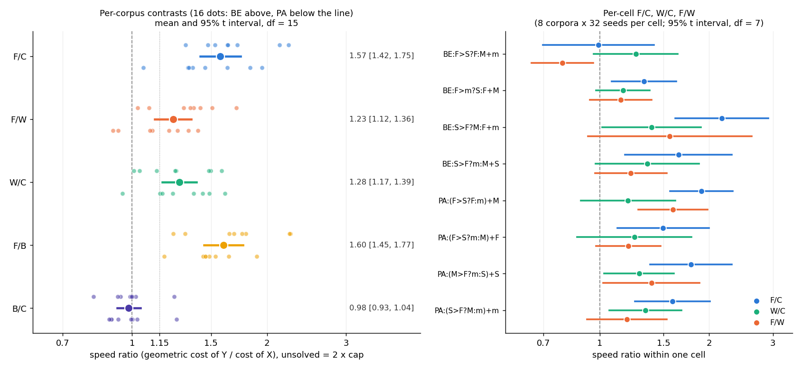

# Analysis — 0843 learned fragment block operator (F/B/W vs C)

Reviewer: Claude Fable 5.1. Data: [`fragments-prepare`](/Users/andreas/developer/folding-evolution/experiments/output/2026-10-09/2026-10-09-0843-fragments-prepare) and [`fragments-score`](/Users/andreas/developer/folding-evolution/experiments/output/2026-10-09/2026-10-09-0843-fragments-score), both from commit `e347793`. All numbers below were recomputed from `search.jsonl` and agree with `result.json` to three decimals.

## 1. Data completeness

Both queue entries finished with exit 0 and well inside their timeouts (prepare 108 s of 2700; score 4435 s of 11700).

| check | result |
|---|---|
| scoring rows (`phase: training`) | 8192 = 4 arms × 16 corpora × 4 cells × 32 seeds |
| rows per (corpus, cell, arm) | 32 in all 256 groups; 0 duplicates |
| paired quadruples (corpus, cell, seed) | 2048, each with all 4 arms and one shared `initial_tokens_hash` |
| extra rows in the same file | 128 `phase: smoke` rows (the pre-scoring replay); excluded here and by `report()` |
| cap / population | 524 288 / 256 on every row; evaluations = 256 × generations |
| unsolved rows | 627/8192, all with evaluations = cap |
| admission | 32 seeds admitted from the prepare smoke (projected 5936 s; actual 4435 s wall) |
| prepare validation | edit audit 10 000/arm passed (2690 tape-start, 2669 tape-end edits each); 16 historical C rows replayed bit-exactly on the allowlist; 128 smoke rows replayed before scoring; all 64 leave-one-out libraries at 32 fragments; 0 padded-solver drops needed |

Nothing is missing, duplicated or silently dropped. "Solved" in `composition_search` means full-domain correct (training-perfect programs are checked against every input); training-only programs are counted as shortcuts, not solves.

## 2. Key numbers

Per arm (2048 searches each):

| arm | solved | capped | geometric cost (evals, unsolved = 2 × cap) | worker s | s per evaluation |
|---|---:|---:|---:|---:|---:|
| C | 1856 (90.6 %) | 192 | 45 856 | 12 140 | 5.3e-5 |
| F | 1922 (93.8 %) | 126 | 29 134 | 9 243 | 5.5e-5 |
| B | 1860 (90.8 %) | 188 | 46 622 | 12 135 | 5.3e-5 |
| W | 1927 (94.1 %) | 121 | 35 963 | 9 769 | 5.3e-5 |

Primary metric: exp(mean over 16 corpora of mean paired log cost_Y − log cost_X), 95 % t interval, df 15. Pairs are matched on (corpus, cell, seed) and share the initial population.

| ratio | estimate | 95 % | 1 × cap | both solved (pairs) | BE (8) | PA (8) | paired wins / losses / ties |
|---|---:|---|---:|---:|---:|---:|---|
| F/C | **1.574** | 1.419–1.746 | 1.539 | 1.472 (1766) | 1.47 [1.25, 1.73] | 1.68 [1.45, 1.96] | 1248 / 753 / 47 |
| F/B | **1.600** | 1.449–1.768 | 1.567 | 1.457 (1770) | | | |
| F/W | **1.234** | 1.124–1.355 | 1.236 | 1.259 (1824) | | | 1135 / 878 / 35 |
| W/C | 1.275 | 1.167–1.393 | 1.245 | 1.153 (1765) | | | 1105 / 899 / 44 |
| B/C | 0.984 | 0.927–1.044 | 0.982 | 0.987 (1714) | | | |

Per corpus (128 pairs each): F/C is above 1 in 16/16 corpora (range 1.06 BE3 to 2.23 PA7). F/W is above 1 in 13/16 (BE3 0.91, BE6 0.93, PA3 1.03). W/C is above 1 in 15/16 (BE1 0.95).

Per cell (8 corpora × 32 seeds each, t df 7, descriptive):

| cell | F/C | W/C | F/W |
|---|---|---|---|
| BE:F>S?F:M+m | 0.99 [0.70, 1.41] | 1.26 [0.96, 1.64] | **0.79 [0.65, 0.96]** |
| BE:F>m?S:F+M | 1.32 [1.08, 1.62] | 1.16 [0.98, 1.37] | 1.14 [0.94, 1.39] |
| BE:S>F?M:F+m | 2.17 [1.61, 2.91] | 1.39 [1.01, 1.90] | 1.56 [0.93, 2.62] |
| BE:S>F?m:M+S | 1.65 [1.17, 2.31] | 1.35 [0.97, 1.88] | 1.22 [0.97, 1.53] |
| PA:(F>S?F:m)+M | 1.91 [1.56, 2.32] | 1.20 [0.89, 1.61] | 1.59 [1.28, 1.98] |
| PA:(F>S?m:M)+F | 1.49 [1.12, 2.00] | 1.25 [0.87, 1.79] | 1.20 [0.98, 1.47] |
| PA:(M>F?m:S)+S | 1.78 [1.38, 2.31] | 1.28 [1.03, 1.60] | 1.39 [1.02, 1.88] |
| PA:(S>F?M:m)+m | 1.59 [1.25, 2.01] | 1.34 [1.06, 1.68] | 1.19 [0.92, 1.53] |

Operator diagnostics (from the per-row counters): realized child fraction 0.200 in F, B and W; tokens actually changed per edit 2.79 (F), 2.80 (B), 2.92 (W) against a mean span of 3.3; elites never edited (eligible children = 254 per generation in every arm). Offspring default-use rates in the sparse diagnostic sample are slightly higher in every block arm than in C (default uses per sampled input: C 4.97, F 5.61, W 5.59, B 6.33; underflows per input 1.4–1.6 in all arms; descriptive only, one sampled child every 32 generations).

Library (prepare): 64 libraries × 32 slots hold 165 distinct fragments; lengths 3/4/5/6 = 1554/409/80/5 slots. Every kept fragment recurs in all three source cells (the rank saturated at 3). Three fragments are in all 64 libraries (`input first gt`, `input reduce_min input`, `add input first`); within a corpus, 16–23 of the 32 fragments are identical across the four leave-one-out libraries. Solver content: mean distinct library fragments per solver C 7.81, F 9.36, B 8.05, W 7.82; solvers containing at least one 4+-token fragment: C 1289/1856 (69.5 %), F 1556/1922 (81.0 %), B 1325/1860 (71.2 %), W 1336/1927 (69.3 %). These are occurrences in the final tape, not operator ancestry; the report's own "library share" is 1.0 for every arm because 3-token windows are ubiquitous and is uninformative.

Shortcuts: solvers with at least one training-only program before the full-domain solve: C 157/1856, F 182/1922, B 131/1860, W 151/1927. No arm reaches its solves through shortcuts.

Routing: rule 1 fires (F/C 1.57 ≥ 1.15 with lower bound 1.42 > 1; F/B lower bound 1.45 > 1; F/W lower bound 1.12 > 1). `result.json` says `earns_review_of_reuse`; I get the same from the raw rows.

## 3. What the data shows

- **F beats all three controls under the pre-registered metric, with intervals clear of 1.** Against C the gain is about 1.5× to 1.7×; against B 1.4× to 1.8×; against W 1.1× to 1.4×. The result is robust to the cap penalty (1 × cap), to restricting to both-solved pairs, and holds in both families. Every one of the 16 corpora favours F over C. It is well inside the proposal's "surprising" region (F/C ≥ 1.3 with F/W resolved).
- **Block editing itself helps.** W/C is 1.17 to 1.39 on the same seeds. Resampling a 3–6 token window from C's own chain, with the decoded suffix repaired, beats C's point mutation alone.
- **Equal-sized blocks of the library's per-position marginals do nothing.** B/C spans 0.93 to 1.04 with the same edit rate and the same tokens changed per edit. The gain is not "more mutation".
- **Fragment content adds on top of the block mechanics.** F/W is the clean content contrast (identical edit rate, span law, start law and suffix repair). Its lower bound of 1.12 is modest; the point estimate is 1.23.
- **The gain is heterogeneous across cells.** F/C ranges from 0.99 to 2.17 per cell. In `BE:F>S?F:M+m` F is no better than C and is worse than W (0.79, interval excluding 1 on 8 corpora). This cell is the only BE template whose then-branch repeats the compared element (`F>S?F:…`), and its leave-one-out library, built from the other three BE cells, is dominated by the other templates' joins. This is a post-hoc reading; the per-cell numbers are descriptive.

## 4. What the data does not show

- **Not transfer.** Scoring cells are the four training cells C was fitted to, and the leave-one-cell-out libraries barely differ from each other (half to two thirds of each library is shared by all four, and the top three fragments are in all 64 libraries). The fragments are the bank's shared syntax (`input <reduce> input`, `input first gt if_gt`, `add input first`), which the held-out cell has by construction. This is within-bank reuse on development cells; it says nothing about fresh banks or held-out shapes.
- **Not modularity or an explanation of C.** The fragments are mostly 3-token joins, as the proposal predicted; the surprise is that inserting them intact still beats C's own chain by about 1.2×. Why W beats C is also not isolated: C's point mutation on an allele re-decodes the whole suffix (the decoder is a conditional chain), whereas all three block arms repair the next allele and keep the suffix. W/C therefore mixes "local edit with suffix preservation" with "chain-sampled content". B shares the locality and gains nothing, which argues against locality alone, but B's content may be actively harmful, so B is not a clean locality control.
- **Not acquisition.** The library is externally fitted and frozen; nothing here evaluates evolutionary acquisition of fragments.
- **Occurrence is not ancestry.** F solvers carry more library windows (9.4 vs 7.8 distinct fragments; 81 % vs 70 % with a 4+-token fragment), consistent with insertion but not proof that inserted blocks are what solved the cell.
- **Precision.** The F/W half-width is ×1.097 on 16 corpora, close to the ×1.07 target the proposal set for an unresolved case, but the per-cell spread shows the effect is not uniform; more seeds would narrow the corpus interval without removing the cell heterogeneity.

## 5. Minor notes

- Prepare's `search.jsonl` also contains 16 operator-off replays of historical 1246 C rows marked `phase: training`; they are not scoring rows and `report()` never reads that file.
- The precision scenario saved in `precision.json` (bootstrap C pseudo-arms) gives a median corpus SD of 0.18 at 32 seeds; the observed SDs of the log contrasts were 0.17 to 0.19, so the noise scenario was accurate. The observed F/C half-width (×1.11) matched the projection.
- Scoring seeds are fresh (base 203610090843) and C's solve rate here (90.6 %) matches the historical 1246 rate (91.4 %, 936/1024), so the C arm behaved as expected.

## Against the predictions

Read after the analysis above was written. Plan.md restates the proposal's ordered rules and adds smoke-based solve scenarios, a precision scenario and a timing projection.

| prediction (plan.md) | observed | verdict |
|---|---|---|
| Steward's guess: F/C 1.0–1.15, landing in rule 2 or 3 | F/C 1.57 [1.42, 1.75], rule 1 | wrong; the result is in the proposal's own "surprising" region (F/C ≥ 1.3 with F/W resolved) |
| F beats B | F/B 1.60 [1.45, 1.77] | as predicted |
| F against W and C "doubtful" | F/W 1.23 [1.12, 1.36], F/C as above | both resolved in F's favour |
| Expected solves (smoke scenario): C 1856, F 1984, B 1856, W 1792 of 2048 | C 1856, F 1922, B 1860, W 1927 | C exact, B within 4; F over-predicted by 62, W under-predicted by 135 (the 32-search smoke was too small for arm rates, as plan.md warned) |
| Precision scenario: half-width factor ×1.100 at 32 seeds (bootstrap) or ×1.107 (steward) | observed ×1.109 (F/C), ×1.104 (F/B), ×1.098 (F/W), ×1.092 (W/C) | matched; the noise scenario was accurate |
| Scoring projection 5976 s, 6310 s with reserves, under an 11 580 s deadline | 4435 s wall | under projection; the tail/cap concern in plan.md did not materialise |
| "Incomplete rosters never yield an efficacy decision" | roster complete, 8192/8192 | not exercised |
| Rule 3 caveat: use "block editing suffices" only if W/C supports it | W/C 1.28 [1.17, 1.39] | W/C does support a block-editing gain on its own, but rule 3 is not the branch reached |

**Outcome label.** Rule 1 (`earns_review_of_reuse`) fires exactly as the plan defines it: F/C ≥ 1.15 with lower bound > 1, and both F/B and F/W lower bounds > 1. Per plan.md this earns a strategy review of the reuse stage, priced at about 3.85 h (3072 F and 3072 C searches on holdout plus then-addition cells, whole-corpus libraries, ~71 queue minutes, 2.5 agent hours), and nothing follows automatically. The plan's scope sentence applies unchanged: a three-way win supports this externally fitted literal-block procedure on development cells and does not establish modularity, C's mechanism, evolutionary acquisition or fresh-bank transfer. Two things the plan did not anticipate deserve the strategist's attention before a reuse stage: the per-cell heterogeneity (one BE cell where F is worse than W), and the fact that W/C alone is a 1.2–1.4× gain from a library-free operator, which makes W a cheap comparator that any reuse stage should carry alongside C.
